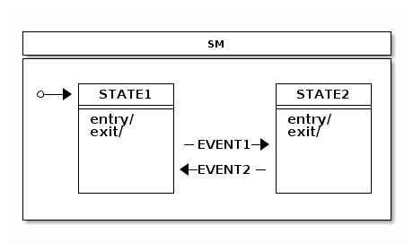
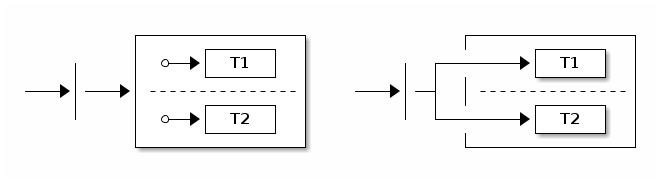
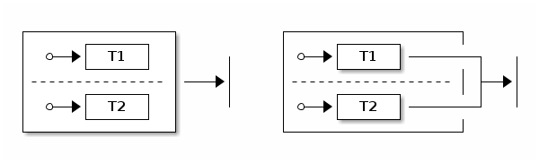
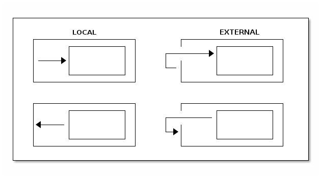
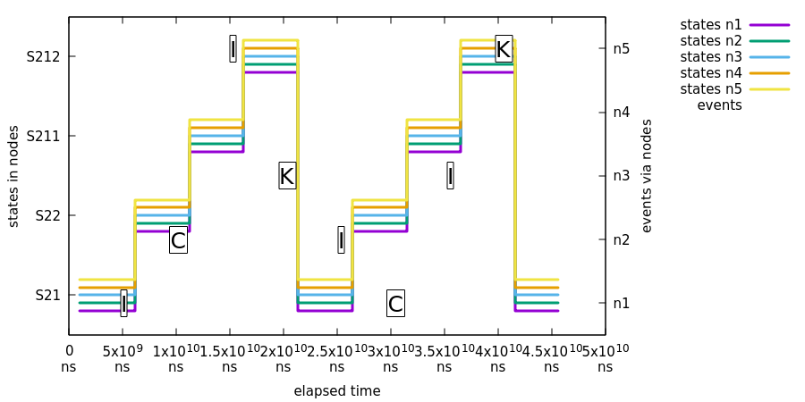
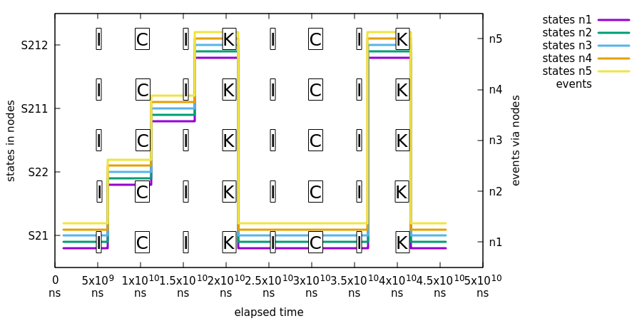
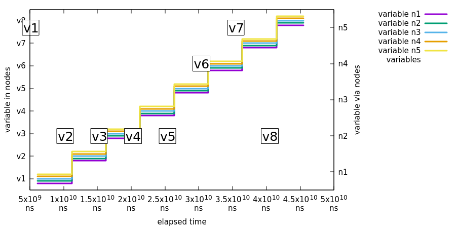
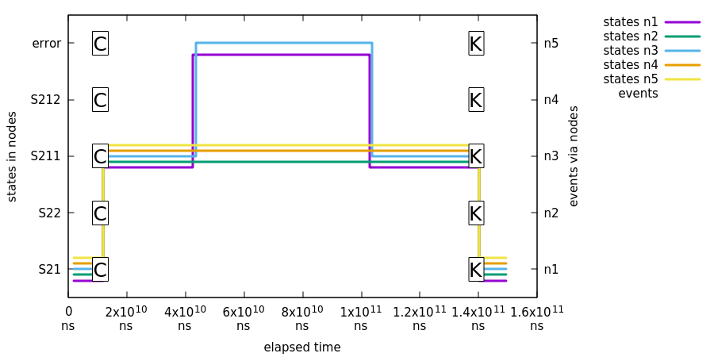
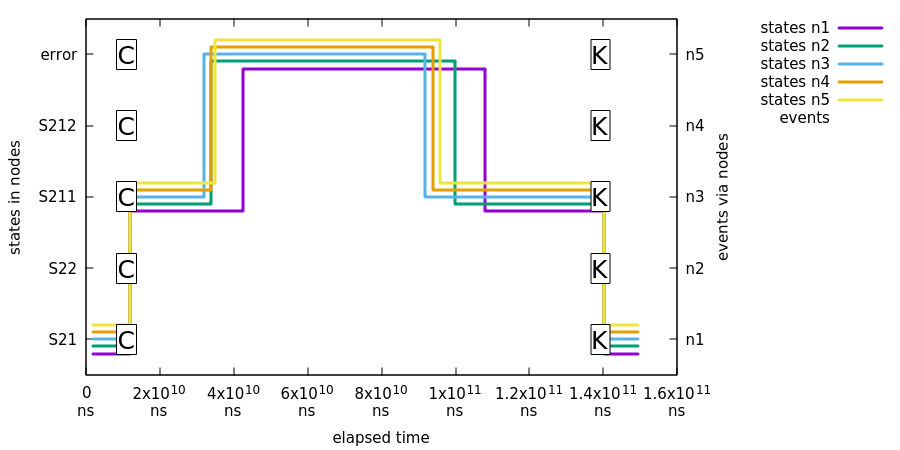
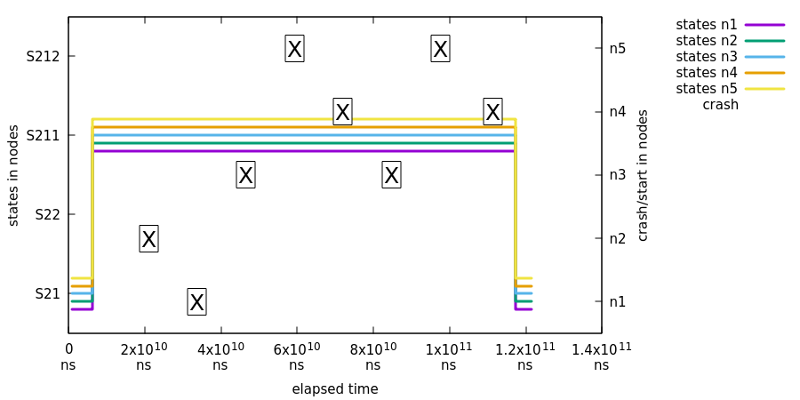

[[appendices]]
= Appendices

:numbered!:

[appendix]
== Support Content
This appendix provides generic information about used classes and
material in this reference documentation.

=== Classes Used in This Document

[source,java,indent=0]
----
include::samples/States.java[tags=snippetA]
----

[source,java,indent=0]
----
include::samples/States2.java[tags=snippetA]
----

[source,java,indent=0]
----
include::samples/States3.java[tags=snippetA]
----

[source,java,indent=0]
----
include::samples/Events.java[tags=snippetA]
----

[appendix]
== State Machine Concepts
This appendix provides generic information about state machines.

=== Quick Example
Assuming we have states _STATE1_, _STATE2_ and events _EVENT1_,
_EVENT2_, logic of state machine can be defined as shown in below
quick example.

[source,java,indent=0]
----
include::samples/IntroSample.java[tags=snippetA]
----

[source,java,indent=0]
----
include::samples/IntroSample.java[tags=snippetB]
----

[source,java,indent=0]
----
include::samples/IntroSample.java[tags=snippetC]
----

[source,java,indent=0]
----
include::samples/IntroSample.java[tags=snippetD]
----

[glossary]
=== Glossary

*State Machine*::
Main entity driving a collection of states together with regions,
transitions and events.

*State*::
A state models a situation during which some invariant condition
holds. State is the main entity of a state machine where state changes
are driven by an events.

*Extended State*::
An extended state is a special set of variables kept in a state
machine to reduce number of needed states.

*Transition*::
A transition is a relationship between a source state and a target
state. It may be part of a compound transition, which takes the state
machine from one state configuration to another, representing the complete
response of the state machine to an occurrence of an event of a
particular type.

*Event*::
An entity which is send to a state machine which then drives a various
state changes.

*Initial State*::
A special state in which the state machine starts. Initial state is
always bound to a particular state machine or a region. A state
machine with a multiple regions may have a multiple initial states.

*End State*::
Also called as a final state is a special kind of state signifying
that  the enclosing region is completed. If the enclosing region is
directly contained in a state machine and all other regions in the
state machine also are completed, then it means that the entire state
machine is completed.

*History State*::
A pseudo state which allows a state machine to remember its last
active state. Two types of history state exists, _shallow_ which only
remember top level state and _deep_ which remembers active states in a
sub-machines.

*Choice State*::
A pseudo state which allows to make a transition choice based of i.e.
event headers or extended state variables.

*Junction State*::
A pseudo state which is relatively similar to choice state but allows
multiple incoming transitions while choice only allows one incoming
transition.

*Fork State*::
A pseudo state which gives a controlled entry into a regions.

*Join State*::
A pseudo state which gives a controlled exit from a regions.

*Entry Point*::
A pseudo state which allows a controlled entry into a submachine.

*Exit Point*::
A pseudo state which allows a controlled exit from a submachine.

*Region*::
A region is an orthogonal part of either a composite state or a state
machine. It contains states and transitions.

*Guard*::
Is a boolean expression evaluated dynamically based on the value of
extended state variables and event parameters. Guard conditions affect
the behavior of a state machine by enabling actions or transitions
only when they evaluate to TRUE and disabling them when they evaluate
to FALSE.

*Action*::
A action is a behaviour executed during the triggering of the
transition.

[[crashcourse]]
=== A State Machines Crash Course
This appendix provides generic crash course to a state machine
concepts.

==== States
A state is a model which a state machine can be in. It is always
easier to describe state as a real world example rather than trying to
abstract concepts with a generic documentation. For example let's take
a simple example of a keyboard most of us are using every single day.
If you have a full keyboard which has normal keys on a left side and
the numeric keypad on a right side you may have noticed that the
numeric keypad may be in a two different states depending whether
numlock is activated or not. If it is not active then typing will
result navigation using arrows, etc. If numpad is active then typing
will result numbers to be used. Essentially numpad part of a keyboard
can be in two different states.

To relate state concept to programming it means that instead of using
flags, nested if/else/break clauses or other impractical logic you
simply rely on state, state variables or other interaction with a
state machine.

==== Pseudo States
PseudoState is a special type of state which usually introduces more
higher level logic into a state machine by either giving a state a
special meaning like initial state. State machine can then internally
react to these states by doing various actions available in UML state
machine concepts.

===== Initial
*Initial pseudostate* state is always needed for every single state
machine whether you have a simple one level state machine or more
complex state machine composed with submachines or regions. Initial
state simple defines where state machine should go when it starts and
without it state machine is ill-formed.

===== End
*Terminate pseudostate* which is also called as end state will indicate
that a particular state machine has reached its final state. Effectively
this mean that a state machine will no longer process any events and will
not transit to any other state. However in a case of submachines are
regions, state machine is able to restart from its terminal state.

===== Choice
*Choice pseudostate* is used to choose a dynamic conditional branch of
a transition from this state. Dynamic condition is evaluated by guards
so that at least one and at most one branch is selected. Usually a
simple if/elseif/else structure is used to make sure that at least one
branch is selected. Otherwise state machine might end up in a deadlock
and configuration would be ill-formed.

===== Junction
*Junction pseudostate* is functionally similar than choice as both are
implemented with if/elseif/else structure. Only real difference is
that junction allows multiple incoming transitions while choice only
allows one. Thus difference is purely academic but have some
differences i.e. when state machine is designed using real UI modeling
framework.

===== History
*History pseudostate* can be used to remember a last active state
configuration. After state machine has been exited, history state can
be used to restore previous knows configuration. There are two types
of history states available, _SHALLOW_ only remember active state of a
state machine itself while _DEEP_ also remembers nested states.

History state could be implemented externally by listening state
machine events but this would soon make logic very difficult to work
with, especially if state machine contains complex nested structures.
Letting state machine itself to handle recording of history states
makes things much simpler. What is left for user to do is simply do a
transition into a history state and state machine will hand the needed
logic to go back to its last known recorded state.

In cases where a Transition terminates on a history state when the state
has not been entered before (i.e., no prior history) or it had reached its
End State, there is an option to force a transition to a specific substate,
using the default history mechanism. This is a Transition that originates
in the history state and terminates on a specific Vertex (the default history
state) of the Region containing the history state. This Transition is only
taken if execution leads to the history state and the state had never been
active before. Otherwise, the normal history entry into the Region is executed.
If no default history transition is defined, then standard default entry of
the region is performed.

===== Fork
*Fork pseudostate* can be used to do an explicit entry into one or more regions.

Target state can be a parent state hosting regions, which simply
means that regions are activated by entering its initial states. It's
also possible to add targets directly to any state in a region which
allows more controlled entry into a state.

===== Join
*Join pseudostate* is used to merge several transitions together
originating from different regions. It is generally used to wait
and block for participating regions to get into its join target states.

Source state can be a parent state hosting regions, which means that
join states will be a terminate states of a participating regions.
It's also possible to define source states to be any state in a
regions which allows controlled exit from a regions.

==== Guard Conditions
Guard conditions are expressions which evaluates either to *TRUE* or
*FALSE* based on extended state variables and event parameters. Guards
are used with actions and transitions to dynamically choose if
particular action or transition should be executed. Aspects of guards,
event parameters and extended state variables are simply to make state
machine design much more simple.

==== Events
Event is the most used trigger behaviour to drive a state machine.
There are other ways to trigger behaviour to happen in state machine
like a timer but events are the ones which really allows user to
interact with a state machine. Events are also called as signals to
possibly alter a state machine state.

==== Transitions
A transition is a relationship between a source state and a target
state. A switch from a state to another is a _state transition_ caused
by a _trigger_.

===== Internal Transition
Internal transition is used when action needs to be executed without
causing a state transition. With internal transition source and target
state is always a same and it is identical with self-transition in the
absence of state entry and exit actions.

===== External vs. Local Transition
Most of the cases external and local transition are functionally
equivalent except in cases where transition is happening between super
and sub states. Local transition doesn't cause exit and entry to
source state if target state is a substate of a source state. Other
way around, local transition doesn't cause exit and entry to target
state if target is a superstate of a source state.

Above image shows a different between local and external transitions
with a very simplistic super and sub states.

==== Actions
Actions are the ones which really glues state machine state changes
with a user's own code. State machine can execute action on various
changes and steps in a state machine like entering or exiting a state,
or doing a state transition.

Actions usually have access to a state context which gives running
code a choice to interact with a state machine in a various ways.
State context i.e. is exposing a whole state machine so user can
access extended state variables, event headers if transition is based
on an event, or actual transition where it is possible to see more
detailed where this state change is coming from and where it is going.

==== Hierarchical State Machines
Concept of a hierarchical state machine is used to simplify state
design when particular states can only exist together.

Hierarchical states are really an innovation in UML state machine over
a traditional state machines like Mealy or Moore machines.
Hierarchical states allows to define some level of abstraction is a
sense how java developer would define a class structure with abstract
classes. For example having a nested state machine user is able to
define transition on a multiple level of states possibly with a
different conditions. State machine will always try to see if current
state is able to handle an event together with a transition guard
conditions. If these conditions are not evaluated to true, state
machine will simply see what a super state can handle.

==== Regions
Regions which are also called as orthogonal regions are usually viewed
as exclusive OR operation applied to a states. Concept of a region in
terms of a state machine is usually a little difficult to understand
but things gets a little simpler with a simple example.

Some of us have a full size keyboard with main keys on a left side and numeric
keys on a right side. You've probably noticed that both sides really
have their own state which you see if you press a numlock key which
only alters behaviour of numbad itself. If you don't have a full size
keyboard you can buy a simple external usb numbad having only numbad
part of a keys. If left and right side can freely exist without the
other they must have a totally different states which means they are
operating on different state machines.

It would be a little inconvenient to handle two different
state machines as totally separate entities because in a sense they are
still working together in a sense. This is why orthogonal regions can
combine together a multiple simultaneous states within a single state
in a state machine.

[appendix]
[[appendices-zookeeper]]
== Distributed State Machine Technical Paper
This appendix provides more detailed technical documentation about
using a Zookeeper with a Spring State Machine.

=== Abstract
Introducing a `distributed state` on top of a single state machine
instance running on a single `jvm` is a difficult and a complex topic.
`Distributed State Machine` is introducing a few relatively complex
problems on top of a simple state machine due to its run-to-completion
model and generally because of its single thread execution model,
though orthogonal regions can be executed parallel. One other natural
problem is that a state machine transition execution is driven by triggers
which are either `event` or `timer` based.

Distributed `Spring State Machine` is trying to solve problem of spanning
a generic `State Machine` through a jvm boundary. Here we show that a generic
`State Machine` concepts can be used in multiple `jvm's` and `Spring
Application Contexts`.

We found that if `Distributed State Machine` abstraction is carefully chosen
and backing distributed state repository guarantees `CP` readiness, it is
possible to create a consistent state machine which is able to share
distributed state among other state machines in an ensemble.

Our results demonstrate that distributed state changes are consistent if backing
repository is `CP`. We anticipate our distributed state machine to provide
a foundation to applications which need to work with a shared distributed
states. This model aims to provide a good methods for cloud applications
to have much easier ways to communicate with each others without having
a need to explicitly build these distributed state concepts.

=== Intro
Spring State Machine is not forced to use a single threaded execution
model because once multiple regions are uses, regions can be executed
parallel if necessary configuration is applied. This is an important
topic because once user wants to have a parallel state machine
execution it will make state changes faster for independent regions.

When state changes are no longer driven by a trigger in a local jvm or
local state machine instance, transition logic needs to be controlled
externally in an arbitrary persistent storage. This storage needs to
have a ways to notify participating state machines when distributed
state is changed.

https://en.wikipedia.org/wiki/CAP_theorem[CAP Theorem] states that
"it is impossible for a distributed computer system to simultaneously
provide all three of the following guarantees, `consistency`,
`availability` and `partition tolerance` ". What this means is that
whatever is chosen for a backing persistence storage is it advisable
to be `CP`. In this context `CP` means `consistency` and `partition
tolerance`. Naturally `Distributed Spring Statemachine` doesn't care
about what is its `CAP` level but in reality `consistency` and
`partition tolerance` are more important than `availability`. This is
an exact reason why i.e. `Zookeeper` is a `CP` storage.

All tests presented in this article are accomplished by running custom
`jepsen` tests in a following environment:

* Cluster having nodes n1, n2, n3, n4 and n5.
* Each node have a `Zookeeper` instance constructing an ensemble with
  all other nodes.
* Each node have a <<statemachine-examples-web>> sample installed
  which will connect to a local `Zookeeper` node.
* Every state machine instance will only communicate with a local
  `Zookeeper` instance. While connecting machine to multiple instances
  is possible, it is not used here.
* All state machine instances when started will create a
  `StateMachineEnsemble` using `Zookeeper` ensemble.
* Sample contains a custom rest api's which `jepsen` will use to send
  events and check particular state machine statuses.

All jepsen tests for `Spring Distributed Statemachine` are available from
https://github.com/spring-projects/spring-statemachine/tree/master/jepsen/spring-statemachine-jepsen[Jepsen
Tests.]

=== Generic Concepts
One design decision of a `Distributed State Machine` was not to make
individual `State Machine` instance aware of that it is part of a
`distributed ensemble`. Because main functions and features of a
`StateMachine` can be accessed via its interface, it makes sense to
wrap this instance using a `DistributedStateMachine`, which simply
intercepts all state machine communication and collaborates with an
ensemble to orchestrate distributed state changes.

One other important concept is to be able to persist enough
information from a state machine order to reset a state machine state
from arbitrary state into a new deserialized state. This is naturally
needed when a new state machine instance is joining with an ensemble
and it needs to synchronize its own internal state with a distributed
state. Together with using concepts of distributed states and state
persisting it is possible to create a distributed state machine.
Currently only backing repository of a `Distributed State Machine` is
implemented using a `Zookeeper`.

As mentioned in <<sm-distributed>> distibuted states are enabled by
wrapping an instance of a `StateMachine` within a
`DistributedStateMachine`. Specific `StateMachineEnsemble`
implementation is `ZookeeperStateMachineEnsemble` providing
integration with a `Zookeeper`.

=== ZookeeperStateMachinePersist
We wanted to have a generic interface `StateMachinePersist` which is
able to persist `StateMachineContext` into an arbitrary storage and
`ZookeeperStateMachinePersist` is implementing this interface for a
`Zookeeper`.

=== ZookeeperStateMachineEnsemble
While distributed state machine is using one set of serialized
contexts to update its own state, with zookeeper we're having a
conceptual problem how these context changes can be listened. We're
able to serialize context into a zookeeper `znode` and eventually
listen when `znode` data is modified. However `Zookeeper` doesn't
guarantee that you will get notification for every data change
because registered `watcher` for a `znode` is disabled once it fires
and user need to re-register that `watcher`. During this short time
a `znode` data can be changed thus resulting missing events. It is
actually very easy to miss these events by just changing data from a
multiple threads in a concurrent manner.

Order to overcome this issue we're keeping individual context changes
in a multiple `znodes` and we just use a simple integer counter to mark
which `znode` is a current active one. This allows us to replay missed
events. We don't want to create more and more znodes and then later
delete old ones, instead we're using a simple concept of a circular
set of znodes. This allows to use predefined set of znodes where
a current can be determided with a simple integer counter. We already have
this counter by tracking main `znode` data version which in
`Zookeeper` is
an integer.

Size of a circular buffer is mandated to be a power of two not to get
trouble when interger is going to overflow thus we don't need to
handle any specific cases.

=== Distributed Tolerance
Order to show how a various distributed actions against a state
machine work in a real life, we're using a set of `jepsen` tests to
simulate various conditions which may happen in a real distributed
cluster. These include a `brain split` on a network level, parallel
events with a multiple `distributed state machines` and changes in
an `extended state variables`. Jepsen tests are based on a sample
<<statemachine-examples-web>> where this sample instance is run on
multiple hosts together with a `Zookeeper` instance on every node
where state machine is run. Essentially every state machine sample
will connect to local `Zookeeper` instance which allows use, via
`jepsen` to simulate network conditions.

Plotted graphs below in this chapter contain states and events which
directly maps to a state chart which can be found from
<<statemachine-examples-web>>.

[[sm-tech-isolated-events]]
==== Isolated Events
Sending an isolated single event into exactly one state machine in an
ensemble is the most simplest testing scenario and demonstrates that a
state change in one state machine is properly propagated into other
state machines in an ensemble.

In this test we will demonstrate that a state change in one machine
will eventually cause a consistent state change in other machines.

What's happening in above chart:

* All machines report state `S21`.
* Event `I` is sent to node `n1` and all nodes report state change
  from `S21` to `S22`.
* Event `C` is sent to node `n2` and all nodes report state change
  from `S22` to `S211`.
* Event `I` is sent to node `n5` and all nodes report state change
  from `S211` to `S212`.
* Event `K` is sent to node `n3` and all nodes report state change
  from `S212` to `S21`.
* We cycle events `I`, `C`, `I` and `K` one more time via random nodes.

==== Parallel Events
Logical problem with multiple distributed state machines is that if a
same event is sent into a multiple state machine exactly at a same
time, only one of those events will cause a distributed state
transitions. This is somewhat expected scenario because a first state
machine, for this event, which is able to change a distributed state
will control the distributed transition logic. Effectively all other
machines receiving this same event will silently discard the event
because distributed state is no longer in a state where particular
event can be processed.

In this test we will demonstrate that a state change caused by a
parallel events throughout an ensemble will eventually cause a
consistent state change in all machines.

What's happening in above chart:

* We use exactly same event flow than in previous sample
  <<sm-tech-isolated-events>> with a difference that events are always
  sent to all nodes.

==== Concurrent Extended State Variable Changes
Extended state machine variables are not guaranteed to be atomic at
any given time but after a distributed state change, all state machines
in an ensemble should have a synchronized extended state.

In this test we will demonstrate that a change in extended state
variables in one distributed state machine will eventually be
consistent in all distributed state machines.

What's happening in above chart:

* Event `J` is send to node `n5` with event variable `testVariable`
  having value `v1`. All nodes are then reporting having varible
  `testVariable` as value `v1`.
* Event `J` is repeated from variable `v2` to `v8` doing same checks.

==== Partition Tolerance
We need to always assume that sooner or later things in a cluster will
go bad whether it is just a crash of a `Zookeeper` instance, a state
machine or a network problem like a `brain split`. Brain split is a
situation where existing cluster members are isolated so that only
part of a hosts are able to see each others. Usual scenario is that a
brain split will create a minority and majority partitions of an
ensemble where hosts in a minority cannot participate in an ensemble
anymore until network status has been healed.

In below tests we will demonstrate that various types of brain-split's in
an ensemble will eventually cause fully synchronized state of all
distributed state machines.

There are two scenarios having a one straight brain split in a
network where where `Zookeeper` and `Statemachine` instances are
split in half, assuming each `Statemachine` will connect into a
local `Zookeeper` instance:

* If current zookeeper leader is kept in a majority, all clients
  connected into majority will keep functioning properly.
* If current zookeeper leader is left in minority, all clients will
  disconnect from it and will try to connect back till previous
  minority members has successfully joined back to existing majority
  ensemble.

[NOTE]
====
In our current `jepsen` tests we can't separate zookeeper split brains
scenarios between leader left in majority or minority so we need to
run tests multiple time to accomplish this situation.
====

[NOTE]
====
In below plots we have mapped a state machine error state into an
`error` to indicate that `state machine` is in error state instead or
a normal state. Please indicate this when interpreting chart states.
====

In this first test we show that when existing zookeeper leader was
kept in majority, 3 out of 5 machines will continue as is.

What's happening in above chart:

* First event `C` is sent to all machine leading a state change to
  `S211`.
* Jepsen nemesis will cause a brain-split which is causing partitions
  of `n1/n2/n5` and `n3/n4`. Nodes `n3/n4` are left in minority and
  nodes `n1/n2/n5` construct a new healthy majority. Nodes in
  majority will keep function without problems but nodes in minority
  will get into error state.
* Jepsen will heal network and after some time nodes `n3/n4` will join
  back into ensemble and synchronize its distributed status.
* Lastly event `K1` is sent to all state machines to ensure that ensemble
  is working properly. This state change will lead back to state
  `S21`.

In this second test we show that when existing zookeeper leader was
kept in minority, all machines will error out:

What's happening in above chart:

* First event `C` is sent to all machine leading a state change to
  `S211`.
* Jepsen nemesis will cause a brain-split which is causing partitions
  so that existing `Zookeeper` leader is kept in minority and all
  instances are disconnected from ensemble.
* Jepsen will heal network and after some time all nodes will join
  back into ensemble and synchronize its distributed status.
* Lastly event `K1` is sent to all state machines to ensure that ensemble
  is working properly. This state change will lead back to state
  `S21`.

==== Crash and Join Tolerance
In this test we will demonstrate that killing existing state machine
and then joining new instance back into an ensemble will keep the
distributed state healthy and newly joined state machines will synchronize
their states properly.

[NOTE]
====
In this test, states are not checked between first `X` and last `X`,
thus graph will will show flat line in between. States are checked
exactly where state change happens between `S21` and `S211`.
====

What's happening in above chart:

* All state machines are transitioned from initial state `S21` into
  `S211` so that we can test proper state synchronize during join.
* `X` is marking when a specific node has been crashed and started.
* At a same time we request states from all machines and plot it.
* Finally we do a simple transition back to `S21` from `S211` to make
  sure that all state machines are still functioning properly.

[[devdocs]]
== Developer Documentation
This appendix provides generic information for a developers who may
want to contribute or other people who want to understand how state
machine works or what are its internal concepts.

[[devdocs-configmodel]]
=== StateMachine Config Model
`StateMachineModel` and other related SPI classes are an abstraction
between various configuration and factory classes. This also allows
easier integation for others to build state machines.

As shown above a state machine can be instantiated by building a model
using configuration data classes and then asking a factory to build a
state machine.

[source,java,indent=0]
----
include::samples/DocsConfigurationSampleTests6.java[tags=snippetA]
----
