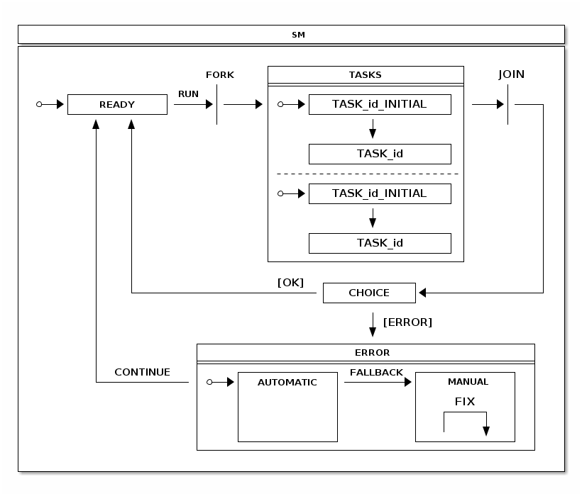

[[statemachine-recipes]]
= Recipes
This chapter contains documentation for existing built-in state
machine recipes.

What exactly is a recipe? As Spring Statemachine is always going to be
a foundational framework meaning that its core will not have that much
higher level functionality or dependencies outside of a Spring
Framework. Correct usage of a state machine may be a little difficult
time to time and there's always some common use cases how state
machine can be used. Recipe modules are meant to provide a higher
level solutions to these common use cases and also provide examples
beyond samples how framework can be used.

[NOTE]
====
Recipes are a great way to make external contributions this Spring
Statemachine project. If you're not ready to contribute to the
framework core itself, a custom and common recipe is a great way to
share functionality among other users.
====

[[statemachine-recipes-persist]]
== Persist
Persist recipe is a simple utility which allows to use a single state
machine instance to persist and update a state of an arbitrary item in
a repository.

Recipe's main class is `PersistStateMachineHandler` which assumes user
to do three different things:

- An instance of a `StateMachine<String, String>` needs to be used
  with a `PersistStateMachineHandler`. States and Events are required
  to be type of Strings.
- `PersistStateChangeListener` need to be registered with handler
  order to react to persist request.
- Method `handleEventWithState` is used to orchestrate state changes.

There is a sample demonstrating usage of this recipe at
<<statemachine-examples-persist>>.

[[statemachine-recipes-tasks]]
== Tasks
Tasks recipe is a concept to execute DAG of `Runnable` instances using
a state machine. This recipe has been developed from ideas introduced
in sample <<statemachine-examples-tasks>>.

Generic concept of a state machine is shown below. In this state chart
everything under `TASKS` just shows a generic concept of how a single
task is executed. Because this recipe allows to register deep
hierarcical DAG of tasks, meaning a real state chart would be deep
nested collection of sub-states and regions, there's no need to be
more presise.

For example if you have only two registered tasks, below state chart
would be correct with `TASK_id` replaced with `TASK_1` and `TASK_2` if
registered tasks ids are `1` and `2`.

Executing a `Runnable` may result an error and especially if a complex
DAG of tasks is involved it is desirable that there is a way to handle
tasks execution errors and then having a way to continue execution
without executing already successfully executed tasks. Addition to
this it would be nice if some execution errors can be handled
automatically and as a last fallback, if error can't be handled
automatically, state machine is put into a state where user can handle
errors manually.

`TasksHandler` contains a builder method to configure handler instance
and follows a simple builder patter. This builder can be used to
register `Runnable` tasks, `TasksListener` instances, define
`StateMachinePersist` hook, and setup custom `TaskExecutor` instance.

Now lets take a simple `Runnable` just doing a simple sleep as shown
below. This is a base of all examples in this chapter.

[source,java,indent=0]
----
include::samples/DocsTasksSampleTests.java[tags=snippetAA]
----

To execute multiple `sleepRunnable` tasks just register tasks and
execute `runTasks()` method from `TasksHandler`.

[source,java,indent=0]
----
include::samples/DocsTasksSampleTests.java[tags=snippetB]
----

Order to listen what is happening with a task execution an instance of
a `TasksListener` can be registered with a `TasksHandler`. Recipe
provides an adapter `TasksListenerAdapter` if you don't want to
implement a full interface. Listener provides a various hooks to
listen tasks execution events.

[source,java,indent=0]
----
include::samples/DocsTasksSampleTests.java[tags=snippetAB]
----

Listeners can be either registered via a builder or directly with a
`TasksHandler` as shown above.

[source,java,indent=0]
----
include::samples/DocsTasksSampleTests.java[tags=snippetC]
----

Above sample show how to create a deep nested DAG of tasks. Every task
needs to have an unique identifier and optionally as task can be
defined to be a sub-task. Effectively this will create a DAG of tasks.

[source,java,indent=0]
----
include::samples/DocsTasksSampleTests.java[tags=snippetD]
----

When error happens and a state machine running these tasks goes into a
`ERROR` state, user can call handler methods `fixCurrentProblems` to
reset current state of tasks kept in a state machine extended state
variables. Handler method `continueFromError` can then be used to
instruct state machine to transition from `ERROR` state back to
`READY` state where tasks can be executed again.

[source,java,indent=0]
----
include::samples/DocsTasksSampleTests.java[tags=snippetE]
----

