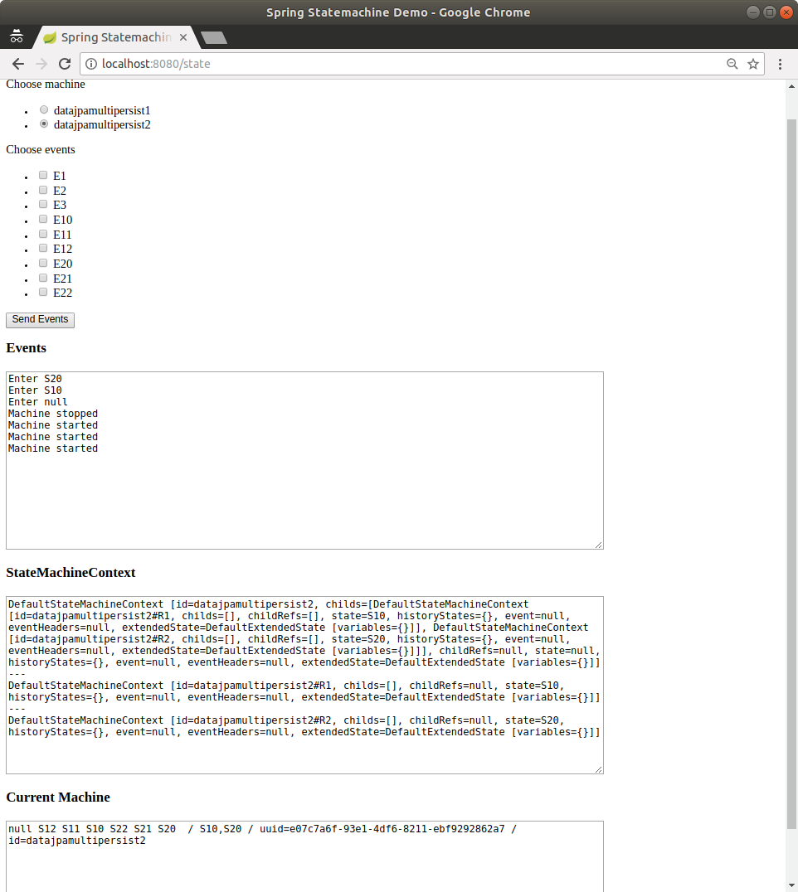
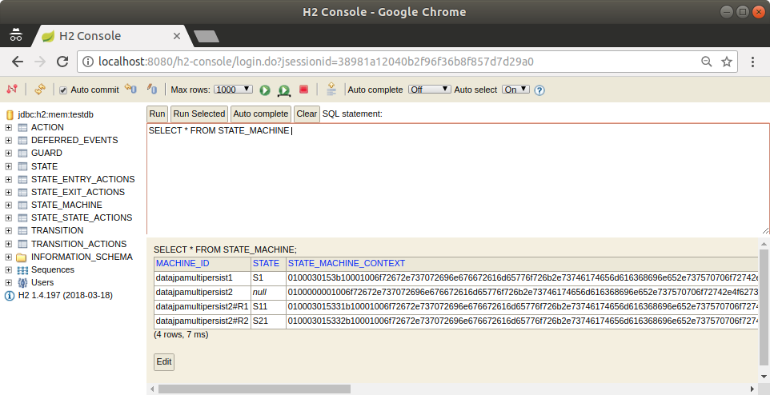

[[statemachine-examples-datajpamultipersist]]
== Data Multi Persist

The data multi ersist sample is an extension of two other samples:
<<statemachine-examples-datajpa>> and <<statemachine-examples-datapersist>>.
We still keep machine configuration in a database and persist into a
database. However, this time, we also have a machine that contains two orthogonal
regions, to show how those are persisted independently. This sample
also uses an embedded H2 database with an H2 Console (to ease playing
with the database).

This sample uses `spring-statemachine-autoconfigure` (which, by default,
auto-configures the repositories and entity classes needed for JPA).
Thus, you need only `@SpringBootApplication`.
The following example shows the `Application` class with the `@SpringBootApplication` annotation:

====
[source,java,indent=0]
----
include::samples/demo/datajpamultipersist/Application.java[tags=snippetA]
----
====

As in the other data-driven samples, we again create a `StateMachineRuntimePersister`,
as the following listing shows:

====
[source,java,indent=0]
----
include::samples/demo/datajpamultipersist/StateMachineConfig.java[tags=snippetA]
----
====

A `StateMachineService` bean makes it easier to work with a machines.
The following listing shows how to create such a bean:

====
[source,java,indent=0]
----
include::samples/demo/datajpamultipersist/StateMachineConfig.java[tags=snippetB]
----
====

We use JSON data to import the configuration.
The following example creates a bean to do so:

====
[source,java,indent=0]
----
include::samples/demo/datajpamultipersist/StateMachineConfig.java[tags=snippetC]
----
====

The following listing shows how we get a `RepositoryStateMachineModelFactory`:

====
[source,java,indent=0]
----
include::samples/demo/datajpamultipersist/StateMachineConfig.java[tags=snippetD]
----
====

You can run the sample by using the following command:

====
[source,text,subs="attributes"]
----
# java -jar spring-statemachine-samples-datajpamultipersist-{revnumber}.jar
----
====

Accessing the application at `http://localhost:8080` brings up a newly
constructed machine for each request and lets you send
events to a machine. The possible events and the state machine configuration are
updated from a database for each request. We also print out
all state machine contexts and the current root machine,
as the following image shows:

The state machine named `datajpamultipersist1` is a simple "`flat`" machine where states `S1`,
`S2` and `S3` are transitioned by events `E1`, `E2`, and `E3` (respectively).
However, the state machine named `datajpamultipersist2` contains two
regions (`R1` and `R2`) directly under the root level. That is why this
root level machine really does not have a state. We need
that root level machine to host those regions.

Regions `R1` and `R2` in the `datajpamultipersist2` state machine contains states
`S10`, `S11`, and `S12` and `S20`, `S21`, and `S22` (respectively). Events
`E10`, `E11`, and `E12` are used for region `R1` and events `E20`, `E21`,
and event `E22` is used for region `R2`. The following images shows what happens when we
send events `E10` and `E20` to the
`datajpamultipersist2` state machine:

image::images/sm-datajpamultipersist-2.png[scaledwidth="100%"]

Regions have their own contexts with their own IDs, and the actual
ID is postfixed with `#` and the region ID. As the following image shows,
different regions in a database have different contexts:

