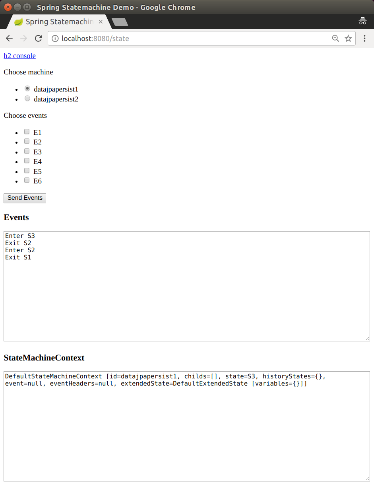
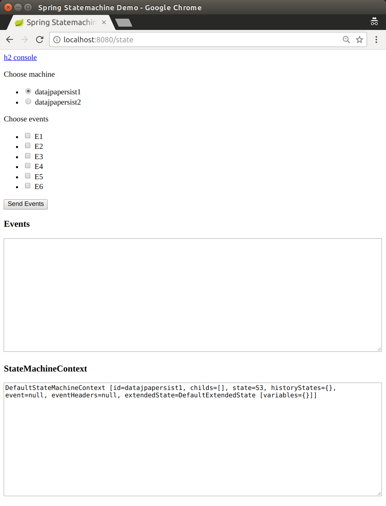

[[statemachine-examples-datapersist]]
== Data Persist

The data persist sample shows how you can state machine concepts
with a persisting machine in an external repository. This sample uses
an embedded H2 database with an H2 Console (to ease playing with the
database). Optionally, you can also enable Redis or MongoDB.

This sample uses `spring-statemachine-autoconfigure` (which, by default,
auto-configures the repositories and entity classes needed for JPA).
Thus, you need only `@SpringBootApplication`.
The following example shows the `Application` class with the `@SpringBootApplication` annotation:

====
[source,java,indent=0]
----
include::samples/demo/datapersist/Application.java[tags=snippetA]
----
====

The `StateMachineRuntimePersister` interface works on the runtime
level of a `StateMachine`. Its implementation,
`JpaPersistingStateMachineInterceptor`, is meant to be used with a
JPA.
The following listing creates a `StateMachineRuntimePersister` bean:

====
[source,java,indent=0]
----
include::samples/demo/datapersist/StateMachineConfig.java[tags=snippetA]
----
====

The following example shows how you can use a very similar configuration
to create a bean for MongoDB:

====
[source,java,indent=0]
----
include::samples/demo/datapersist/StateMachineConfig.java[tags=snippetB]
----
====

The following example shows how you can use a very similar configuration
to create a bean for Redis:

====
[source,java,indent=0]
----
include::samples/demo/datapersist/StateMachineConfig.java[tags=snippetC]
----
====

You can configure `StateMachine` to use runtime persistence by using the
`withPersistence` configuration method.
The following listing shows how to do so:

====
[source,java,indent=0]
----
include::samples/demo/datapersist/StateMachineConfig.java[tags=snippetD]
----
====

This sample also uses `DefaultStateMachineService`, which makes it
easier to work with multiple machines.
The following listing shows how to create an instance of `DefaultStateMachineService`:

====
[source,java,indent=0]
----
include::samples/demo/datapersist/StateMachineConfig.java[tags=snippetE]
----
====

The following listing shows the logic that drives the `StateMachineService` in this sample:

====
[source,java,indent=0]
----
include::samples/demo/datapersist/StateMachineController.java[tags=snippetA]
----
====

You can use the following command to run the sample:

====
[source,text,subs="attributes"]
----
# java -jar spring-statemachine-samples-datapersist-{revnumber}.jar
----
====

[NOTE]
====
By default, the `jpa` profile is enabled in `application.yml`. If you want to try
other backends, enable either the `mongo` profile or the `redis` profile.
The following commands specify which profile to use (`jpa` is the default,
but we included it for the sake of completeness):

=====
[source,text,subs="attributes"]
----
# java -jar spring-statemachine-samples-datapersist-{revnumber}.jar --spring.profiles.active=jpa
# java -jar spring-statemachine-samples-datapersist-{revnumber}.jar --spring.profiles.active=mongo
# java -jar spring-statemachine-samples-datapersist-{revnumber}.jar --spring.profiles.active=redis
----
=====
====

Accessing the application at http://localhost:8080 brings up a newly
constructed state machine for each request, and you can choose to send
events to a machine. The possible events and machine configuration are
updated from a database with every request.

The state machines in this sample have a simple configuration with states 'S1'
to 'S6' and events 'E1' to 'E6' to transition the state machine between those
states. You can use two state machine identifiers (`datajpapersist1` and
`datajpapersist2`) to request a particular state machine.
The following image shows the UI that lets you pick a machine and an event and that shows
what happens when you do:

The sample defaults to using machine 'datajpapersist1' and goes to its
initial state 'S1'.
The following image shows the result of using those defaults:

If you send events `E1` and `E2` to the `datajpapersist1` state machine, its
state is persisted as 'S3'.
The following image shows the result of doing so:

If you then request state machine `datajpapersist1` but send no events,
the state machine is restored back to its persisted state, `S3`.
