[[statemachine-examples]]
= State Machine Examples

This part of the reference documentation explains the use of state
machines together with a sample code and a uml state charts. We do few
shortcuts when representing relationship between a state chart, SSM
configuration and what an application does with a state machine. For
complete examples go and study the samples repository.

Samples are build directly from a main source distribution during a
normal build cycle. Samples in this chapter are:

<<statemachine-examples-turnstile>> Turnstile.

<<statemachine-examples-showcase>> Showcase.

<<statemachine-examples-cdplayer>> CD Player.

<<statemachine-examples-tasks>> Tasks.

<<statemachine-examples-washer>> Washer.

<<statemachine-examples-persist>> Persist.

<<statemachine-examples-zookeeper>> Zookeeper.

<<statemachine-examples-web>> Web.

<<statemachine-examples-scope>> Scope.

<<statemachine-examples-security>> Security.

<<statemachine-examples-eventservice>> Event Service.

<<statemachine-examples-deploy>> Deploy.

<<statemachine-examples-ordershipping>> Order Shipping.

<<statemachine-examples-datajpa>> JPA Config.

<<statemachine-examples-monitoring>> Monitoring.

[source,text]
----
./gradlew clean build -x test
----

Every sample is located in its own directory under
`spring-statemachine-samples`. Samples are based on spring-boot and
spring-shell and you will find usual boot fat jars under every sample
projects `build/libs` directory.

[NOTE]
====
Filenames for jars we refer in this section are populated during a
build of this document, meaning if you're building samples from a
master, you have files with `BUILD-SNAPSHOT` postfix.
====

[[statemachine-examples-turnstile]]
== Turnstile

Turnstile is a simple device which gives you an access if payment is
made and is a very simple to model using a state machine. In its
simplest form there are only two states, `LOCKED` and `UNLOCKED`. Two
events, `COIN` and `PUSH` can happen if you try to go through it or
you make a payment.

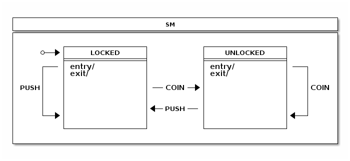

.States
[source,java,indent=0]
----
include::samples/demo/turnstile/Application.java[tags=snippetB]
----

.Events
[source,java,indent=0]
----
include::samples/demo/turnstile/Application.java[tags=snippetC]
----

.Configuration
[source,java,indent=0]
----
include::samples/demo/turnstile/Application.java[tags=snippetA]
----

You can see how this sample state machine interacts with event by
running `turnstile` sample.
[source,text,subs="verbatim,attributes"]
----
$ java -jar spring-statemachine-samples-turnstile-{revnumber}.jar

sm>sm print
+----------------------------------------------------------------+
|                              SM                                |
+----------------------------------------------------------------+
|                                                                |
|         +----------------+          +----------------+         |
|     *-->|     LOCKED     |          |    UNLOCKED    |         |
|         +----------------+          +----------------+         |
|     +---| entry/         |          | entry/         |---+     |
|     |   | exit/          |          | exit/          |   |     |
|     |   |                |          |                |   |     |
| PUSH|   |                |---COIN-->|                |   |COIN |
|     |   |                |          |                |   |     |
|     |   |                |          |                |   |     |
|     |   |                |<--PUSH---|                |   |     |
|     +-->|                |          |                |<--+     |
|         |                |          |                |         |
|         +----------------+          +----------------+         |
|                                                                |
+----------------------------------------------------------------+

sm>sm start
State changed to LOCKED
State machine started

sm>sm event COIN
State changed to UNLOCKED
Event COIN send

sm>sm event PUSH
State changed to LOCKED
Event PUSH send
----

[[statemachine-examples-showcase]]
== Showcase
Showcase is a complex state machine showing all possible transition
topologies up to four levels of state nesting.

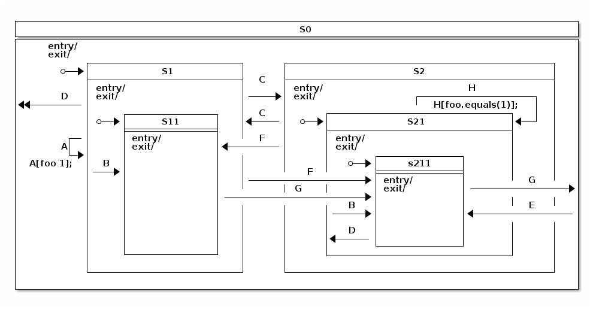

.States
[source,java,indent=0]
----
include::samples/demo/showcase/Application.java[tags=snippetB]
----

.Events
[source,java,indent=0]
----
include::samples/demo/showcase/Application.java[tags=snippetC]
----

.Configuration - states
[source,java,indent=0]
----
include::samples/demo/showcase/Application.java[tags=snippetAA]
----

.Configuration - transitions
[source,java,indent=0]
----
include::samples/demo/showcase/Application.java[tags=snippetAB]
----

.Configuration - actions and guard
[source,java,indent=0]
----
include::samples/demo/showcase/Application.java[tags=snippetAC]
----

.Action
[source,java,indent=0]
----
include::samples/demo/showcase/Application.java[tags=snippetD]
----

.Guard
[source,java,indent=0]
----
include::samples/demo/showcase/Application.java[tags=snippetE]
----

Let's go through what this state machine do when it's executed and we
send various event to it.

[source,text]
----
sm>sm start
Init foo to 0
Entry state S0
Entry state S1
Entry state S11
State machine started

sm>sm event A
Event A send

sm>sm event C
Exit state S11
Exit state S1
Entry state S2
Entry state S21
Entry state S211
Event C send

sm>sm event H
Switch foo to 1
Internal transition source=S0
Event H send

sm>sm event C
Exit state S211
Exit state S21
Exit state S2
Entry state S1
Entry state S11
Event C send

sm>sm event A
Exit state S11
Exit state S1
Entry state S1
Entry state S11
Event A send
----

What happens in above sample:

* State machine is started which takes it to its initial state _S11_
  via superstates _S1_ and _S0_. Also extended state variable `foo` is
  init to `0`.
* We try to execute self transition in state _S1_ with event _A_ but
  nothing happens because transition is guarded by variable `foo` to
  be `1`.
* We send event _C_ which takes us to other state machine where
  initial state _S211_ and its superstates are entered. In there we
  can use event _H_ which does a simple internal transition to flip
  variable `foo`. Then we simply go back using event _C_.
* Event _A_ is sent again and now _S1_ does a self transition because
  guard evaluates true.

Let's take closer look of how hierarchical states and their event
handling works with a below example.

[source,text]
----
sm>sm variables
No variables

sm>sm start
Init foo to 0
Entry state S0
Entry state S1
Entry state S11
State machine started

sm>sm variables
foo=0

sm>sm event H
Internal transition source=S1
Event H send

sm>sm variables
foo=0

sm>sm event C
Exit state S11
Exit state S1
Entry state S2
Entry state S21
Entry state S211
Event C send

sm>sm variables
foo=0

sm>sm event H
Switch foo to 1
Internal transition source=S0
Event H send

sm>sm variables
foo=1

sm>sm event H
Switch foo to 0
Internal transition source=S2
Event H send

sm>sm variables
foo=0
----

What happens in above sample:

* We print extended state variables in various stages.
* With event _H_ we end up executing internal transition
  which is logged with source state.
* It's also worth to pay attention to how event _H_ is handled in
  different states _S0_, _S1_ and _S2_. This is a good example of how
  hierarchical states and their event handling works. If state _S2_ is
  unable to handle event _H_ due to guard condition, its parent is
  checked next. This guarantees that while on state _S2_, `foo` flag
  is always flipped around. However in state _S1_ event _H_ always
  match to its dummy transition without guard or action, not never
  happens.

[[statemachine-examples-cdplayer]]
== CD Player
CD Player is a sample which resembles better use case of most of use have
used in a real world. CD Player itself is a really simple entity where
user can open a deck, insert or change a disk, then drive player
functionality by pressing various buttons like _eject_, _play_,
_stop_, _pause_, _rewind_ and _backward_.

How many of us have really given a thought of what it will take to
make a code for a CD Player which interacts with a hardware. Yes,
concept of a player is overly simple but if you look behind the scenes
things actually get a bit convoluted.

You've probably noticed that if your deck is open and you press play,
deck will close and a song will start to play if CD was inserted in
a first place. In a sense when deck is open you first need to close
it and then try to start playing if cd is actually inserted. Hopefully
you have now realised that a simple CD Player is not anymore so simple.
Sure you can wrap all this with a simple class with few boolean variables
and probably few nested if/else clauses, that will do the job, but what
about if you need to make all this behaviour much more complex, do you
really want to keep adding more flags and if/else clauses.

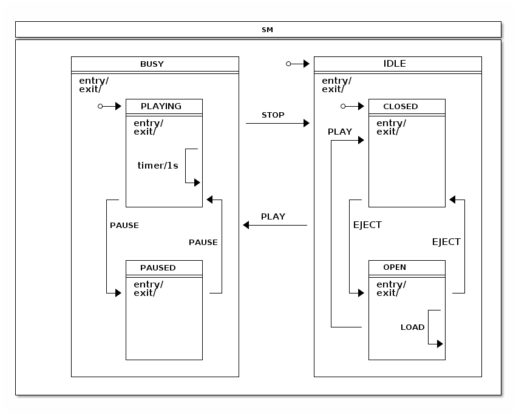

Let's go through how this sample and its state machine is designed and
how those two interacts with each other. Below three config sections
are used withing a _EnumStateMachineConfigurerAdapter_.

[source,java,indent=0]
----
include::samples/demo/cdplayer/Application.java[tags=snippetAA]
----

[source,java,indent=0]
----
include::samples/demo/cdplayer/Application.java[tags=snippetAB]
----

[source,java,indent=0]
----
include::samples/demo/cdplayer/Application.java[tags=snippetAC]
----

What we did in above configuration:

* We used EnumStateMachineConfigurerAdapter to configure states and
  transitions.
* States _CLOSED_ and _OPEN_ are defined as substates of _IDLE_,
  states _PLAYING_ and _PAUSED_ are defined as substates of _BUSY_.
* With state _CLOSED_ we added entry action as bean
  _closedEntryAction_.
* With transition we mostly mapped events to expected state
  transitions like _EJECT_ closing and opening a deck, _PLAY_, _STOP_
  and _PAUSE_ doing their natural transitions. Few words to mention
  what we did for other transitions.
** With source state _PLAYING_ we added a timer trigger which is
needed to automatically track elapsed time within a playing track and
to have facility to make a decision when to switch to next track.
** With event _PLAY_ if source state is _IDLE_ and target state is
  _BUSY_ we defined action _playAction_ and guard _playGuard_.
** With event _LOAD_ and state _OPEN_ we defined internal
transition with action _loadAction_ which will insert cd disc into
extended state variables.
** _PLAYING_ state defined three internal transitions where one is
triggered by a timer executing a _playingAction_ which updates
extended state variables. Other two transitions are with _trackAction_
with different events, _BACK_ and _FORWARD_ respectively which handles
when user wants to go back or forward in tracks.

This machine only have six states which are introduced as an enum.
[source,java,indent=0]
----
include::samples/demo/cdplayer/Application.java[tags=snippetB]
----

Events represent, in a sense in this example, what buttons user would
press and if user loads a cd disc into a deck.
[source,java,indent=0]
----
include::samples/demo/cdplayer/Application.java[tags=snippetC]
----

Beans _cdPlayer_ and _library_ are just used with a sample to drive
the application.
[source,java,indent=0]
----
include::samples/demo/cdplayer/Application.java[tags=snippetD]
----

We can define extended state variable key as simple enums.
[source,java,indent=0]
----
include::samples/demo/cdplayer/Application.java[tags=snippetE]
----

We wanted to make this samply type safe so we're defining our own
annotation _@StatesOnTransition_ which have a mandatory meta
annotation _@OnTransition_.
[source,java,indent=0]
----
include::samples/demo/cdplayer/Application.java[tags=snippetF]
----

_ClosedEntryAction_ is a entry action for state _CLOSED_ to simply
send and _PLAY_ event to a statemachine if cd disc is present.
[source,java,indent=0]
----
include::samples/demo/cdplayer/Application.java[tags=snippetG]
----

_LoadAction_ is simply updating extended state variable if event
headers contained information about a cd disc to load.
[source,java,indent=0]
----
include::samples/demo/cdplayer/Application.java[tags=snippetH]
----

_PlayAction_ is simply resetting player elapsed time which is kept as
an extended state variable.
[source,java,indent=0]
----
include::samples/demo/cdplayer/Application.java[tags=snippetI]
----

_PlayGuard_ is used to guard transition from _IDLE_ to _BUSY_ with
event _PLAY_ if extended state variable _CD_ doesn't indicate that cd
disc has been loaded.
[source,java,indent=0]
----
include::samples/demo/cdplayer/Application.java[tags=snippetJ]
----

_PlayingAction_ is updating extended state variable _ELAPSEDTIME_ which
cd player itself can read and update lcd status. Action also handles
track shift if user is going back or forward in tracks.
[source,java,indent=0]
----
include::samples/demo/cdplayer/Application.java[tags=snippetK]
----

_TrackAction_ handles track shift action if user is going back or forward
in tracks. If it is a last track of a cd, playing is stopped and _STOP_
event sent to a state machine.
[source,java,indent=0]
----
include::samples/demo/cdplayer/Application.java[tags=snippetL]
----

One other important aspect of a state machines is that they have their
own responsibilities mostly around handling states and all application
level logic should be kept outside. This means that application needs
to have a ways to interact with a state machine and below sample is
how cdplayer does it order to update lcd status. Also pay attention
that we annotated _CdPlayer_ with _@WithStateMachine_ which instructs
state machine to find methods from your pojo which are then called
with various transitions.

[source,java,indent=0]
----
include::samples/demo/cdplayer/CdPlayer.java[tags=snippetA]
----

In above example we use _@OnTransition_ annotation to hook a callback
when transition happens with a target state _BUSY_.

[source,java,indent=0]
----
include::samples/demo/cdplayer/CdPlayer.java[tags=snippetB]
----

_@OnTransition_ we used above can only be used with strings which are
matched from enums. _@StatesOnTransition_ is then something what user
can create into his own application to get a type safe annotation where
a real enums can be used.

Let's see an example how this state machine actually works.

[source,text]
----
sm>sm start
Entry state IDLE
Entry state CLOSED
State machine started

sm>cd lcd
No CD

sm>cd library
0: Greatest Hits
  0: Bohemian Rhapsody  05:56
  1: Another One Bites the Dust  03:36
1: Greatest Hits II
  0: A Kind of Magic  04:22
  1: Under Pressure  04:08

sm>cd eject
Exit state CLOSED
Entry state OPEN

sm>cd load 0
Loading cd Greatest Hits

sm>cd play
Exit state OPEN
Entry state CLOSED
Exit state CLOSED
Exit state IDLE
Entry state BUSY
Entry state PLAYING

sm>cd lcd
Greatest Hits Bohemian Rhapsody 00:03

sm>cd forward

sm>cd lcd
Greatest Hits Another One Bites the Dust 00:04

sm>cd stop
Exit state PLAYING
Exit state BUSY
Entry state IDLE
Entry state CLOSED

sm>cd lcd
Greatest Hits
----

What happened in above run:

* State machine is started which causes machine to get initialized.
* CD Player lcd screen status is printed.
* CD Library is printed.
* CD Player deck is opened.
* CD with index 0 is loaded into a deck.
* Play is causing deck to get closed and immediate playing because cd
  was inserted.
* We print lcd status and request next track.
* We stop playing.

[[statemachine-examples-tasks]]
== Tasks

Tasks is a sample demonstrating a parallel task handling within a
regions and additionally adds an error handling to either
automatically or manually fixing task problems before continuing back
to a state where tasks can be run again.

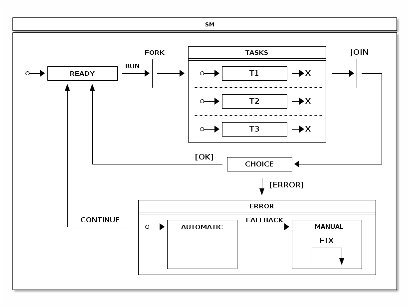

On a high level what happens in this state machine is:

* We're always trying to get into READY state so that we can use event
  RUN to execute tasks.
* TASKS state which is composed with 3 independent regions has been
  put in a middle of FORK and JOIN states which will cause regions to
  go into its initial states and to be joined by end states.
* From JOIN state we go automatically into a CHOICE state which checks
  existence of error flags in extended state variables. Tasks can set
  these flags and it gives CHOICE state a possibility to go into ERROR
  state where errors can be handled either automatically or manually.
* AUTOMATIC state in ERROR can try to automatically fix error and goes
  back to READY if it succeed to do so. If error is something what
  can't be handled automatically, user intervention is needed and
  machine is put into MANUAL state via FALLBACK event.

.States
[source,java,indent=0]
----
include::samples/demo/tasks/Application.java[tags=snippetB]
----

.Events
[source,java,indent=0]
----
include::samples/demo/tasks/Application.java[tags=snippetC]
----

.Configuration - states
[source,java,indent=0]
----
include::samples/demo/tasks/Application.java[tags=snippetAA]
----

.Configuration - transitions
[source,java,indent=0]
----
include::samples/demo/tasks/Application.java[tags=snippetAB]
----

Guard below is guarding choice entry into a ERROR state and needs to
return TRUE if error has happened. For this guard simply checks that
all extended state variables(T1, T2 and T3) are TRUE.

[source,java,indent=0]
----
include::samples/demo/tasks/Application.java[tags=snippetAC]
----

Actions below will simply send event to a state machine to request
next step which would be either fallback or continue back to ready.

[source,java,indent=0]
----
include::samples/demo/tasks/Application.java[tags=snippetAD]
----

Currently default region execution is synchronous but it can be
changed to asynchronous by changing `TaskExecutor`. Task will simulate
work by sleeping 2 seconds so you'll able to see how actions in
regions are executed parallel.

[source,java,indent=0]
----
include::samples/demo/tasks/Application.java[tags=snippetAE]
----

Let's see an examples how this state machine actually works.

[source,text]
----
sm>sm start
State machine started
Entry state READY

sm>tasks run
Entry state TASKS
run task on T3
run task on T2
run task on T1
run task on T2 done
run task on T1 done
run task on T3 done
Entry state T2
Entry state T3
Entry state T1
Entry state T1E
Entry state T2E
Entry state T3E
Exit state TASKS
Entry state JOIN
Exit state JOIN
Entry state READY
----

In above we can execute tasks multiple times.

[source,text]
----
sm>tasks list
Tasks {T1=true, T3=true, T2=true}

sm>tasks fail T1

sm>tasks list
Tasks {T1=false, T3=true, T2=true}

sm>tasks run
Entry state TASKS
run task on T1
run task on T3
run task on T2
run task on T1 done
run task on T3 done
run task on T2 done
Entry state T1
Entry state T3
Entry state T2
Entry state T1E
Entry state T2E
Entry state T3E
Exit state TASKS
Entry state JOIN
Exit state JOIN
Entry state ERROR
Entry state AUTOMATIC
Exit state AUTOMATIC
Exit state ERROR
Entry state READY
----

In above, if we simulate failure for task T1, it is fixed
automatically.

[source,text]
----
sm>tasks list
Tasks {T1=true, T3=true, T2=true}

sm>tasks fail T2

sm>tasks run
Entry state TASKS
run task on T2
run task on T1
run task on T3
run task on T2 done
run task on T1 done
run task on T3 done
Entry state T2
Entry state T1
Entry state T3
Entry state T1E
Entry state T2E
Entry state T3E
Exit state TASKS
Entry state JOIN
Exit state JOIN
Entry state ERROR
Entry state AUTOMATIC
Exit state AUTOMATIC
Entry state MANUAL

sm>tasks fix
Exit state MANUAL
Exit state ERROR
Entry state READY
----

In above if we simulate failure for either task T2 or T3, state
machine goes to MANUAL state where problem needs to be fixed manually
before we're able to go back to READY state.

[[statemachine-examples-washer]]
== Washer

Washer is a sample demonstrating a use of a history state to recover a
running state configuration with a simulated power off situation.

Anyone ever used a washing machine knows that if you can somehow pause
the program it will continue from a same state when lid is closed.
This kind of behaviour can be implemented in a state machine by using
a history pseudo state.

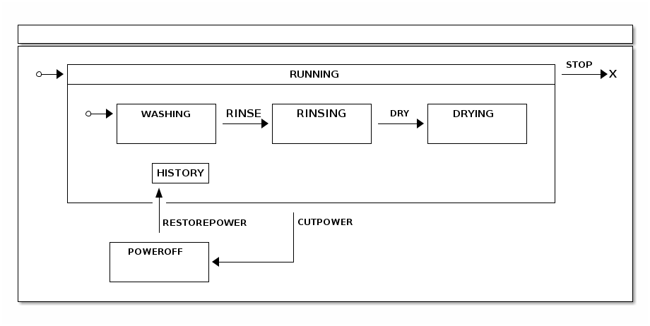

.States
[source,java,indent=0]
----
include::samples/demo/washer/Application.java[tags=snippetB]
----

.Events
[source,java,indent=0]
----
include::samples/demo/washer/Application.java[tags=snippetC]
----

.Configuration - states
[source,java,indent=0]
----
include::samples/demo/washer/Application.java[tags=snippetAA]
----

.Configuration - transitions
[source,java,indent=0]
----
include::samples/demo/washer/Application.java[tags=snippetAB]
----

Let's see an example how this state machine actually works.
[source,text]
----
sm>sm start
Entry state RUNNING
Entry state WASHING
State machine started

sm>sm event RINSE
Exit state WASHING
Entry state RINSING
Event RINSE send

sm>sm event DRY
Exit state RINSING
Entry state DRYING
Event DRY send

sm>sm event CUTPOWER
Exit state DRYING
Exit state RUNNING
Entry state POWEROFF
Event CUTPOWER send

sm>sm event RESTOREPOWER
Exit state POWEROFF
Entry state RUNNING
Entry state WASHING
Entry state DRYING
Event RESTOREPOWER send
----

What happened in above run:

* State machine is started which causes machine to get initialized.
* We go to RINSING state.
* We go to DRYING state.
* We cut power and go to POWEROFF state.
* State is restored via HISTORY state which takes state machine back
  to its previous known state.

[[statemachine-examples-persist]]
== Persist
Persist is a sample using recipe <<statemachine-recipes-persist>> to
demonstrate how a database entry update logic can be controlled by a
state machine.

The state machine logic and configuration is shown above:

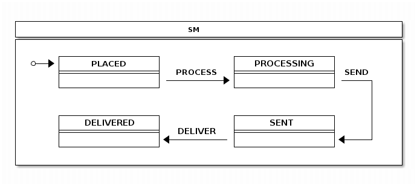

.StateMachine Config
[source,java,indent=0]
----
include::samples/demo/persist/Application.java[tags=snippetA]
----

`PersistStateMachineHandler` can be created using a below config:

.Handler Config
[source,java,indent=0]
----
include::samples/demo/persist/Application.java[tags=snippetB]
----

Order class used with this sample is shown below:

.Order Class
[source,java,indent=0]
----
include::samples/demo/persist/Application.java[tags=snippetC]
----

Now let's see how this example works.

[source,text]
----
sm>persist db
Order [id=1, state=PLACED]
Order [id=2, state=PROCESSING]
Order [id=3, state=SENT]
Order [id=4, state=DELIVERED]

sm>persist process 1
Exit state PLACED
Entry state PROCESSING

sm>persist db
Order [id=2, state=PROCESSING]
Order [id=3, state=SENT]
Order [id=4, state=DELIVERED]
Order [id=1, state=PROCESSING]

sm>persist deliver 3
Exit state SENT
Entry state DELIVERED

sm>persist db
Order [id=2, state=PROCESSING]
Order [id=4, state=DELIVERED]
Order [id=1, state=PROCESSING]
Order [id=3, state=DELIVERED]
----

What happened in above run:

* We listed rows from an existing embedded database which is already
  populated with sample data. 
* We request to update order `1` into `PROCESSING` state.
* We list db entries again and see that state has been changed from
  `PLACED` into a `PROCESSING`.
* We do update for order `3` to update state from `SENT` into
  `DELIVERED`.

[NOTE]
====
If you're wondering where is the database because there are literally no
signs of it in a sample code. Sample is based on Spring Boot and
because necessary classes are in a classpath, embedded `HSQL` instance
is created automatically.

Spring Boot will even create an instance of `JdbcTemplate` which you
can just autowire like how it's done in `Persist.java`.

[source,java,indent=0]
----
include::samples/demo/persist/Persist.java[tags=snippetA]
----
====

Finally we need to handle state changes:

[source,java,indent=0]
----
include::samples/demo/persist/Persist.java[tags=snippetB]
----

And use a `PersistStateChangeListener` to update database:

[source,java,indent=0]
----
include::samples/demo/persist/Persist.java[tags=snippetC]
----

[[statemachine-examples-zookeeper]]
== Zookeeper
Zookeeper is a distributed version from sample
<<statemachine-examples-turnstile>>.

[NOTE]
====
This sample needs and external `Zookeeper` instance accessible from
`localhost` with default port and settings.
====

Configuration of this sample is almost same as `turnstile` sample. We
only add configuration for distributed state machine where we
configure `StateMachineEnsemble`.

[source,java,indent=0]
----
include::samples/demo/zookeeper/Application.java[tags=snippetA]
----

Actual `StateMachineEnsemble` needs to be created as bean together
with `CuratorFramework` client.

[source,java,indent=0]
----
include::samples/demo/zookeeper/Application.java[tags=snippetB]
----

Let's go through a simple example where two different shell instances are
started with command

[source,text,subs="attributes"]
----
@n1:~# java -jar spring-statemachine-samples-zookeeper-{revnumber}.jar
----

First open first shell instance(do not start second instance yet).
When state machine is started it will end up into its initial state
`LOCKED`. Then send event `COIN` to transit into `UNLOCKED` state.

.Shell1
[source,text]
----
sm>sm start
Entry state LOCKED
State machine started

sm>sm event COIN
Exit state LOCKED
Entry state UNLOCKED
Event COIN send

sm>sm state
UNLOCKED
----

Open second shell instance and start a state machine. You should see
that distributed state `UNLOCKED` is entered instead of default
initial state `LOCKED`.

.Shell2
[source,text]
----
sm>sm start
State machine started

sm>sm state
UNLOCKED
----

Then from either of a shells(we use second instance here) send event
`PUSH` to transit from `UNLOCKED` into `LOCKED` state.

.Shell2
[source,text]
----
sm>sm event PUSH
Exit state UNLOCKED
Entry state LOCKED
Event PUSH send
----

In other shell you should see state getting changed automatically
based on distributed state kept in Zookeeper.

.Shell1
[source,text]
----
sm>Exit state UNLOCKED
Entry state LOCKED
----

[[statemachine-examples-web]]
== Web
Web is a distributed state machine example using a zookeeper to handle
distributed state. This example is meant to be run on a multiple
browser sessions against a multiple different hosts.

This sample is using a modified state machine structure from a
<<statemachine-examples-showcase>> to work with a distributed state
machine. The state machine logic is shown above:

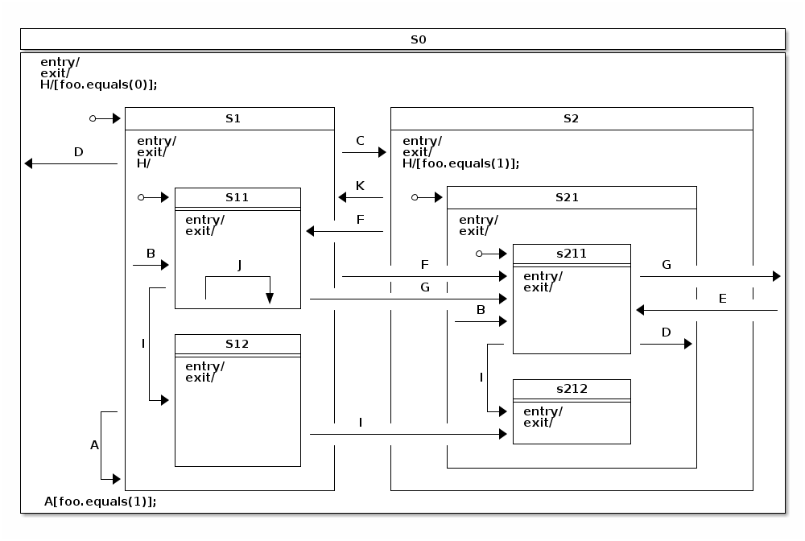

[NOTE]
====
Due to nature of this sample an instance of a `Zookeeper` is expected to
be available from a localhost for every individual sample instance.
====

Let's go through a simple example where three different sample instances are
started.  If you are running different instances on a same host you need to
distinguish used port by adding `--server.port=<myport>` to the command.
Otherwise default port for each host will be `8080`.

In this sample run we have three hosts, `n1`, `n2` and `n3` which all
have a local zookeeper instance running and a state machine sample running
on a port `8080`.

[source,text,subs="attributes"]
----
@n1:~# java -jar spring-statemachine-samples-web-{revnumber}.jar
@n2:~# java -jar spring-statemachine-samples-web-{revnumber}.jar
@n3:~# java -jar spring-statemachine-samples-web-{revnumber}.jar
----

When all instances are running you should see all showing similar
information via a browser where states are `S0`, `S1` and `S11`,
and extended state variable `foo=0`. Main state is `S11`.

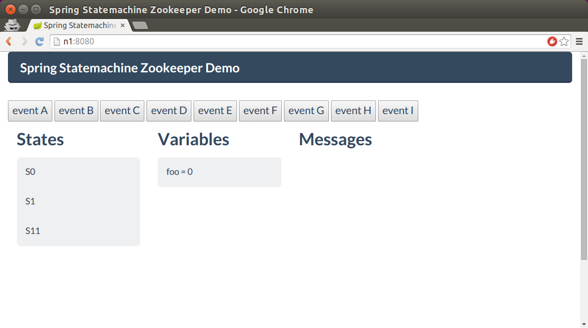

When you press button `Event C` in any of a browser window,
distributed state is changed to `S211` which is the target state
denoted by transition associated with an event `C`.

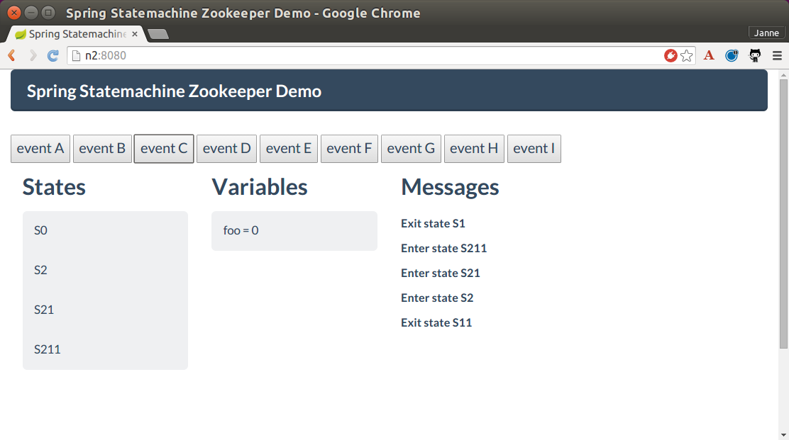

Then let's press button `Event H` and what is supposed to happen is
that internal transition is executed on all state machines changing
extended state variable `foo` from value `0` to `1`. This change is
first done on a state machine receiving the event and then propagated
to other state machines. You should only see variable `foo` to change
from `0` to `1`.

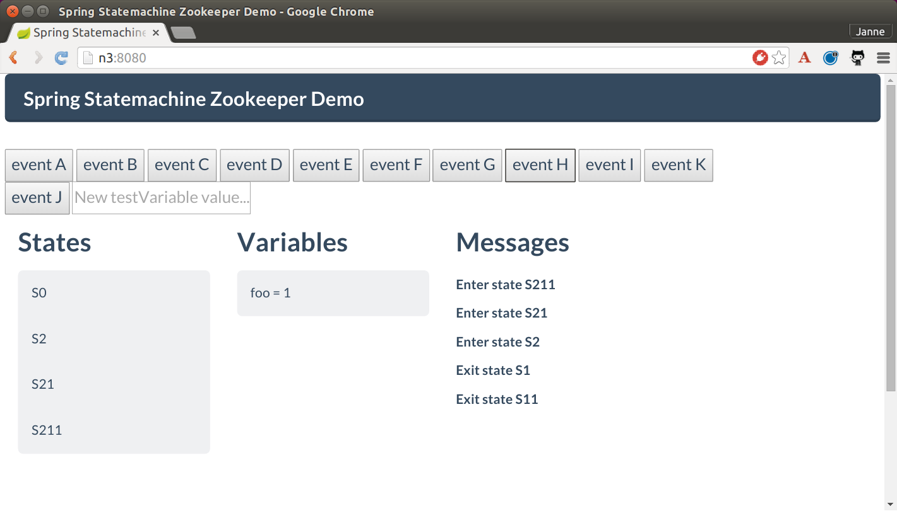

Last we simply send an event `Event K` which is supposed to take state
machine state back to state `S11` and you should see this happening in
all browser sessions.

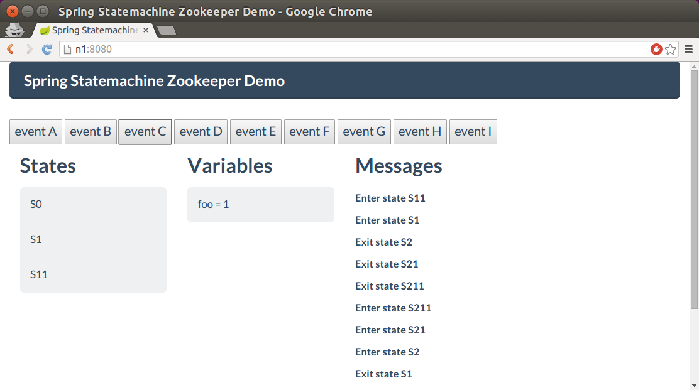

[[statemachine-examples-scope]]
== Scope
Scope is a state machine example using a session scope to provide
individual instance for every user.

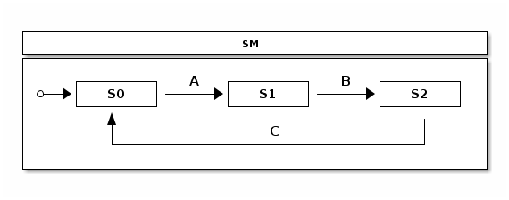

This is a simple state machine having states `S0`, `S1` and `S2`.
Transitions between those are controlled via events `A`, `B` and `C`
as shown in a state chart.

[source,text,subs="attributes"]
----
@n1:~# java -jar spring-statemachine-samples-scope-{revnumber}.jar
----

When instance is running you can open a browser and play with a state
machine. If you open same page using a different browser, i.e one in
_Chrome_ and one in _Firefox_, you should get a new state machine
instance per user session.

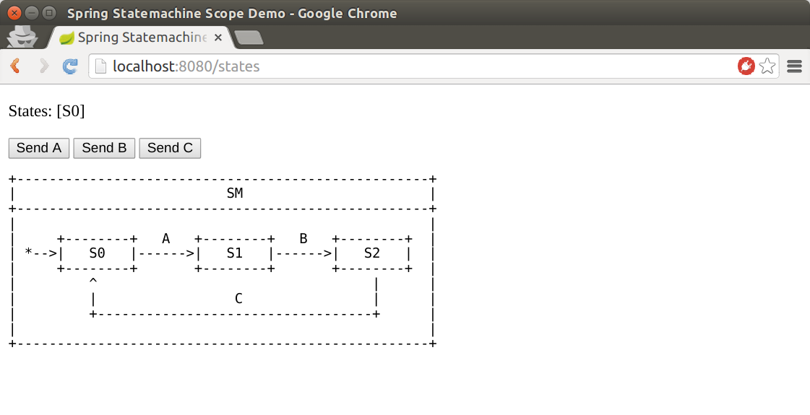

[[statemachine-examples-security]]
== Security
Security is a state machine example using most of a compinations of
securing a state machine. It is securing sending events, transitions
and actions.

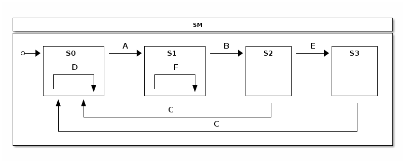

[source,text,subs="attributes"]
----
@n1:~# java -jar spring-statemachine-samples-secure-{revnumber}.jar
----

We secure event sending with a users having a role `USER`. None of
a other users imposed by a _Spring Security_ can't send events into a
state machine.

[source,java,indent=0]
----
include::samples/demo/security/StateMachineConfig.java[tags=snippetA]
----

In this sample we define two users, _user_ having a role `USER` and
_admin_ having both roles `USER` and `ADMIN`. Authentication for both
user for password is `password`.

[source,java,indent=0]
----
include::samples/demo/security/StateMachineConfig.java[tags=snippetE]
----

We define various transitions between states according to a statechart
seen above. Only a user with active `ADMIN` role can execute
external transitions between `S2` and `S3`. Similarly `ADMIN` can only
execute internal transition in a state `S1`.

[source,java,indent=0]
----
include::samples/demo/security/StateMachineConfig.java[tags=snippetB]
----

`Action` `adminAction` is secured with a role `ADMIN`.

[source,java,indent=0]
----
include::samples/demo/security/StateMachineConfig.java[tags=snippetC]
----

Below `Action` would only be executed with internal transition in a
state `S1` when event `F` is send. Transition itself is secured with a
role `ADMIN` so this transition will not be executed if current user
does not hate that role.

[source,java,indent=0]
----
include::samples/demo/security/StateMachineConfig.java[tags=snippetD]
----

[[statemachine-examples-eventservice]]
== Event Service
Event Service is an example how state machine concepts can be used as
a processing engine for events. Sample was born out from a question:

[NOTE]
====
Can Spring Statemachine be used as a microservice to feed events to it
with millions different state machine instances.
====

In this example we will use a `Redis` to persist a state machine
instances.

Obviously a million state machine instances in a jvm would be
a relatively bad idea due to memory constraints. This simply leads to
other available features from a Spring Statemachine to persist a
`StateMachineContext` and re-use existing instances.

We assume few things like there is a shopping application which is
sending different types of `PageView` events into a separate
microservice which is then tracking user behaviour using a state
machine. State model is shown below which simply have few states
representing user navigating on product items list, add and remote
items from a cart and going to a payment page and initiating a pay
operation. Actual shopping application would send these events into
this service for example using a simple rest calls. More about this
later.

[NOTE]
====
Remember that focus here is to have an application which is exposing a
`REST` api user can use to send events which would be processed by a
state machine per request.
====

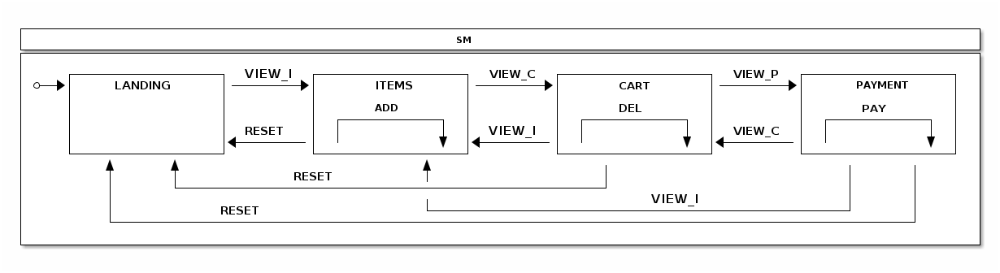

In below state machine configuration we simply model what we have in a
state chart. Various actions are updating state machine `Extended
State` to track number of entry's into various states and also how
many times internal transition for `ADD` and `DEL` are called and if
`PAY` has been executed. Don't focus on `stateMachineTarget` or
`@Scope` for now, as we'll explain those in a bit.

[source,java,indent=0]
----
include::samples/demo/eventservice/StateMachineConfig.java[tags=snippetC]
----

In below config we setup a `RedisConnectionFactory` which defaults to
localhost and default port. We use `StateMachinePersist` with a
`RepositoryStateMachinePersist` implementation. Finally we create a
`RedisStateMachinePersister` which underneath uses a previously
created `StateMachinePersist` bean.

These are then used in a `Controller` handling `REST` calls.

[source,java,indent=0]
----
include::samples/demo/eventservice/StateMachineConfig.java[tags=snippetD]
----

We now get into why `StateMachine` was created as `stateMachineTarget`
and a `prototype` bean. State machine instantiation is a relatively
expensive operation so it is better to try to pool instances instead
of instantiating a new instance with every request. For this we first
create a `poolTargetSource` which wraps `stateMachineTarget` and pools
it with max size of 3. This `poolTargetSource` is then proxied with
`ProxyFactoryBean` using a `request` scope. Effectively this means
that every `REST` request will get pooled state machine instance from
a bean factory. It's shown later how these are used.

[source,java,indent=0]
----
include::samples/demo/eventservice/StateMachineConfig.java[tags=snippetA]
----

[source,java,indent=0]
----
include::samples/demo/eventservice/StateMachineConfig.java[tags=snippetB]
----

Lets get into actual demo. You need to have a redis running on a
localhost with a default settings. Then run the boot based sample
application:

[source,text,subs="attributes"]
----
@n1:~# java -jar spring-statemachine-samples-eventservice-{revnumber}.jar
----

In a browser you see something like:

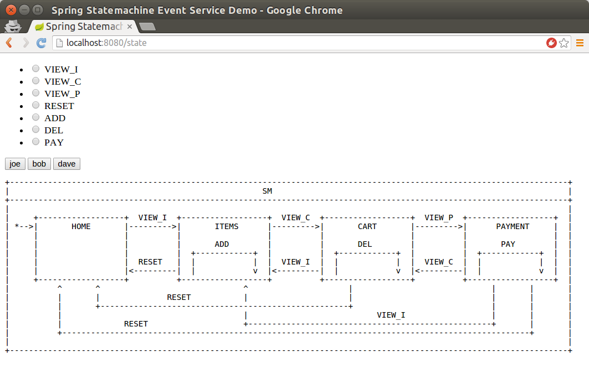

In this UI you have three users you can use, `joe`, `bob` and `dave`.
Clicking button will show current state and extended state. Enabling a
radio button before clicking users will send particular event for that
user. This is a way you can play with this using an UI.

In our `StateMachineController` we autowire `StateMachine` and
`StateMachinePersist`. `StateMachine` is a `request` scoped so you'll
get new instance per request while `StateMachinePersist` is normal
singleton bean.

[source,java,indent=0]
----
include::samples/demo/eventservice/StateMachineController.java[tags=snippetA]
----

Below `feedAndGetState` is just used with an UI to do same things what
actual `REST` api will do.

[source,java,indent=0]
----
include::samples/demo/eventservice/StateMachineController.java[tags=snippetB]
----

Below `feedPageview` is a `REST` method which accepts a post with a
json content.

[source,java,indent=0]
----
include::samples/demo/eventservice/StateMachineController.java[tags=snippetC]
----

Below `feedMachine` will send event into a `StateMachine` and persists
its state using a `StateMachinePersister`.

[source,java,indent=0]
----
include::samples/demo/eventservice/StateMachineController.java[tags=snippetD]
----

Below `resetStateMachineFromStore` is used to restore a state machine
for a particular user.

[source,java,indent=0]
----
include::samples/demo/eventservice/StateMachineController.java[tags=snippetE]
----

As you'd send event using UI, same can be done using a `REST` calls:

[source,text]
----
# curl http://localhost:8080/feed -H "Content-Type: application/json" --data '{"user":"joe","id":"VIEW_I"}'
----

At this point you should have a content in `Redis` with a
`testprefix:joe` key.

[source,text]
----
$ ./redis-cli
127.0.0.1:6379> KEYS *
1) "testprefix:joe"
----

Below is a three images when state for `joe` has been changed from
`HOME` to `ITEMS` and when `ADD` action has been executed.

Send evend `ADD`:

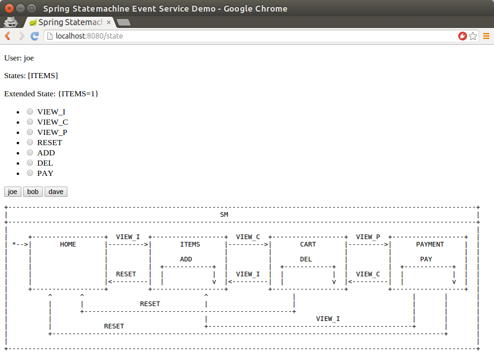

Now your are still on state `ITEMS` and internal transition caused
extended state variable `COUNT` to increase to `1`.

Execute below `curl` rest call few times or do it via UI and you
should see `COUNT` variable to increase with every call.

[source,text]
----
# curl http://localhost:8080/feed -H "Content-Type: application/json" # --data '{"user":"joe","id":"ADD"}'
----

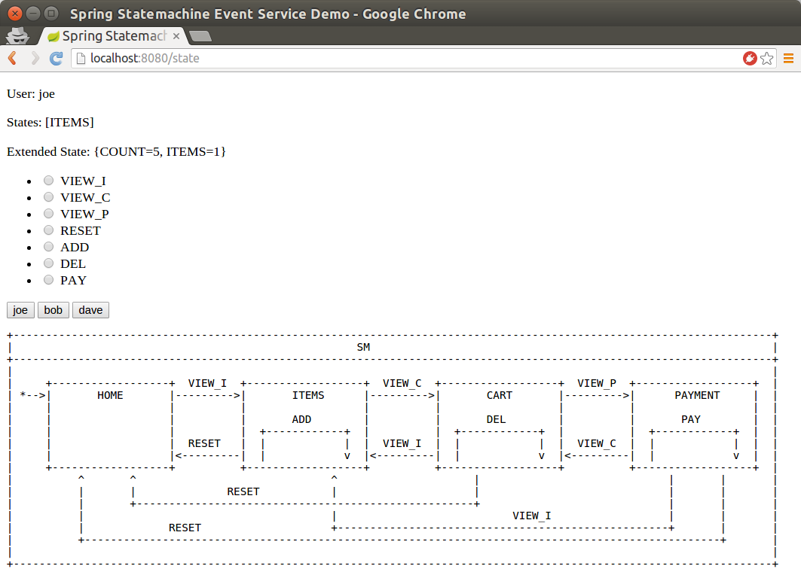

[[statemachine-examples-deploy]]
== Deploy
Deploy is an example how state machine concepts can be used with an
uml modeling to provide a generic error handling state. This state
machine is a relatively complex example of how various features can be
used to provide a centralized error handling concept.

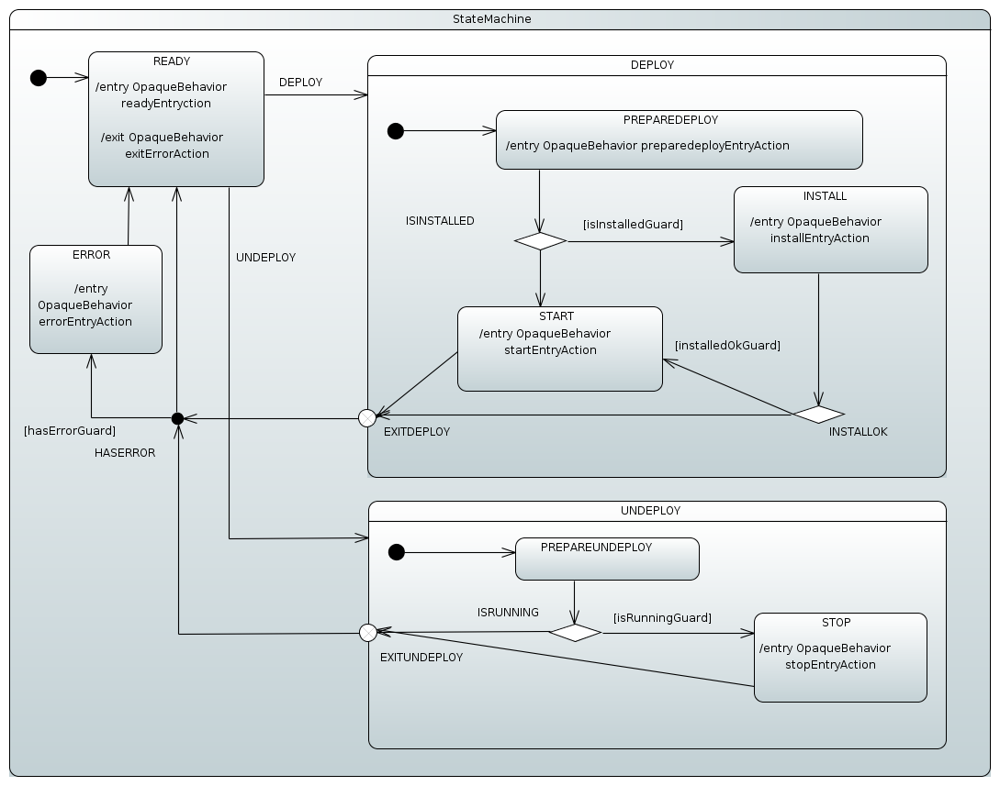

[NOTE]
====
Above statechart is designed using _Eclipse Papyrus Plugin_
<<sm-papyrus>> and imported into _Spring StateMachine_ via its uml
model file. _Actions_ and _Guards_ defined in a model are resolved
from a _Spring Application Context_.
====

In this state machice scenario we have two different behaviors,
`DEPLOY` and `UNDEPLOY` what user tries to execute.

What is happening a above statechart:

* In `DEPLOY` state `INSTALL` and `START` states are entered
  conditionally. We enter `START` directly if product is already
  installed and no need to try to `START` if install fails.
* In `UNDEPLOY` state we enter `STOP` conditionally if application is
  already running.
* Conditional choices for `DEPLOY` and `UNDEPLOY` are done via
  _Choice_ pseudostate within those states and choices are selected
  by _Guards_.
* We used _Exit Point_ pseudostates to have more controlled exit from
  `DEPLOY` and `UNDEPLOY` states.
* After exit from `DEPLOY` and `UNDEPLOY` we go through a _Junction_
  pseudostate to make a choice if we want to go though `ERROR` state
  in case error was added into an _Extended State_.
* Finally we go back to `READY` state to process new requests.

Lets get into actual demo. Run the boot based sample application:

[source,text,subs="attributes"]
----
# java -jar spring-statemachine-samples-deploy-{revnumber}.jar
----

In a browser you see something like:

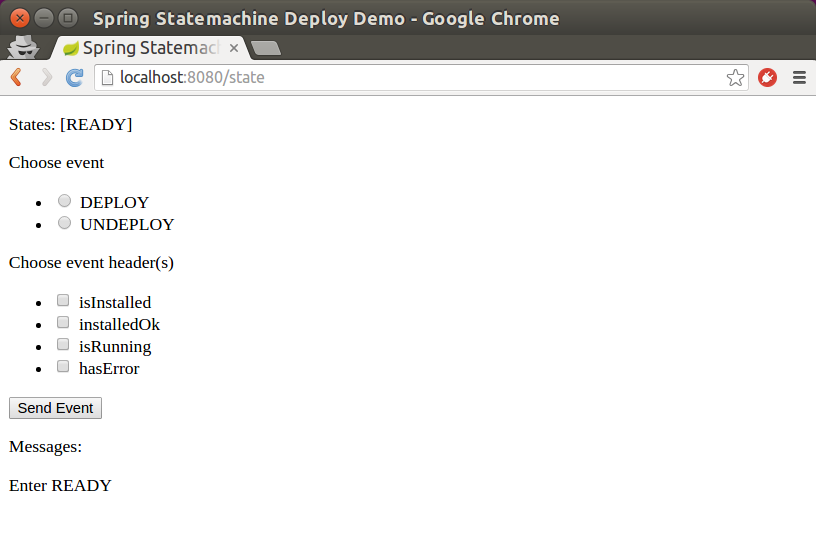

[IMPORTANT]
====
As we don't have a real _install_, _start_ or _stop_ functionality we
simulate failures by checking existence of particular message headers.
====

Now you can start to send event to a machine and choose various
message headers which will drive a different functionality.

[[statemachine-examples-ordershipping]]
== Order Shipping
Order Shipping is an example how state machine concepts can be used
with a process of building a simple order processing system.

Below you can see a statechart driving this order shipping sample.

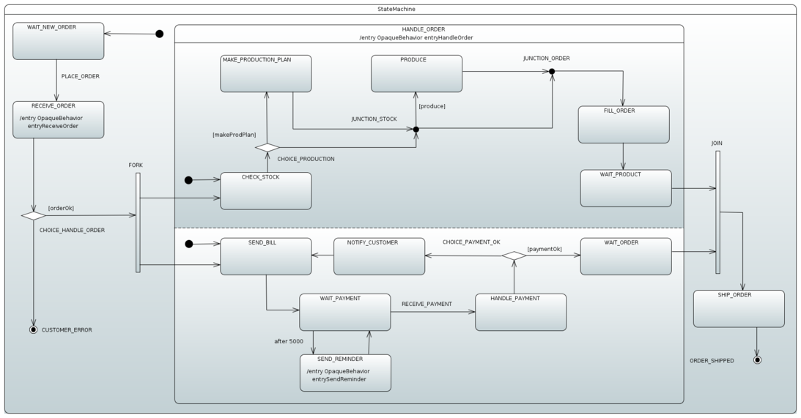

What is happening a above statechart:

* Machine enters `WAIT_NEW_ORDER` default state.
* Event `PLACE_ORDER` transitions into state `RECEIVE_ORDER` and entry
  action `entryReceiveOrder` is executed.
* If order is _OK_ machine goes into two regions one handling order
  production and one handling user level payment, else machine goes
  into `CUSTOMER_ERROR` final state.
* Machine will loop in a lower region to remind user of a payment
  until `RECEIVE_PAYMENT` is sent successfully to indidate correct
  payment.
* Both regions will go into waiting states `WAIT_PRODUCT` and
  `WAIT_ORDER` to be joined before parent orthogonal state
  `HANDLE_ORDER` is exited.
* Finally machine goes via `SHIP_ORDER` into its final state
  `ORDER_SHIPPED`.

Lets get into actual demo. Run the boot based sample application:

[source,text,subs="attributes"]
----
# java -jar spring-statemachine-samples-ordershipping-{revnumber}.jar
----

In a browser you see something shown above. You can start by choosing
customer and order and create a machine.

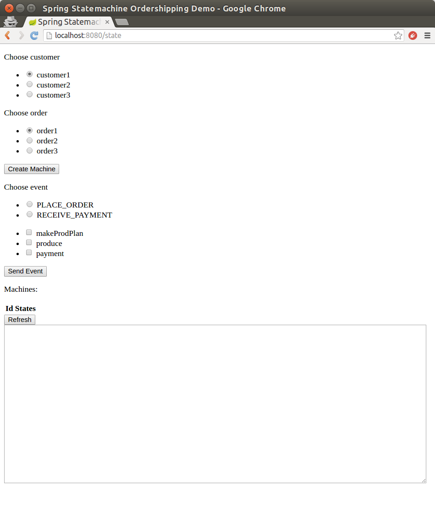

Machine for particular order is now created and you can start to play
with placing an order and sending a payment. Other settings like
_makeProdPlan_, _produce_ and _payment_ allows you to control how
machine works.

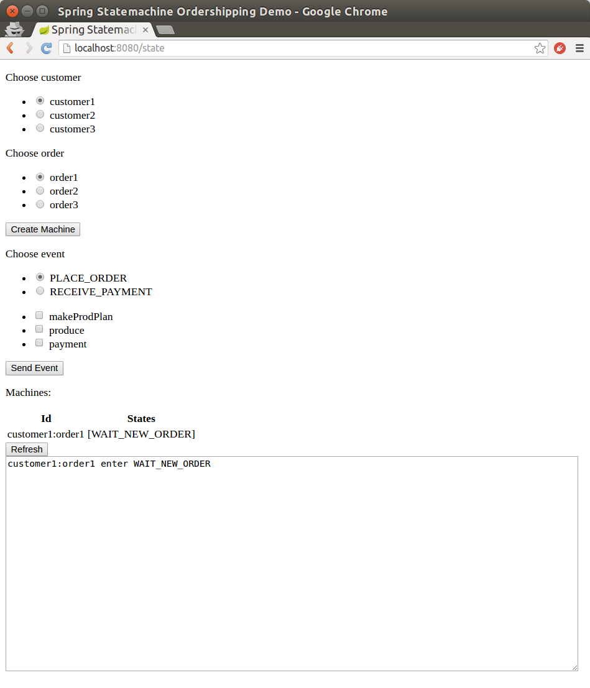

Finally you can see what machine does by refressing a page.

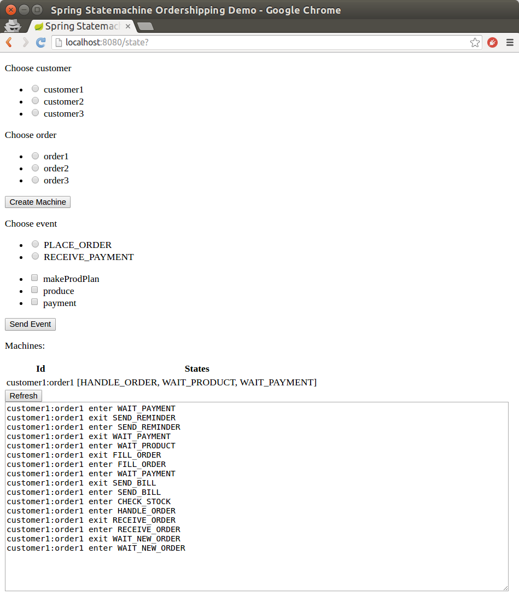

[[statemachine-examples-datajpa]]
== JPA Config
JPA Config is an example how state machine concepts can be used
with a machine configuration kept in a database. This sample is using
embedded _H2_ database with a _H2 Console_ to ease playing with a
database.

To enable automatic scan of needed _Entity_ classes and _JPA
Repositories_, a boot application can be annotated with a custom
locations as shown below.

[source,java,indent=0]
----
include::samples/demo/datajpa/Application.java[tags=snippetA]
----

What comes for a machine config `RepositoryStateMachineModelFactory`
can be used as shown below.

[source,java,indent=0]
----
include::samples/demo/datajpa/StateMachineConfig.java[tags=snippetB]
----

Lets get into actual demo. Run the boot based sample application:

[source,text,subs="attributes"]
----
# java -jar spring-statemachine-samples-datajpa-{revnumber}.jar
----

Accessing application via _http://localhost:8080_ brings up a new
constructed machine with every request and you can choose to send
events to a machine. Possible events and machine configuration are
updated from a database with every request.

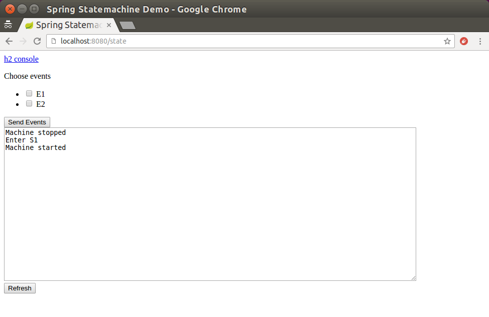

To access embedded console use _JDBC URL_ `jdbc:h2:mem:testdb` if it's
not already set.

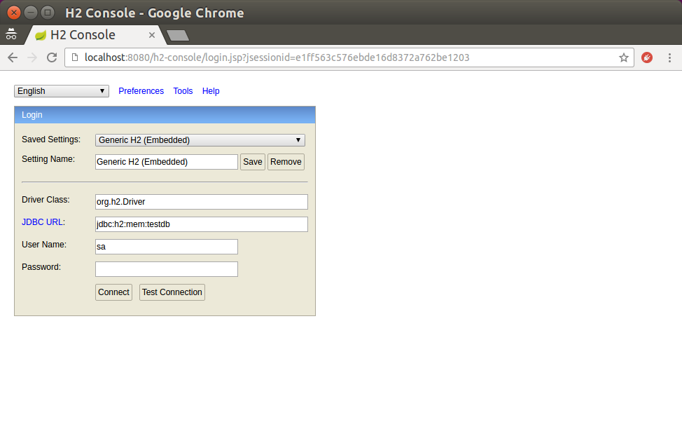

From console you can see how database tables look like and modify
those as you wish.

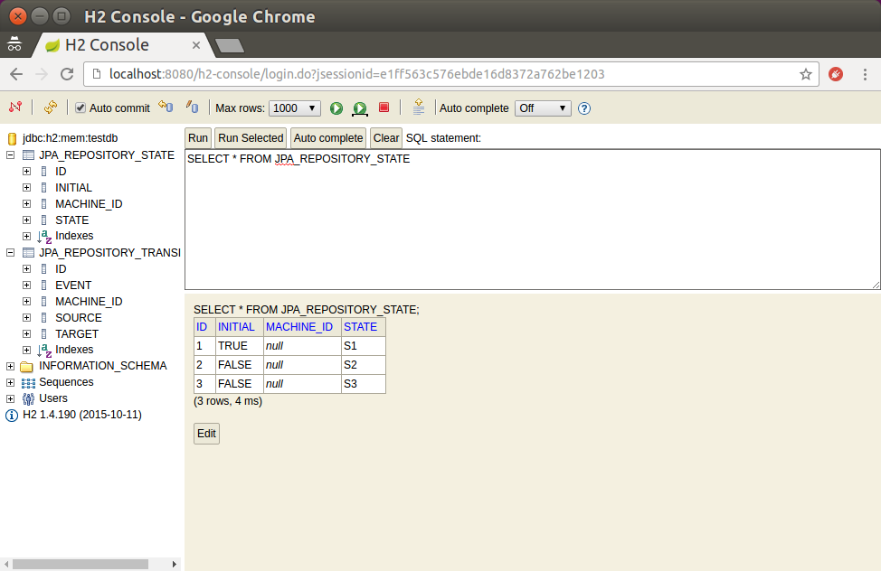

Now that you got this far you probably wondered how those default
states and transitions got populated into a database. Spring Data
already have a nice trick to auto populate repositories and we simply
use this feature via `Jackson2RepositoryPopulatorFactoryBean`.

[source,java,indent=0]
----
include::samples/demo/datajpa/StateMachineConfig.java[tags=snippetA]
----

Actual source for populator data is shown below.

[source,json,indent=0]
----
include::samples/data.json[]
----

[[statemachine-examples-monitoring]]
== Monitoring
Monitoring is an example how state machine concepts can be used to
monitor machine transitions and actions.

[source,java,indent=0]
----
include::samples/demo/monitoring/StateMachineConfig.java[tags=snippetA]
----

Lets get into actual demo. Run the boot based sample application:

[source,text,subs="attributes"]
----
# java -jar spring-statemachine-samples-monitoring-{revnumber}.jar
----

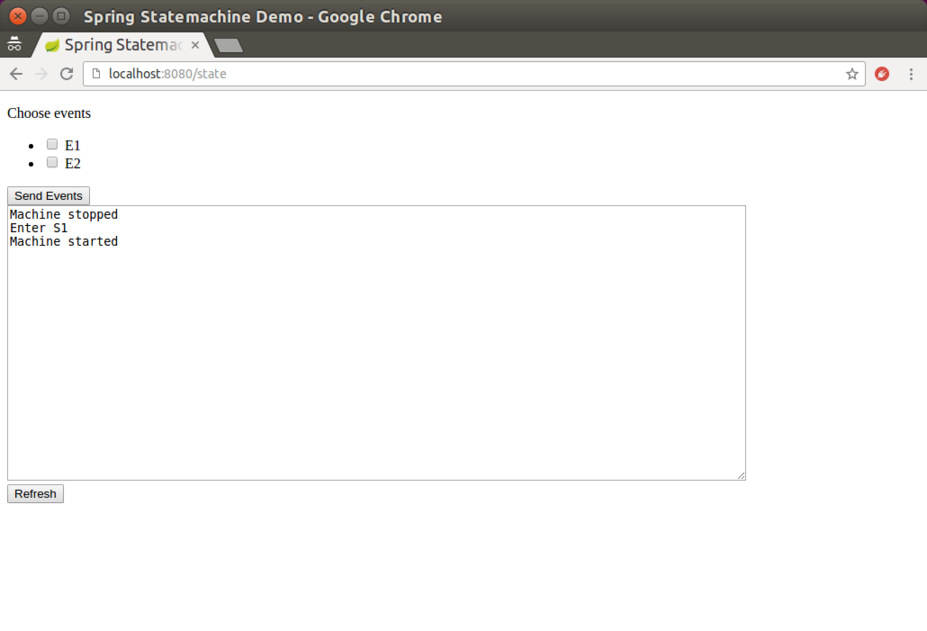

Execute some transitions.

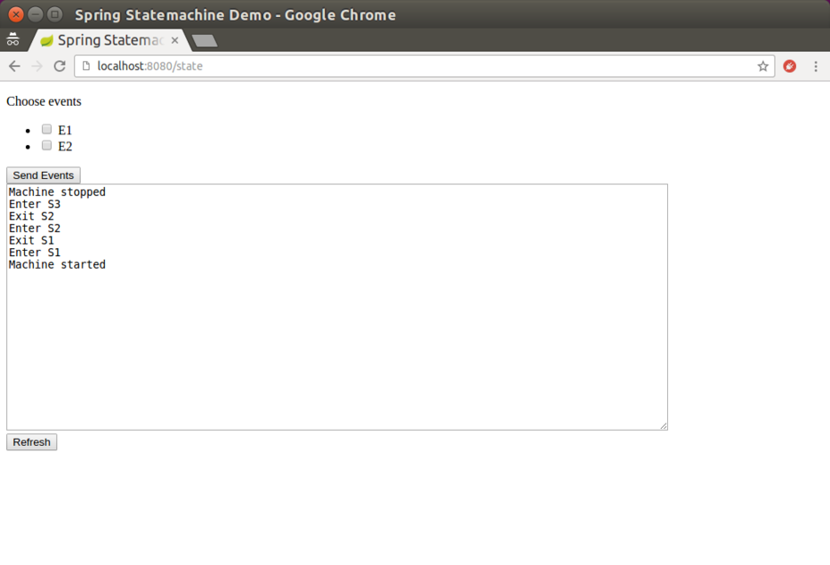

Metrics can be viewed from Boot.

[source,json]
----
# curl http://localhost:8080/metrics

{
"gauge.ssm.transition.INITIAL_S1.duration":0.0,
"gauge.ssm.transition.EXTERNAL_S2_S3.duration":0.0,
"gauge.ssm.action.demo.monitoring.StateMachineConfig$Config$$Lambda$8/12546741@a522d0.duration":0.0,
"gauge.ssm.transition.EXTERNAL_S1_S2.duration":1.0,
"gauge.ssm.action.demo.monitoring.StateMachineConfig$Config$$Lambda$7/25284245@1c21333.duration":0.0,
"gauge.ssm.action.demo.monitoring.StateMachineConfig$Config$$Lambda$9/28306193@10069f9.duration":0.0,
"counter.ssm.action.demo.monitoring.StateMachineConfig$Config$$Lambda$8/12546741@a522d0.execute":1,
"counter.ssm.action.demo.monitoring.StateMachineConfig$Config$$Lambda$9/28306193@10069f9.execute":1,
"counter.ssm.transition.EXTERNAL_S2_S3.transit":1,
"counter.ssm.action.demo.monitoring.StateMachineConfig$Config$$Lambda$7/25284245@1c21333.execute":1,
"counter.ssm.transition.EXTERNAL_S1_S2.transit":1,
"counter.ssm.transition.INITIAL_S1.transit":2,
}
----

Tracing can be viewed from Boot.

[source,json]
----
# curl http://localhost:8080/trace

[{
  "timestamp":1478419121956,
  "info":{
    "duration":0,
    "machine":null,
    "transition":
    "EXTERNAL_S2_S3"
  }
 },
 {
  "timestamp":1478419121956,
  "info":{
    "duration":0,
    "machine":null,
    "action":"demo.monitoring.StateMachineConfig$Config$$Lambda$9/28306193@10069f9"
  }
 },
 {
  "timestamp":1478419121956,
  "info":{
    "duration":0,
    "machine":null,
    "action":"demo.monitoring.StateMachineConfig$Config$$Lambda$8/12546741@a522d0"
  }
 },
 {
  "timestamp":1478419121956,
  "info":{
    "duration":1,
    "machine":null,
    "transition":"EXTERNAL_S1_S2"
  }
 },
 {
  "timestamp":1478419121955,
  "info":{
    "duration":0,
    "machine":null,
    "action":"demo.monitoring.StateMachineConfig$Config$$Lambda$7/25284245@1c21333"
  }
 }
]

----
