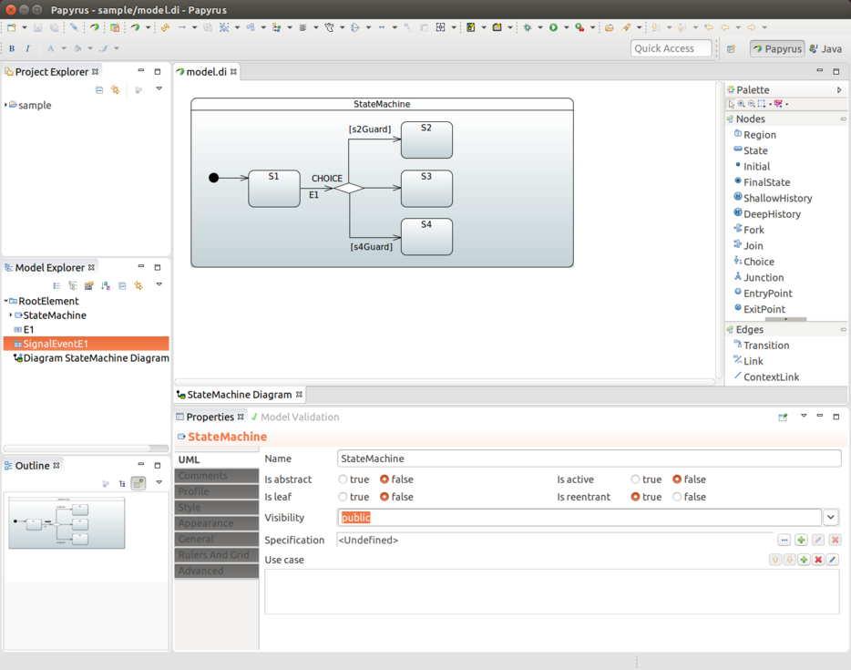
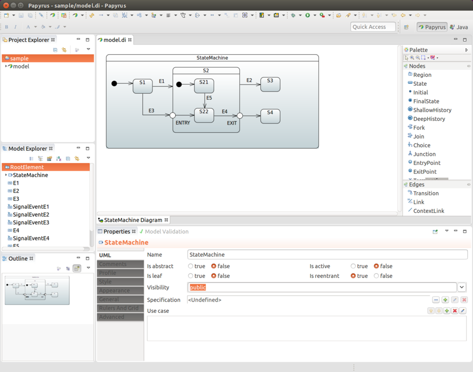
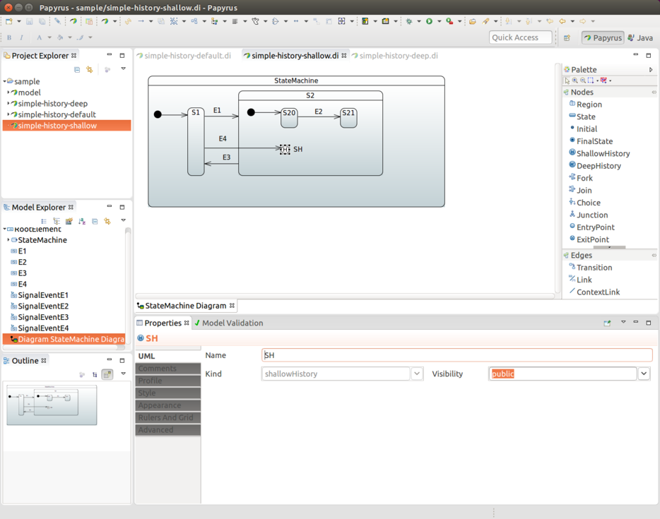
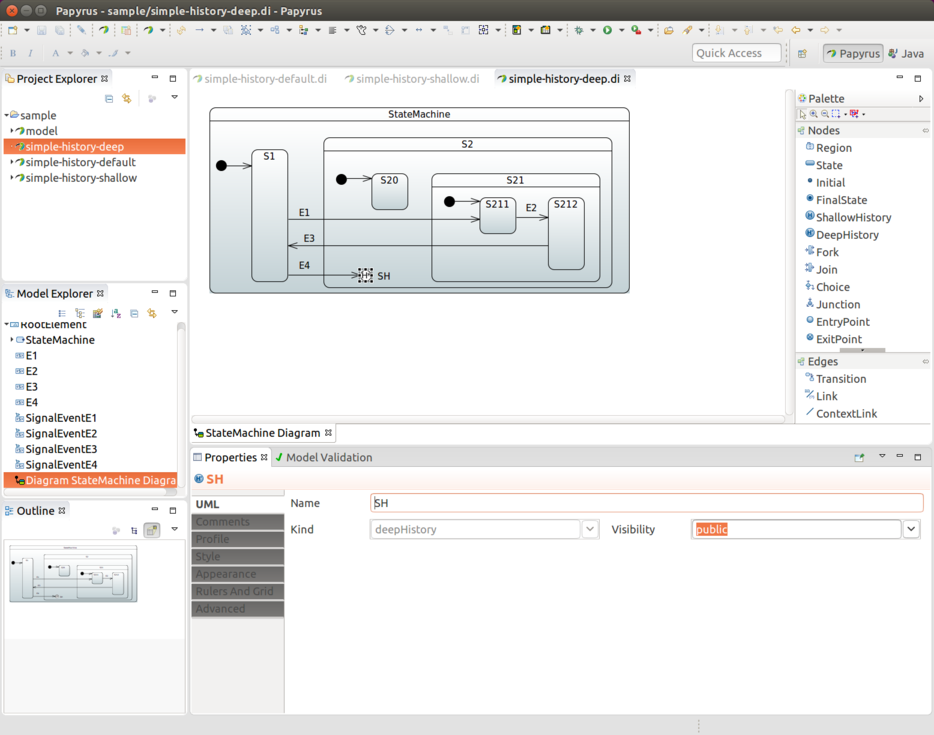
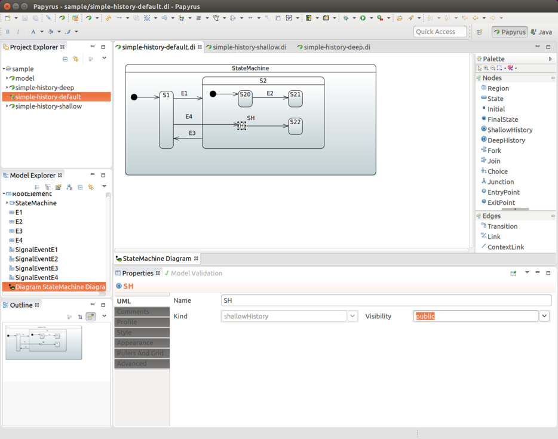
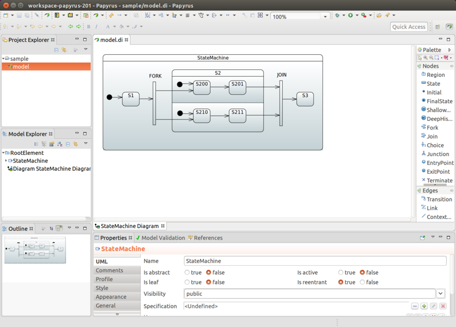
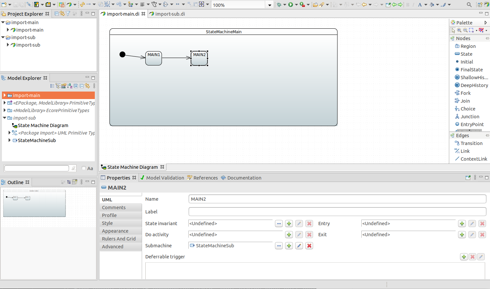

[[sm-papyrus]]
== Eclipse Modeling Support

Defining a state machine configuration with UI modeling is supported
through the Eclipse Papyrus framework.

From the Eclipse wizard, you can create a new Papyrus Model with the UML Diagram
Language. In this example, it is named `simple-machine`. Then you
have an option to choose from various diagram kinds, and you must choose a `StateMachine
Diagram`.

We want to create a machine that has two states (`S1` and `S2`), where
`S1` is the initial state. Then, we need to create event `E1` to do a transition
from `S1` to `S2`. In Papyrus, a machine would then look like something
the following example:

====
image::images/simple-machine.png[width=500]
====

Behind the scenes, a raw UML file would look like the following example:

====
[source,xml,indent=0]
----
include::samples/simple-machine.uml[]
----
====

TIP: When opening an existing model that has been defined as UML, you have three
files: `.di`, `.notation`, and `.uml`. If a model was not created in your
eclipse's session, it does not understand how to open an actual state
chart. This is a known issue in the Papyrus plugin, and there is an easy
workaround. In a Papyrus perspective, you can see a model explorer for
your model. Double click Diagram StateMachine Diagram, which
instructs Eclipse to open this specific model in its proper Papyrus
modeling plugin.

=== Using `UmlStateMachineModelFactory`

After a UML file is in place in your project, you can import it into your
configuration by using `StateMachineModelConfigurer`, where
`StateMachineModelFactory` is associated with a model.
`UmlStateMachineModelFactory` is a special factory that knows how to
process a Eclipse Papyrus_generated UML structure. The source UML file can
either be given as a Spring `Resource` or as a normal location string.
The following example shows how to create an instance of
`UmlStateMachineModelFactory`:

====
[source,java,indent=0]
----
include::samples/DocsUmlSampleTests1.java[tags=snippetA]
----
====

As usual, Spring Statemachine works with guards and
actions, which are defined as beans. Those need to be hooked into UML
by its internal modeling structure. The following sections show
how customized bean references are defined within UML definitions.
Note that it is also possible to register particular methods manually
without defining those as beans.

If `UmlStateMachineModelFactory` is created as a bean, its
`ResourceLoader` is automatically wired to find registered actions and
guards. You can also manually define a
`StateMachineComponentResolver`, which is then used to find these
components. The factory also has _registerAction_ and
_registerGuard_ methods, which you can use to register these components. For more
about this, see <<sm-papyrus-statemachinecomponentresolver>>.

A UML model is relatively loose when it comes to an implementation such as
Spring Statemachine itself. Spring Statemachine leaves how to implement a lot of features and
functionalities up to the actual implementation. The following sections go
through how Spring Statemachine implements UML models based on
the Eclipse Papyrus plugin.

[[sm-papyrus-statemachinecomponentresolver]]
==== Using `StateMachineComponentResolver`

The next example shows how `UmlStateMachineModelFactory` is defined with
a `StateMachineComponentResolver`, which registers the
`myAction` and `myGuard` functions, respectively. Note that these components
are not created as beans. The following listing shows the example:

====
[source,java,indent=0]
----
include::samples/DocsUmlSampleTests1.java[tags=snippetB]
----
====

=== Creating a Model

We start by creating an empty state machine model, shown in the following image:

image::images/papyrus-gs-1.png[width=300]

You can start by creating a new model and giving it a name, as the following image shows:

image::images/papyrus-gs-2.png[width=300]

Then you need to choose StateMachine Diagram, as follows:

image::images/papyrus-gs-3.png[scaledwidth="100%"]

You end up with an empty state machine.

In the preceding images, you should have created a sample named `model`.
You should have wound up with three files: `model.di`,
`model.notation`, and `model.uml`. You can then used these files in any other
Eclipse instance. Further, you can import `model.uml` into a
Spring Statemachine.

=== Defining States

The state identifier comes from a component name in a diagram.
You must have an initial state in your machine, which you can do by adding
a root element and then drawing a transition to your own initial state,
as the following image shows:

image::images/papyrus-gs-4.png[scaledwidth="100%"]

In the preceding image, we added a root element and an initial state (`S1`). Then we drew a transition
between those two to indicate that `S1` is an initial state.

image::images/papyrus-gs-5.png[scaledwidth="100%"]

In the preceding image, we added a second state (`S2`) and added a transition between
S1 and S2 (indicating that we have two states).

=== Defining Events

To associate an event with a transition, you need to create a Signal
(`E1`, in this case). To do so, choose RootElement -> New Child -> Signal.
The following image shows the result:

image::images/papyrus-gs-6.png[scaledwidth="100%"]

Then you need to crate a SignalEvent with the new Signal, `E1`.
To do so, choose RootElement -> New Child -> SignalEvent.
The following image shows the result:

image::images/papyrus-gs-7.png[scaledwidth="100%"]

Now that you have defined a `SignalEvent`, you can use it to associate
a trigger with a transition. For more about that, see
<<sm-papyrus-transitions>>.

==== Deferring an Event

You can defer events to process them at a more appropriate time. In
UML, this is done from a state itself. Choose any state, create a
new trigger under *Deferrable trigger* and choose the SignalEvent which
matches the Signal you want to defer.

[[sm-papyrus-transitions]]
=== Defining Transitions

You can create a transition by drawing a transition line between the
source and target states. In the preceding images, we have states `S1` and `S2` and an
anonymous transition between the two. We want to associate event
`E1` with that transition. We choose a transition, create a new
trigger, and define SignalEventE1 for that, as the following image shows:

image::images/papyrus-gs-8.png[scaledwidth="100%"]

This gives you something like the arrangement shown in the following image:

image::images/papyrus-gs-9.png[scaledwidth="100%"]

TIP: If you omit SignalEvent for a transition, it becomes an
anonymous transition.

=== Defining Timers

Transitions can also happen based on timed events. Spring Statemachine
support two types of timers, ones which fires continuously on a
background and ones which fires once with a delay when state is
entered.

To add a new TimeEvent child to Model Explorer, modify When as an
expression defined as LiteralInteger. The value of it (in milliseconds) becomes the timer.
Leave Is Relative false to make the timer fire continuously.

image::images/papyrus-gs-10.png[scaledwidth="100%"]

To define one timed based event that triggers when a state is entered, the process is exactly
same as described earlier, but leave Is Relative set to true. The following image
shows the result:

image::images/papyrus-gs-11.png[scaledwidth="100%"]

Then the user can pick one of these timed events instead of a
signal event for a particular transition.

[[sm-papyrus-choice]]
=== Defining a Choice

A choice is defined by drawing one incoming transition into a
CHOICE state and drawing multiple outgoing transitions from it to target
states. The configuration model in our `StateConfigurer` lets you define
an if/elseif/else structure. However, with UML, we need to work with
individual Guards for outgoing transitions.

You must ensure that the guards defined for transitions do not overlap so that,
whatever happens, only one guard evaluates to TRUE at any given
time. This gives precise and predictable results for choice branch
evaluation. Also we recommend leaving one transition without a guard
so that at least one transition path is guaranteed.
The following image shows the result of making a choice with three branches:

NOTE: Junction works similarly same, except that it allows multiple incoming
transitions. Thus, its behavior compared to Choice is purely
academic. The actual logic to select the outgoing transition is exactly the same.

=== Defining a Junction
See <<sm-papyrus-choice>>.

=== Defining Entry and Exit Points

You can use EntryPoint and ExitPoint to create controlled entry and exit
with states that have sub-states. In the following state chart, events `E1` and
`E2` have normal state behavior by entering and exiting state
`S2`, where normal state behavior happens by entering initial state
`S21`.

Using event `E3` takes the machine into the `ENTRY` EntryPoint, which then
leads to `S22` without activating initial state `S21` at any time.
Similarly the `EXIT` ExitPoint with event `E4` controls the specific exit
into state `S4`, while normal exit behavior from `S2` would take the
machine into state `S3`. While on state `S22`, you can choose from
events `E4` and `E2` to take the machine into states `S3` or `S4`,
respectively. The following image shows the result:

NOTE: If state is defined as a sub-machine reference and you need to use entry and exit points,
you must externally define a ConnectionPointReference, with
its entry and exit reference set to point to a correct entry or exit point
within a submachine reference. Only after that, is it possible to
target a transition that correctly links from the outside to the inside of
a sub-machine reference. With ConnectionPointReference, you may need
to find these settings from Properties -> Advanced -> UML ->
Entry/Exit. The UML specification lets you define multiple entries and exits. However,
with a state machine, only one is allowed.

=== Defining History States

When working with history states, three different concepts are in play.
UML defines a Deep History and a Shallow History. The Default History
State comes into play when history state is not yet known. These are
represented in following sections.

==== Shallow History

In the following image, Shallow History is selected and a transition is defined into it:

==== Deep History

Deep History is used for state that has other deep nested states,
thus giving a chance to save whole nested state structure.
The following image shows a definition that uses Deep History:

==== Default History

In cases where a Transition terminates on a history when
the state has not been entered before it had reached its
final state, there is an option to force
a transition to a specific substate, using the default
history mechanism. For this to happen, you must define a transition
into this default state. This is the transition from `SH` to
`S22`.

In the following image, state `S22` is entered if state `S2` has
never been active, as its history has never been recorded. If state
`S2` has been active, then either `S20` or `S21` gets chosen.

=== Defining Forks and Joins

Both Fork and Join are represented as bars in Papyrus. As shown
in the next image, you need to draw one outgoing transition from `FORK` into state
`S2` to have orthogonal regions. `JOIN` is then the reverse, where
joined states are collected together from incoming transitions.

=== Defining Actions

You can assoiate swtate entry and exit actions by using a behavior.
For more about this, see <<sm-papyrus-beanref>>.

==== Using an Initial Action

An initial action (as shown in <<statemachine-config-actions>>) is defined
in UML by adding an action in the transition that leads from the Initial State
marker into the actual state. This Action is then run when the state
machine is started.

=== Defining Guards

You can define a guard by first adding a Constraint and then defining
its Specification as OpaqueExpression, which works in the same way
as <<sm-papyrus-beanref>>.

[[sm-papyrus-beanref]]
=== Defining a Bean Reference

When you need to make a bean reference in any UML effect,
action, or guard, you can do so with
`FunctionBehavior` or `OpaqueBehavior`, where the defined language needs to
be `bean` and the language body msut have a bean reference id.

[[sm-papyrus-spelref]]
=== Defining a SpEL Reference

When you need to use a SpEL expression instead of a bean reference in
any UML effect, action, or guard, you can do so by using
`FunctionBehavior` or `OpaqueBehavior`, where the defined language needs to
be `spel` and the language body must be a SpEL expression.

[[sm-papyrus-submachineref]]
=== Using a Sub-Machine Reference

Normally, when you use sub-states, you draw those into the state
chart itself. The chart may become too complex and big to
follow, so we also support defining a sub-state as a state machine
reference.

To create a sub-machine reference, you must first create a new diagram and give it a name
(for example, SubStateMachine Diagram). The following image shows the menu choices to use:

image::images/papyrus-gs-12.png[scaledwidth="100%"]

Give the new diagram the design you need.
The following image shows a simple design as an example:

image::images/papyrus-gs-13.png[scaledwidth="100%"]

From the state you want to link (in this case,m state `S2`), click the
`Submachine` field and choose your linked machine (in our example,
`SubStateMachine`).

image::images/papyrus-gs-14.png[scaledwidth="100%"]

Finally, in the following image, you can see that state `S2` is linked to `SubStateMachine` as a
sub-state.

image::images/papyrus-gs-15.png[scaledwidth="100%"]

[[sm-papyrus-import]]
=== Using a Machine Import
It's also possible to use import functionality where uml files can reference to other models.

Within `UmlStateMachineModelFactory` it's possible to use additional resources or locations
to define referenced model files.

====
[source,java,indent=0]
----
include::samples/DocsUmlSampleTests1.java[tags=snippetC]
----
====

IMPORTANT: Links between files in uml models needs to be relative as
otherwise things break when model files are copied out from a
classpath to a temporary directory so that eclipse parsing classes can
read those.
