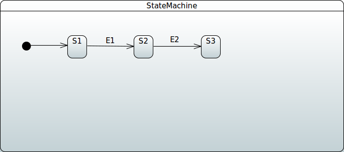
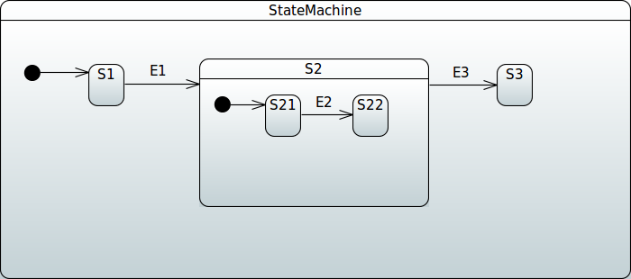
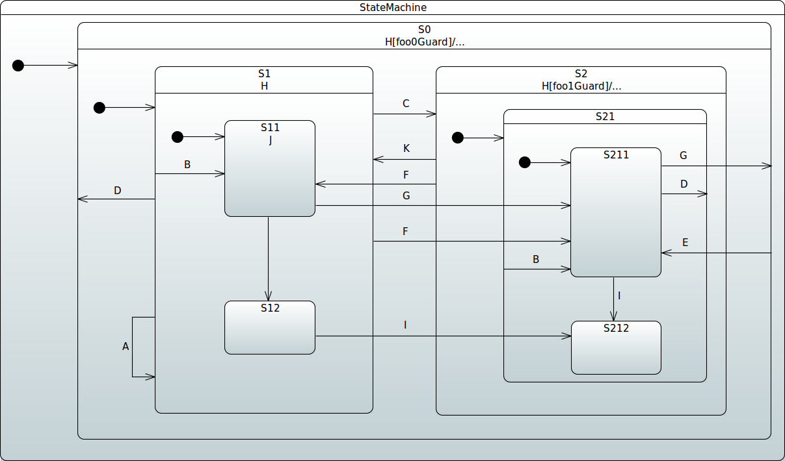

[[sm-repository]]
== Repository Support

This section contains documentation related to using 'Spring Data
Repositories' in Spring Statemachine.

[[sm-repository-config]]
=== Repository Configuration

You can keep machine configuration in external
storage, from which it can be loaded on demand, instead of creating a static
configuration by using either Java configuration or UML-based configuration. This
integration works through a Spring Data Repository abstraction.

We have created a special `StateMachineModelFactory` implementation
called `RepositoryStateMachineModelFactory`. It can use the base
repository interfaces (`StateRepository`, `TransitionRepository`,
`ActionRepository` and `GuardRepository`) and base entity
interfaces (`RepositoryState`, `RepositoryTransition`,
`RepositoryAction`, and `RepositoryGuard`).

Due to way how entities and repositories work in Spring Data,
from a user perspective, read access can be fully abstracted as it is
done in `RepositoryStateMachineModelFactory`. There is no need to
know the actual mapped entity class with which a repository works.
Writing into a repository is always dependent on using a real
repository-specific entity class. From a machine-configuration point
of view, we do not need to know these, meaning that we do not need to know
whether the actual implementation is JPA, Redis, or anything else
that Spring Data supports. Using an actual repository-related
entity class comes into play when you manually try to write new
states or transitions into a backed repository.

TIP: Entity classes for `RepositoryState` and `RepositoryTransition` have a
`machineId` field, which is at your disposal and can be used to
differentiate between configurations -- for example, if machines are built
via `StateMachineFactory`.

Actual implementations are documented in later sections.
The following images are UML-equivalent state charts of repository
configurations.

[[image-sm-repository-simplemachine]]

[[image-sm-repository-simplesubmachine]]

[[image-sm-repository-showcasemachine]]

[[sm-repository-config-jpa]]
==== JPA

The actual repository implementations for JPA are
`JpaStateRepository`, `JpaTransitionRepository`, `JpaActionRepository`,
and `JpaGuardRepository`, which are backed by the
entity classes `JpaRepositoryState`, `JpaRepositoryTransition`,
`JpaRepositoryAction`, and `JpaRepositoryGuard`, respectively.

IMPORTANT: Unfortunately, version '1.2.8' had to make a change in JPA's entity
model regarding used table names. Previously, generated table names
always had a prefix of `JPA_REPOSITORY_`, derived from entity class
names. As this caused breaking issues with databases imposing
restrictions on database object lengths, all entity classes have
spesific definitions to force table names. For example,
`JPA_REPOSITORY_STATE` is now 'STATE' -- and so on with other
ntity classes.

The generic way to update states and transitions manually for JPA is shown
in the following example (equivalent to the machine shown in
<<image-sm-repository-simplemachine>>):

====
[source,java,indent=0]
----
include::samples/DocsJpaRepositorySampleTests1.java[tags=snippetA]
----
====

The following example is also equivalent to the machine shown in
<<image-sm-repository-simplesubmachine>>.

====
[source,java,indent=0]
----
include::samples/DocsJpaRepositorySampleTests1.java[tags=snippetB]
----
====

First, you must access all repositories.
The following example shows how to do so:

====
[source,java,indent=0]
----
include::samples/DocsJpaRepositorySampleTests1.java[tags=snippetC1]
----
====

Second, you mus create actions and guards.
The following example shows how to do so:

====
[source,java,indent=0]
----
include::samples/DocsJpaRepositorySampleTests1.java[tags=snippetC2]
----
====

Third, you must create states.
The following example shows how to do so:

====
[source,java,indent=0]
----
include::samples/DocsJpaRepositorySampleTests1.java[tags=snippetC3]
----
====

Fourth and finally, you must  create transitions.
The following example shows how to do so:

====
[source,java,indent=0]
----
include::samples/DocsJpaRepositorySampleTests1.java[tags=snippetC4]
----
====

You can find a complete example
<<statemachine-examples-datajpa, here>>. This example also shows how you can
pre-populate a repository from an existing JSON file that has
definitions for entity classes.

[[sm-repository-config-redis]]
==== Redis

The actual repository implementations for a Redis instance are
`RedisStateRepository`, `RedisTransitionRepository`, `RedisActionRepository`,
and `RedisGuardRepository`, which are backed by the
entity classes `RedisRepositoryState`, `RedisRepositoryTransition`,
`RedisRepositoryAction`, and `RedisRepositoryGuard`, respectively.

The next example shows the generic way to manually update states and transitions for Redis.
This is equivalent to machine shown in
<<image-sm-repository-simplemachine>>.

====
[source,java,indent=0]
----
include::samples/DocsRedisRepositorySampleTests1.java[tags=snippetA]
----
====

The following example is equivalent to machine shown in
<<image-sm-repository-simplesubmachine>>:

====
[source,java,indent=0]
----
include::samples/DocsRedisRepositorySampleTests1.java[tags=snippetB]
----
====

[[sm-repository-config-mongodb]]
==== MongoDB

The actual repository implementations for a MongoDB instance are
`MongoDbStateRepository`, `MongoDbTransitionRepository`, `MongoDbActionRepository`,
and `MongoDbGuardRepository`, which are backed by the
entity classes `MongoDbRepositoryState`, `MongoDbRepositoryTransition`,
`MongoDbRepositoryAction`, and `MongoDbRepositoryGuard`, respectively.

The next example shows the generic way to manually update states and transitions for MongoDB.
This is equivalent to the machine shown in
<<image-sm-repository-simplemachine>>.

====
[source,java,indent=0]
----
include::samples/DocsMongoDbRepositorySampleTests1.java[tags=snippetA]
----
====

The following example is equivalent to the machine shown in
<<image-sm-repository-simplesubmachine>>.

====
[source,java,indent=0]
----
include::samples/DocsMongoDbRepositorySampleTests1.java[tags=snippetB]
----
====

[[sm-repository-persistence]]
=== Repository Persistence

Apart from storing machine configuration (as shown in
<<sm-repository-config>>), in an external repository, you canx also
persist machines into repositories.

The `StateMachineRepository` interface is a central access point that
interacts with machine persistence and is backed by the entity class
`RepositoryStateMachine`.

[[sm-repository-persistence-jpa]]
==== JPA

The actual repository implementation for JPA is
`JpaStateMachineRepository`, which is backed by the entity class
`JpaRepositoryStateMachine`.

The following example shows the generic way to persist a machine for JPA:

====
[source,java,indent=0]
----
include::samples/DocsJpaRepositorySampleTests1.java[tags=snippetD]
----
====

[[sm-repository-persistence-redis]]
==== Redis

The actual repository implementation for a Redis is
`RedisStateMachineRepository`, which is backed by the entity class
`RedisRepositoryStateMachine`.

The following example shows the generic way to persist a machine for Redis:

====
[source,java,indent=0]
----
include::samples/DocsRedisRepositorySampleTests1.java[tags=snippetC]
----
====

[[sm-repository-persistence-mongodb]]
==== MongoDB

The actual repository implementation for MongoDB is
`MongoDbStateMachineRepository`, which is backed by the entity class
`MongoDbRepositoryStateMachine`.

The following example shows the generic way to persist a machine for MongoDB:

====
[source,java,indent=0]
----
include::samples/DocsMongoDbRepositorySampleTests1.java[tags=snippetC]
----
====
