[[statemachine]]
= Using Spring Statemachine

This part of the reference documentation explains the core functionality
that Spring Statemachine provides to any Spring based application.

<<sm-config>> the generic configuration support.

<<sm-factories>> the generic state machine factory support.

<<sm-actions>> the actions support.

<<sm-guards>> the guard support.

<<sm-extendedstate>> the extended state support.

<<sm-statecontext>> the state context support.

<<sm-triggers>> the use of triggers.

<<sm-listeners>> the use of state machine listeners.

<<sm-context>> the generic Spring application context support.

<<sm-accessor>> the state machine internal accessor support.

<<sm-interceptor>> the state machine error handling support.

<<sm-error-handling>> the state machine interceptor support.

<<sm-persist>> the state machine persisting support.

<<sm-distributed>> the distributed state machine support.

<<sm-test>> the state machine testing support.

<<sm-papyrus>> the state machine uml modeling support.

<<sm-repository>> the state machine repository config support.

[[sm-config]]
== Statemachine Configuration
One of the common tasks when using a Statemachine is to design its
runtime configuration. This chapter will focus on how Spring
Statemachine is configured and how it leverages Spring's lightweight
IoC containers to simplify the application internals to make it more
manageable.

[NOTE]
====
Configuration examples in this section are not feature complete, i.e.
you always need to have definitions of both states and transitions,
otherwise state machine configuration would be ill-formed. We have
simply made code snippets less verbose by leaving other needed parts
away.
====

[[statemachine-config-annotations]]
=== Using _enable_ annotations
We use familiar spring _enabler_ annotations to ease configuration. Two
annotations exists, _@EnableStateMachine_ and _@EnableStateMachineFactory_.
These annontations if placed in a _@Configuration_ class will enable
some basic functionality needed by a state machines.

_@EnableStateMachine_ is used when a configuration wants to create an
instance of a _StateMachine_. Usually _@Configuration_ class extends adapters
`EnumStateMachineConfigurerAdapter` or `StateMachineConfigurerAdapter` which
allows user to override configuration callback methods. We automatically
detect if user is using these adapter classes and modify runtime configuration
logic.

_@EnableStateMachineFactory_ is used when a configuration wants to create an
instance of a _StateMachineFactory_.

[NOTE]
====
Usage examples of these are shown in below sections.
====

[[statemachine-config-states]]
=== Configuring States
We'll get into more complex configuration examples a bit later but
let's first start with a something simple. For most simple state
machine you just use `EnumStateMachineConfigurerAdapter` and define
possible states, choose initial and optional end state.

[source,java,indent=0]
----
include::samples/DocsConfigurationSampleTests.java[tags=snippetAA]
----

It's also possible to use strings instead of enums as states and
events by using `StateMachineConfigurerAdapter` as shown below. Most
of a configuration examples is using enums but generally speaking
strings and enums can be just interchanged.

[source,java,indent=0]
----
include::samples/DocsConfigurationSampleTests.java[tags=snippetAB]
----

[NOTE]
====
Using enums will bring more safe set of states and event types but
limits possible combinations to compile time. Strings don't have this
limitation and allows user to use more dynamic ways to build state
machine configurations but doesn't allow same level of safety.
====

=== Configuring Hierarchical States
Hierarchical states can be defined by using multiple `withStates()`
calls where `parent()` can be used to indicate that these
particular states are sub-states of some other state.

[source,java,indent=0]
----
include::samples/DocsConfigurationSampleTests.java[tags=snippetB]
----

=== Configuring Regions

There are no special configuration methods to mark a collection of
states to be part of an orthogonal state. To put it simple, orthogonal
state is created when same hierarchical state machine has multiple set
of states each having a initial state. Because an individual state
machine can only have one initial state, multiple initial states must
mean that a specific state must have multiple independent regions.

[source,java,indent=0]
----
include::samples/DocsConfigurationSampleTests.java[tags=snippetP]
----

=== Configuring Transitions
We support three different types of transitions, `external`,
`internal` and `local`. Transitions are either triggered by a signal
which is an event sent into a state machine or a timer.

[source,java,indent=0]
----
include::samples/DocsConfigurationSampleTests.java[tags=snippetC]
----

=== Configuring Guards
Guards are used to protect state transitions. Interface _Guard_ is
used to do an evaluation where method has access to a _StateContext_.

[source,java,indent=0]
----
include::samples/DocsConfigurationSampleTests.java[tags=snippetD]
----

In above two different types of guard configurations are used. Firstly a
simple _Guard_ is created as a bean and attached to transition between
states `S1` and `S2`.

Secondly a simple SPeL expression can be used as a guard where
expression must return a `BOOLEAN` value. Behind a scenes this
expression based guard is a _SpelExpressionGuard_. This was attached to
transition between states `S2` and `S3`. Both guard in above sample
always evaluate to true.

[[statemachine-config-actions]]
=== Configuring Actions
Actions can be defined to be executed with transitions and states
itself. Action is always executed as a result of a transition which
originates from a trigger.

[source,java,indent=0]
----
include::samples/DocsConfigurationSampleTests.java[tags=snippetEA]
----

In above a single `Action` is defined as bean `action` and associated
with a transition from `S1` to `S2`.

[source,java,indent=0]
----
include::samples/DocsConfigurationSampleTests.java[tags=snippetEB]
----

[NOTE]
====
Usually you would not define same `Action` instance for different
stages but we did it here not to make too much noise in a code
snippet.
====

In above a single `Action` is defined as bean `action` and associated
with states `S1`, `S2` and `S3`. There is more going on there which
needs more clarification:

* We defined action for initial state `S1`.
* We defined entry action for state `S1` and left exit action empty.
* We defined exit action for state `S2` and left entry action empty.
* We defined a single state action for state `S2`.
* We defined entry action as well as exit action for state `S3`.
* Notice how state `S1` is used twice with `initial()` and `state()`
  functions. This is only needed if you want to define entry or exit
  actions with initial state.

[IMPORTANT]
====
Defining action with `initial()` function only executes particular
action when state machine or sub state is started. Think this action
to be initializing action which is only executed once. Action defined
with `state()` is then executed if state machine is transitioning back
and forward between initial and non-inital states.
====

==== State Actions

State actions are executed differently compared to entry and exit
actions simply because execution happens after state has been entered
and can be cancelled if state exit happens before particular action
has been completed.

State Actions are executed using a normal Spring `TaskScheduler`
wrapped within a `Runnable` which may get cancelled via
`ScheduledFuture`. What this means is that whatever your doing in your
action, you need to be able to catch `InterruptedException` which is
raised if task is cancelled.

[[statemachine-config-actions-errorhandling]]
==== Transition Action Error Handling

User can always catch exceptions manually but with actions defined for
transitions it is possible to define error action which is called if
exception is reased. Exception is then available from a `StateContext`
passed to that action.

[source,java,indent=0]
----
include::samples/DocsConfigurationSampleTests.java[tags=snippetEC]
----

Similar logic can be done manually for every action if needed.

[source,java,indent=0]
----
include::samples/DocsConfigurationSampleTests.java[tags=snippetED]
----

=== Configuring Pseudo States

_Pseudo state_ configuration is usually done by configuring states and
transitions. Pseudo states are automatically added to state machine as
states.

==== Initial State
Simply mark a particular state as initial state by using `initial()`
method. There are two methods where one takes extra argument to define
an initial action. This initial action is good for example initialize
extended state variables.

[source,java,indent=0]
----
include::samples/DocsConfigurationSampleTests.java[tags=snippetQ]
----

==== Terminate State
Simply mark a particular state as end state by using `end()` method.
This can be done max one time per individual sub-machine or region.

[source,java,indent=0]
----
include::samples/DocsConfigurationSampleTests.java[tags=snippetAA]
----

==== History State
History state can be defined once for each individual state machine.
You need to choose its state identifier and `History.SHALLOW` or
`History.DEEP` respectively.

[source,java,indent=0]
----
include::samples/DocsConfigurationSampleTests.java[tags=snippetR]
----

Also as shown above, optionally it is possible to define a default
transition from a history state into a state vertex in a same machine.
This transition takes place as a default if for example machine has
never been entered, thus no history would be available. If default
state transition is not defined, then normal entry into a region is
done. This default transition is also used if machine's history is
a final state.

==== Choice State
Choice needs to be defined in both states and transitions to work
properly. Mark particular state as choice state by using `choice()`
method. This state needs to match source state when transition is
configured for this choice.

Transition is configured using `withChoice()` where you define source
state and `first/then/last` structure which is equivalent to normal
`if/elseif/else`. With `first` and `then` you can specify a guard just
like you'd use a condition with `if/elseif` clauses.

Transition needs to be able to exist so make sure `last` is used.
Otherwise configuration is ill-formed.

[source,java,indent=0]
----
include::samples/DocsConfigurationSampleTests.java[tags=snippetS]
----

[[statemachine-config-states-junction]]
==== Junction State
Junction needs to be defined in both states and transitions to work
properly. Mark particular state as choice state by using `junction()`
method. This state needs to match source state when transition is
configured for this choice.

Transition is configured using `withJunction()` where you define source
state and `first/then/last` structure which is equivalent to normal
`if/elseif/else`. With `first` and `then` you can specify a guard just
like you'd use a condition with `if/elseif` clauses.

Transition needs to be able to exist so make sure `last` is used.
Otherwise configuration is ill-formed.

[source,java,indent=0]
----
include::samples/DocsConfigurationSampleTests.java[tags=snippetSS]
----

[NOTE]
====
Difference between choice and junction is purely academic as both are
implemented with `first/then/last` structure. However in theory based
on uml model, _choice_ allows only one incoming transition while
_junction_ allows multiple incoming transitions. At a code level
functionality is pretty much identical.
====

==== Fork State
Fork needs to be defined in both states and transitions to work
properly. Mark particular state as choice state by using `fork()`
method. This state needs to match source state when transition is
configured for this fork.

Target state needs to be a super state or immediate states in
regions. Using a super state as target will take all regions into
initial states. Targeting individual state give more controlled entry
into regions.

[source,java,indent=0]
----
include::samples/DocsConfigurationSampleTests.java[tags=snippetT]
----

==== Join State
Join needs to be defined in both states and transitions to work
properly. Mark particular state as choice state by using `join()`
method. This state doesn't need to match either source states or
target state in a transition configuration.

Select a target state where transition goes when all source states
has been joined. If you use state hosting regions as source, end
states of a regions are used as joins. Otherwise you can pick any
states from a regions.

[source,java,indent=0]
----
include::samples/DocsConfigurationSampleTests.java[tags=snippetU]
----

It is also possible to have multiple transitions originating from a
join state. It this case it is adviced to use guards and define those
so that only one guard evaluates _TRUE_ at any given time as otherwise
transition behaviour is not predicted. This is shown above where guard
simply checks if extended state has variables.

[source,java,indent=0]
----
include::samples/DocsConfigurationSampleTests.java[tags=snippetUUU]
----

[[statemachine-config-states-exitentry]]
==== Exit/Entry Point States
Exit and Entry Points can be used to do more controlled exit and entry
from and into a submachines.

[source,java,indent=0]
----
include::samples/DocsConfigurationSampleTests.java[tags=snippetUU]
----

As shown above you need to mark particular states as _exit_ and
_entry_ states. Then you create a normal transitions into those states
and also specify _withExit()_ and _withEntry()_ where those states
will exit and entry respectively.

[[statemachine-config-commonsettings]]
=== Configuring Common Settings
Some of a common state machine configuration can be set via a
`ConfigurationConfigurer`. This allows to set `BeanFactory`,
`TaskExecutor`, `TaskScheduler`, autostart flag for a state machine
and register `StateMachineListener` instances.

[source,java,indent=0]
----
include::samples/DocsConfigurationSampleTests.java[tags=snippetYA]
----

State machine `autoStartup` flag is disabled by default because all
instances handling sub-states are controlled by a state machine itself
and cannot be started automatically. Also it is much safer to leave
this decision to a user whether a machine should be started
automatically or not. This flag will only control an autostart of a
top-level state machine.

Setting a `BeanFactory`, `TaskExecutor` or `TaskScheduler` exist for
conveniance for a user and are also use within a framework itself.

Registering `StateMachineListener` instances is also partly for
convenience but is required if user wants to catch callback during a
state machine lifecycle like getting notified of a state machine
start/stop events. Naturally it is not possible to listen a state
machine start events if `autoStartup` is enabled unless listener can
be registered during a configuration phase.

`DistributedStateMachine` is configured via `withDistributed()` which
allows to set a `StateMachineEnsemble` which if exists automatically
wraps created `StateMachine` with `DistributedStateMachine` and
enables distributed mode.

[source,java,indent=0]
----
include::samples/DocsConfigurationSampleTests.java[tags=snippetYB]
----

More about distributed states, refer to section <<sm-distributed>>.

`StateMachineModelVerifier` is an interface what is used internally to
do some sanity checks for a state machine structure. Its purpose is to
fail fast early instead of letting common configuration errors into a
state machine itself. On default verifier is automatically enabled and
`DefaultStateMachineModelVerifier` implementation is used.

With `withVerifier()` user can disable verifier or set a custom one if
needed.

[source,java,indent=0]
----
include::samples/DocsConfigurationSampleTests.java[tags=snippetYC]
----

More about config model, refer to section <<devdocs-configmodel>>.

=== Configuring Model
`StateMachineModelFactory` is a hook to configure statemachine model
without using a manual configuration. Essentially it is a thirt party
integration to integrate into a configuration model.
`StateMachineModelFactory` can be hooked into a configuration model by
using a `StateMachineModelConfigurer` as shown above.

[source,java,indent=0]
----
include::samples/DocsConfigurationSampleTests8.java[tags=snippetA]
----

As a custom example `CustomStateMachineModelFactory` would simply
define two states, _S1_ and _S2_ and an event _E1_ between those
states.

[source,java,indent=0]
----
include::samples/DocsConfigurationSampleTests8.java[tags=snippetB]
----

[NOTE]
====
Defining a custom model is usually not what end user is looking for,
although it is possible, however it is a central concept of allowing
external access to this configuration model.
====

Example of using this model factory integration can be found from
<<sm-papyrus>>. More generic info about custom model integration can
be found from <<devdocs>>.

[[statemachine-config-thingstoremember]]
=== Things to Remember

When defining actions, guards or any other references from a
configuration there are things to remember how Spring Framework works
with beans. In below we have defined a normal configuration with
states `S1` and `S2` and 4 transitions between those. All transitions
are either guarded by `guard1` or `guard2`. Pay attention that
`guard1` is created as a real bean because it's annotated with a
_@Bean_, while `guard2` is not.

What this mean is that event `E3` would get `guard2` condition as
`TRUE` and `E4` would get `guard2` condition as `FALSE` as those are
simply coming from a plain method calls to those functions.

However because `guard1` is defined as a _@Bean_, it is proxied by a
Spring Framework, thus additional calls to its method will result
only one instantiation of that instance. Event `E1` would get first
proxied instance with condition `TRUE` while event `E2` would get same
instance with `TRUE` condition while method call was defined with
`FALSE`. This is not a Spring State Machine specific behaviour, it's
just how Spring Framework works with _Beans_.

[source,java,indent=0]
----
include::samples/DocsConfigurationSampleTests7.java[tags=snippetA]
----

[[sm-factories]]
== State Machine Factories
There are use cases when state machine needs to be created dynamically
instead of defining static configuration at compile time. For example
if there are custom components which are using its own state machines
and these components are created dynamically it is impossible to have
a static state machined build during the application start. Internally
state machines are always build via a factory interfaces and this then
gives user an option to use this feature programmatically.
Configuration for state machine factory is exactly same as you've seen
in various examples in this document where state machine configuration
is hard coded.

=== Factory via Adapter
Actually creating a state machine using _@EnableStateMachine_ will
work via factory so _@EnableStateMachineFactory_ is merely exposing
that factory via its interface.

[source,java,indent=0]
----
include::samples/DocsConfigurationSampleTests.java[tags=snippetFA]
----

Now that you've used _@EnableStateMachineFactory_ to create a factory
instead of a state machine bean, it can be injected and used as is to
request new state machines.

[source,java,indent=0]
----
include::samples/DocsConfigurationSampleTests.java[tags=snippetL]
----

==== Adapter Factory Limitations
Current limitation of factory is that all actions and guard it is
associating with created state machine will share a same instances.
This means that from your actions and guard you will need to
specifically handle a case that same bean will be called by a different
state machines. This limitation is something which will be resolved in
future releases.

=== State Machine via Builder
Using adapters shown above has a limitation imposed by its
requirement to work via Spring `@Configuration` classes and
application context. While this is a very clear model to configure a
state machine instances it will limit configuration at a compile time
which is not always what a user wants to do. If there is a requirement
to build more dynamic state machines, a simple builder pattern can be
used to construct similar instances. Using strings as states and
events this builder pattern can be used to build fully dynamic state
machines outside of a Spring application context as shown above.

[source,java,indent=0]
----
include::samples/DocsConfigurationSampleTests.java[tags=snippetFB]
----

Builder is using same configuration interfaces behind the scenes that
the `@Configuration` model using adapter classes. Same model goes to
configuring transitions, states and common configuration via builder's
methods. This simply means that whatever you can use with a normal
`EnumStateMachineConfigurerAdapter` or `StateMachineConfigurerAdapter`
can be used dynamically via a builder.

[NOTE]
====
Currently `builder.configureStates()`, `builder.configureTransitions()`
and `builder.configureConfiguration()` interface methods cannot be
chained together meaning builder methods needs to be called individually.
====

[source,java,indent=0]
----
include::samples/DocsConfigurationSampleTests.java[tags=snippetFC]
----

It is important to understand on what cases common configuration needs
to be used with a machines instantiated from a builder. Configurer
returned from a `withConfiguration()` can be used to setup _autoStart_,
_TaskScheduler_, _TaskExecutor_, _BeanFactory_ and additionally register
a _StateMachineListener_. If _StateMachine_ instance returned from
a builder is registered as a bean via `@Bean`, i.e. _BeanFactory_
is attached automatically and then a default _TaskExecutor_ can be found
from there. If instances are used outside of a spring application context
these methods must be used to setup needed facilities.

[[sm-deferevents]]
== Using Deferred Events
When en event is sent it may fire an `EventTrigger` which then may cause
a transition to happen if a state machine is in a state where trigger is
evaluated successfully. Normally this may lead to a situation where
an event is not accepted and is dropped. However it may be desirable to
postpone this event until a state machine enters other state, in which
it is possible to accept that event. In other words an event simply
arrives at an inconvenient time.

Spring Statemachine provides a mechanism for deferring events for later
processing. Every state can have a list of deferred events. If an event
in the current state’s deferred event list occurs, the event will be saved
(deferred) for future processing until a state is entered that does not list
the event in its deferred event list. When such a state is entered, the
state machine will automatically recall any saved events that are no longer
deferred and will then either consume or discard these events. It is possible
for a superstate to have a transition defined on an event that is deferred
by a substate. Following same hierarchical state machines concepts, the substate
takes precedence over the superstate, the event will be deferred and the
transition for the superstate will not be executed. With orthogonal regions
where one orthogonal region defers an event and another accepts the event, the
accept takes precedence and the event is consumed and not deferred.

The most obvious use case for event deferring is when an event is causing
a transition into a particular state and state machine is then returned back
to its original state where second event should cause a same transition. Lets
take this with a simple example.

[source,java,indent=0]
----
include::samples/DocsConfigurationSampleTests2.java[tags=snippetE]
----

In above state machine has state _READY_ which indicates that machine is
ready to process events which would take it into a _DEPLOY_ state where the
actual deployment would happen. After deploy actions has been executed machine
is then returned back into a _READY_ state. Sending multiple events in a
_READY_ state is not causing any trouble if machine is using synchronous executor
because event sending would block between event calls. However if executor is using
threads then other events may get lost because machine is no longer in a state where
event could be processed. Thus deferring some of these events allows machine to
preserve these events.

[source,java,indent=0]
----
include::samples/DocsConfigurationSampleTests2.java[tags=snippetF]
----

In above state machine which is using nested states instead of a flat
state model, event _DEPLOY_ can be deferred directly in a substate.
It is also showing concept of deferring event _DONE_ in one of a
sub-states which would then override anonymous transition between
_DEPLOY_ and _DONE_ states if state machine happens to be in a
_DEPLOYPREPARE_ state when _DONE_ event is dispatched. In
_DEPLOYEXECUTE_ state _DONE_ event is not deferred, thus event would
be handled in a super state.

[[sm-scopes]]
== Using Scopes
Support for scopes in a state machine is very limited but it is possible
to enable use of _session_ scope using a normal spring `@Scope` annotation.
Firstly if state machine is build manually via a builder and returned into
context as `@Bean`, and secondly via an contifuration adapter. Both of
these simply needs an a `@Scope` to be present where _scopeName_ is set to
_session_ and _proxyMode_ to `ScopedProxyMode.TARGET_CLASS`. Examples for
both use cases are shown below.

[TIP]
====
See sample <<statemachine-examples-scope>> how to use session scoping.
====

[source,java,indent=0]
----
include::samples/DocsConfigurationSampleTests2.java[tags=snippetB]
----

[source,java,indent=0]
----
include::samples/DocsConfigurationSampleTests2.java[tags=snippetC]
----

Once you have scoped state machine into `session`, autowiring it into
a `@Controller` will give new state machine instance per session.
State machine is then destroyed when `HttpSession` is invalidated.

[source,java,indent=0]
----
include::samples/DocsConfigurationSampleTests2.java[tags=snippetD]
----

[NOTE]
====
Using state machines in a `session` scopes needs a careful planning
mostly because it is a relatively heavy component.
====

[NOTE]
====
Spring Statemachine poms don't have any dependencies to Spring MVC
classes which you will need to work with session scope. But if you're
working with a web application, you've already pulled those deps
directly from Spring MVC or Spring Boot.
====

[[sm-actions]]
== Using Actions
Actions are one of the most useful components from user perspective to
interact and collaborate with a state machine. Actions can be executed
in various places in a state machine and its states lifecycle like
entering or exiting states or during a transitions.

[source,java,indent=0]
----
include::samples/DocsConfigurationSampleTests.java[tags=snippetVA]
----

Above `action1` and `action2` beans are attached to states entry and
exit respectively.

[source,java,indent=0]
----
include::samples/DocsConfigurationSampleTests.java[tags=snippetVD]
----

You can directly implement _Action_ as an anonymous function or create
a your own implementation and define appropriate implementation as a
bean.

In `action3` a SpEL expression is used to send event *Events.E1* into
a state machine.

[NOTE]
====
_StateContext_ is described in section <<sm-statecontext>>.
====

=== SpEL Expressions with Actions 
It is also possible to use SpEL expressions as a replacement for a
full _Action_ implementation.

[[sm-guards]]
== Using Guards
Above `guard1` and `guard2` beans are attached to states entry and
exit respectively.

[source,java,indent=0]
----
include::samples/DocsConfigurationSampleTests.java[tags=snippetVB]
----

You can directly implement _Guard_ as an anonymous function or create
a your own implementation and define appropriate implementation as a
bean. In above sample `guardExpression` is simply checking if extended
state variable `myvar` evaluates to _TRUE_.

[source,java,indent=0]
----
include::samples/DocsConfigurationSampleTests.java[tags=snippetVC]
----

[NOTE]
====
_StateContext_ is described in section <<sm-statecontext>>.
====

=== SpEL Expressions with Guards
It is also possible to use SpEL expressions as a replacement for a
full _Guard_ implementation. Only requirement is that expression needs
to return a *Boolean* value to satisfy _Guard_ implementation. This is
demonstrated with a _guardExpression()_ function which takes an
expression as an argument.

[[sm-extendedstate]]
== Using Extended State
Let's assume that we'd need to create a state machine tracking how
many times a user is pressing a key on a keyboard and then terminate
when keys are pressed 1000 times. Possible but a really naive solution
would be to create a new state for each 1000 key presses. Going
even worse combinations you might suddenly have astronomical number of
states which naturally is not very practical.

This is where extended state variables comes into rescue by not having
a necessity to add more states to drive state machine changes, instead
a simple variable change can be done during a transition.

`StateMachine` has a method `getExtendedState()` which returns an
interface `ExtendedState` which gives an access to extended state
variables. You can access variables directly via a state machine or
`StateContext` during a callback from actions or transitions.

[source,java,indent=0]
----
include::samples/DocsConfigurationSampleTests.java[tags=snippet7]
----

If there is a need to get notified for extended state variable
changes, there are two options; either use `StateMachineListener` and
listen `extendedStateChanged(key, value)` callbacks:

[source,java,indent=0]
----
include::samples/DocsConfigurationSampleTests.java[tags=snippet5]
----

Or implement a Spring Application context listeners for
`OnExtendedStateChanged`. Naturally as mentioned in <<sm-listeners>>
you can also listen all `StateMachineEvent` events.

[source,java,indent=0]
----
include::samples/DocsConfigurationSampleTests.java[tags=snippet6]
----

[[sm-statecontext]]
== Using StateContext
{sm-statecontext}[_StateContext_] is a one of a most important objects
when working with a state machine as it is passed into various methods
and callbacks to give status of a current state of a state machine and
where it is possibly going. If simplifying things a little it can be
considered to be a snapshot of a current state machine stage where it
is at a time _StateContext_ is passed on.

[NOTE]
====
In `Spring Statemachine 1.0.x` _StateContext_ usage were relatively naive
in terms of how it was used to just pass stuff around as a simple `POJO`.
Starting from `Spring Statemachine 1.1.x` its role has been greatly
improved by making it a first class citizen in a state machine.
====

In overall _StateContext_ can be used as.

* Access to current `Message`, `Event` or their
  `MessageHeaders` if known.
* Access to state machine `Extended State`.
* Access to `StateMachine` itself.
* Access to possible state machine error.
* Access to current `Transition` if applicable.
* Access to _source_ and _target_ states where state machine is
  possibly getting from and going to.
* Access to current `Stage` as described in <<sm-statecontext-stage>>.

_StateContext_ is passed into various components interacting with user
like `Action` and `Guard`.

[[sm-statecontext-stage]]
=== Stages
{sm-statecontext-stage}[_Stage_] is representation of a `stage` on
which a state machine is currently interacting with a user. Current
stages are `EVENT_NOT_ACCEPTED`, `EXTENDED_STATE_CHANGED`,
`STATE_CHANGED`, `STATE_ENTRY`, `STATE_EXIT`, `STATEMACHINE_ERROR`,
`STATEMACHINE_START`, `STATEMACHINE_STOP`, `TRANSITION`,
`TRANSITION_START` and `TRANSITION_END` which look very familiar as
those match how user can interact with listeners as described in
<<sm-listeners>>.

[[sm-triggers]]
== Triggering Transitions
Driving a statemachine is done via transitions which are triggered
by triggers. Currently supported triggers are _EventTrigger_ and
_TimerTrigger_.

=== EventTrigger
_EventTrigger_ is the most useful trigger because it allows user to
directly interact with a state machine by sending events to it. These
events are also called signals. Trigger is added to a transition simply
by associating a state to it during a configuration.

[source,java,indent=0]
----
include::samples/DocsConfigurationSampleTests.java[tags=snippetO]
----
In above example we send an event using two different ways. Firstly we
simply sent a type safe event using state machine api method
`sendEvent(E event)`. Secondly we send event wrapped in a Spring
messaging _Message_ using api method `sendEvent(Message<E> message)`
with a custom event headers. This allows user to add arbitrary extra
information with an event which is then visible to _StateContext_ when
for example user is implementing actions.

[NOTE]
====
Message headers are generally passed on until machine runs to
completion for a specific event. For example if an event is causing
transition into a state `A` which have an anonymous transition into a
state `B`, original event is available for actions or guards in state
`B`.
====

=== TimerTrigger
_TimerTrigger_ is useful when something needs to be triggered
automatically without any user interaction. `Trigger` is added to a
transition by associating a timer with it during a configuration.

Currently there are two types of timers supported, one which fires
continously and one which fires once a source state is entered.

[source,java,indent=0]
----
include::samples/DocsConfigurationSampleTests2.java[tags=snippetA]
----

In above we have three states, `S1`, `S2` and `S3`. We have a normal
external transition from `S1` to `S2` and from `S1` to `S3` with
events `E1` and `E2` respectively. Interesting parts are when we define
internal transitions for source states `S2` and `S3`.

For both transitions we associate `Action` bean `timerAction` where
source state `S2` will use `timer` and `S3` will use `timerOnce`.
Values given are with milliseconds which in these cases mean `1000ms`.

Once a state machine receive event `E1` it does a transition
from `S1` to `S2` and timer kicks in. As long as state is kept in `S2`
`TimerTrigger` executes and causes a transition associated with that
state which in this case is the internal transition which has the
`timerAction` defined.

Once a state machine receive event `E2` it does a transition
from `S1` to `S3` and timer kicks in. This timer is executed only once
after state is entered after a delay defined in a timer.

[NOTE]
====
Behind a scenes timers are a simple triggers which may cause an
transition to happen. Defining a transition with a `timer()` will keep
firing triggers and only causes transition if source state is active.
Transtition with `timerOnce()` is a little different as it will only
trigger after a delay when source state is actually entered.
====

[TIP]
====
Use `timerOnce()` if you want something to happen after a delay
exactly once when state is entered.
====

[[sm-listeners]]
== Listening State Machine Events
There are use cases where you just want to know what is happening with
a state machine, react to something or simply get logging for
debugging purposes. SSM provides interfaces for adding listeners which
then gives an option to get callback when various state changes,
actions, etc are happening.

You basically have two options, either to listen Spring application
context events or directly attach listener to a state machine. Both of
these basically will provide same information where one is producing
events as event classes and other producing callbacks via a listener
interface. Both of these have pros and cons which will be discussed later.

=== Application Context Events
Application context events classes are _OnTransitionStartEvent_,
_OnTransitionEvent_, _OnTransitionEndEvent_, _OnStateExitEvent_,
_OnStateEntryEvent_, _OnStateChangedEvent_, _OnStateMachineStart_ and
_OnStateMachineStop_ and others which extends base event class
_StateMachineEvent_ These can be used as is with spring typed
_ApplicationListener_.

_StateMachine_ will send context events via _StateMachineEventPublisher_
it's set. Default implementation is automatically created if _@Configuration_
class is annotated with _@EnableStateMachine_.

[source,java,indent=0]
----
include::samples/DocsConfigurationSampleTests.java[tags=snippetG]
----

Context events are also automatically enabled via _@EnableStateMachine_
with machine builder _StateMachine_ registered as a bean as shown below.

[source,java,indent=0]
----
include::samples/DocsConfigurationSampleTests.java[tags=snippetGG]
----

=== State Machine Listener
Using _StateMachineListener_ you can either extend it and
implement all callback methods or use _StateMachineListenerAdapter_
class which contains stub method implementations and choose which ones
to override.

[source,java,indent=0]
----
include::samples/DocsConfigurationSampleTests.java[tags=snippetH]
----

In above example we simply created our own listener class
_StateMachineEventListener_ which extends
_StateMachineListenerAdapter_.

Listener method `stateContext` gives an access to various
_StateContext_ changes on a different stages. More about about it in
section <<sm-statecontext>>.

Once you have your own listener defined, it can be registered into a
state machine via its interface as shown below. It's just a matter of
flavour if it's hooked up within a spring configuration or done
manually at any time of application life-cycle.

[source,java,indent=0]
----
include::samples/DocsConfigurationSampleTests.java[tags=snippetM]
----

=== Limitations and Problems
Spring application context is not a fastest eventbus out there so it
is advised to give some thought what is a rate of events state machine
is sending. For better performance it may be better to use
_StateMachineListener_ interface. For this specific reason it is
possible to use `contextEvents` flag with _@EnableStateMachine_ and
_@EnableStateMachineFactory_ to disable Spring application context
events as shown above.

[source,java,indent=0]
----
include::samples/DocsConfigurationSampleTests.java[tags=snippetN]
----

[[sm-context]]
== Context Integration
It is a little limited to do interaction with a state machine by
either listening its events or using actions with states and
transitions. Time to time this approach would be too limited and
verbose to create interaction with the application a state machine is
working with. For this specific use case we have made a spring style
context integration which easily attach state machine functionality
into your beans.

Available annotations has been harmonised to enable access to same
state machine execution points than what is available from
<<sm-listeners>>.

_@WithStateMachine_ annotation can be used to associate a state
machine with an existing bean. Then it is possible to start adding
supported annotations to methods of that bean.

[source,java,indent=0]
----
include::samples/DocsConfigurationSampleTests4.java[tags=snippetA]
----

It is also possible to attach to any other state machine from an
application context by using annotation `name` field.

[source,java,indent=0]
----
include::samples/DocsConfigurationSampleTests4.java[tags=snippetAA]
----

_@WithStateMachine_ can also be used as a meta-annotation as shown
above. In this case you could annotate your bean with _WithMyBean_.

[source,java,indent=0]
----
include::samples/DocsConfigurationSampleTests4.java[tags=snippetAAA]
----

[NOTE]
====
Return type of these methods doesn't matter and is effectively
discard.
====

=== Method Parameters
Every annotation is supporting exactly same set of possible method
parameters but runtime behaviour is different depending on an
annotation itself and a stage where annotated method is called. To
better understand how context works see
<<sm-statecontext>>.

[NOTE]
====
For differences between method parameters, see individual annotation
docs below.
====

Effectively all annotated methods are called using Spring SPel
expressions which are build dynamically during the process. As to make
this work these expressions needs to have a root object it evaluates
against. This root object is a `StateContext` and we have also made some
tweaks internally so that it is possible to  access `StateContext` methods
directly without going through the context handle.

Simplest method parameter would naturally be a `StateContext` itself.

[source,java,indent=0]
----
include::samples/DocsConfigurationSampleTests4.java[tags=snippetB]
----

Rest of the `StateContext` content can be accessed as shown below.
Number of parameters or order of those doesn't matter.

[source,java,indent=0]
----
include::samples/DocsConfigurationSampleTests4.java[tags=snippetBB]
----

=== Transition Annotations
Annotations for transitions are `OnTransition`, `OnTransitionStart`
and `OnTransitionEnd`.

These annotations behave exactly same and lets
see how `OnTransition` is used. Within this annotation a property's
_source_ and _target_ can be used to qualify a transition. If
_source_ and _target_ is left empty then any transition is matched.

[source,java,indent=0]
----
include::samples/DocsConfigurationSampleTests4.java[tags=snippetC]
----

Default _@OnTransition_ annotation can't be used with a state and
event enums user have created due to java language limitations, thus
string representation have to be used.

Additionally it is possible to access `Event Headers` and
`ExtendedState` by adding needed arguments to a method. Method
is then called automatically with these arguments.

[source,java,indent=0]
----
include::samples/DocsConfigurationSampleTests4.java[tags=snippetD]
----

However if you want to have a type safe annotation it is possible to
create a new annotation and use _@OnTransition_ as meta annotation.
This user level annotation can make a reference to actual states and
events enums and framework will try to match these in a same way.

[source,java,indent=0]
----
include::samples/DocsConfigurationSampleTests4.java[tags=snippetE]
----

Above we created a _@StatesOnTransition_ annotation which defines
`source` and `target` as a type safe manner.

[source,java,indent=0]
----
include::samples/DocsConfigurationSampleTests4.java[tags=snippetF]
----

In your own bean you can then use this _@StatesOnTransition_ as is and
use type safe `source` and `target`.

=== State Annotations
Annotations for states are `OnStateChanged`, `OnStateEntry` and
`OnStateExit`.

[source,java,indent=0]
----
include::samples/DocsConfigurationSampleTests4.java[tags=snippetG]
----

In a same way that in transition anotations it's possible to define
target and source states.

[source,java,indent=0]
----
include::samples/DocsConfigurationSampleTests4.java[tags=snippetGG]
----

For type safety a new annotation needs to be created for enums with
`OnStateChanged` as a meta annotation.

[source,java,indent=0]
----
include::samples/DocsConfigurationSampleTests4.java[tags=snippetGGG]
----

[source,java,indent=0]
----
include::samples/DocsConfigurationSampleTests4.java[tags=snippetGGGG]
----

Methods for state entry and exit behave in a same way.

[source,java,indent=0]
----
include::samples/DocsConfigurationSampleTests4.java[tags=snippetGGGGG]
----

=== Event Annotation
There is one event related annotation named `OnEventNotAccepted`. It
is possible to listen only specific event by defining `event` property
with the annotation.

[source,java,indent=0]
----
include::samples/DocsConfigurationSampleTests4.java[tags=snippetH]
----

=== State Machine Annotations
Annotations for state machine are `OnStateMachineStart`,
`OnStateMachineStop` and `OnStateMachineError`.

During a state machine start and stop lifecycle methods are called.

[source,java,indent=0]
----
include::samples/DocsConfigurationSampleTests4.java[tags=snippetI]
----

In case a state machine goes into an error with exception, below
annotation is called.

[source,java,indent=0]
----
include::samples/DocsConfigurationSampleTests4.java[tags=snippetII]
----

=== Extended State Annotation
There is one extended state related annotation named
`OnExtendedStateChanged`. It's also possible to listen changes only
for specific `key` changes.

[source,java,indent=0]
----
include::samples/DocsConfigurationSampleTests4.java[tags=snippetJ]
----

[[sm-accessor]]
== State Machine Accessor
`StateMachine` is a main interface to communicate with a state machine
itself. Time to time there is a need to get more dynamical and
programmatic access to internal structures of a state machine and its
nested machines and regions. For these use cases a `StateMachine` is
exposing a functional interface `StateMachineAccessor` which provides
an interface to get access to individual `StateMachine` and
`Region` instances.

`StateMachineFunction` is a simple functional interface which allows
to apply `StateMachineAccess` interface into a state machine. With
jdk7 these will create a little verbose code but with jdk8 lambdas
things look relatively non-verbose.

Method `doWithAllRegions` gives access to all `Region` instances in
a state machine.

[source,java,indent=0]
----
include::samples/DocsConfigurationSampleTests.java[tags=snippetZA]
----

Method `doWithRegion` gives access to single `Region` instance in a
state machine.

[source,java,indent=0]
----
include::samples/DocsConfigurationSampleTests.java[tags=snippetZB]
----

Method `withAllRegions` gives access to all `Region` instances in
a state machine.

[source,java,indent=0]
----
include::samples/DocsConfigurationSampleTests.java[tags=snippetZC]
----

Method `withRegion` gives access to single `Region` instance in a
state machine.

[source,java,indent=0]
----
include::samples/DocsConfigurationSampleTests.java[tags=snippetZD]
----

[[sm-interceptor]]
== State Machine Interceptor
Instead of using a `StateMachineListener` interface one option is to
use a `StateMachineInterceptor`. One conceptual difference is that an
interceptor can be used to intercept and stop a current state
change or transition logic. Instead of implementing full interface,
adapter class `StateMachineInterceptorAdapter` can be used to override
default no-op methods.

[NOTE]
====
There is one recipe <<statemachine-recipes-persist>> and one sample
<<statemachine-examples-persist>> which are related to use of an
interceptor.
====

Interceptor can be registered via `StateMachineAccessor`. Concept of
an interceptor is relatively deep internal feature and thus is not
exposed directly via `StateMachine` interface.

[source,java,indent=0]
----
include::samples/DocsConfigurationSampleTests.java[tags=snippetZH]
----

[NOTE]
====
More about error handling shown in above example, see section
<<sm-error-handling>>.
====

[[sm-security]]
== State Machine Security
Security features are build atop of functionality from a
{spring-security-site}[_Spring Security_]. Security features are
handy when it is required to protect part of a state machine
execution and interaction with it.

[IMPORTANT]
====
We expect user to be fairly familiar with a _Spring Security_ meaning
we don't go into details of how overall security framework works. For
this read _Spring Security_ reference documentation.
====

First level of defence with a security is naturally protecting events
which really are a driver from user point of view what is going to
happen in a state machine. More fine grained security settings can
then be defined for transitions and actions. This can be think of like
allowing an employee to access a building, walk around it and then
giving more detailed access rights to enter different rooms and allow
to switch lights on and off while being on those rooms. If you trust
your users then event security may be all you need, if you don't, then
more detailed security needs to be applied.

More detailed info can be
found from section <<sm-security-details>>.

[TIP]
====
For complete example, see sample <<statemachine-examples-security>>.
====

=== Configuring Security
All generic configurations for security are done in
`SecurityConfigurer` which is obtained from
`StateMachineConfigurationConfigurer`. Security is disabled on
default even if _Spring Security_ classes are
present.

[source,java,indent=0]
----
include::samples/DocsConfigurationSampleTests3.java[tags=snippetD]
----

If absolutely needed `AccessDecisionManager` for both events and
transitions can be customised. If decision managers are not defined or
are set to `null`, default managers are created internally.

=== Securing Events
Event security is defined on a global level within a
`SecurityConfigurer`.

[source,java,indent=0]
----
include::samples/DocsConfigurationSampleTests3.java[tags=snippetA]
----

In above configuration we use expression `true` which always evaluates
to _TRUE_. Using an expression which always evaluates to _TRUE_
would not make sense in a real application but gives a point that
expression needs to return either _TRUE_ or _FALSE_. We also defined
attribute `ROLE_ANONYMOUS` and `ComparisonType` `ANY`. Using attributes
and expressions, see section <<sm-security-attributes-expressions>>.

=== Securing Transitions
Transition security can be defined globally.

[source,java,indent=0]
----
include::samples/DocsConfigurationSampleTests3.java[tags=snippetF]
----

If security is defined in a transition itself it will override any
globally set security.

[source,java,indent=0]
----
include::samples/DocsConfigurationSampleTests3.java[tags=snippetB]
----

Using attributes and expressions, see section <<sm-security-attributes-expressions>>.

=== Securing Actions
There are no dedicated security definitions for actions in a state
machine, but it can be accomplished using a global method security
from a _Spring Security_. This simply needs that an `Action` is
defined as a proxied `@Bean` and its `execute` method annotated with a
`@Secured`.

[source,java,indent=0]
----
include::samples/DocsConfigurationSampleTests3.java[tags=snippetC]
----

Global method security needs to be enabled with a _Spring Security_
which is done with along a lines shown below. See _Spring Security_
reference docs for more details.

[source,java,indent=0]
----
include::samples/DocsConfigurationSampleTests3.java[tags=snippetE]
----

[[sm-security-attributes-expressions]]
=== Using Security Attributes and Expressions
Generally there are two ways to define security properties, firstly
using security attributes and secondly using security expressions.
Attributes are easier to use but are relatively limited in terms of
functionality. Expressions provide more features but are a little bit
of harder to use.

==== Generic Attribute Usage
On default `AccessDecisionManager` instances for events and
transitions both use a `RoleVoter`, meaning you can use role attributes
familiar from _Spring Security_.

For attributes we have 3 different comparison types, `ANY`, `ALL` and
`MAJORITY` which maps into default access decision managers
`AffirmativeBased`, `UnanimousBased` and `ConsensusBased` respectively.
If custom `AccessDecisionManager` has been defined, comparison type is
effectively discarded as it's only used to create a default manager.

==== Generic Expression Usage
Security expressions needs to return either _TRUE_ or _FALSE_.

The base class for expression root objects is
`SecurityExpressionRoot`. This provides some common expressions which
are available in both transition and event security.

[[common-expressions]]
.Common built-in expressions
|===
| Expression | Description

| `hasRole([role])`
| Returns `true` if the current principal has the specified role. By
default if the supplied role does not start with 'ROLE_' it will be
added. This can be customized by modifying the `defaultRolePrefix` on
`DefaultWebSecurityExpressionHandler`.

| `hasAnyRole([role1,role2])`
| Returns `true` if the current principal has any of the supplied
roles (given as a comma-separated list of strings). By default if the
supplied role does not start with 'ROLE_' it will be added. This can
be customized by modifying the `defaultRolePrefix` on
`DefaultWebSecurityExpressionHandler`.

| `hasAuthority([authority])`
| Returns `true` if the current principal has the specified authority.

| `hasAnyAuthority([authority1,authority2])`
| Returns `true` if the current principal has any of the supplied
roles (given as a comma-separated list of strings)

| `principal`
| Allows direct access to the principal object representing the
current user

| `authentication`
| Allows direct access to the current `Authentication` object obtained
from the `SecurityContext`

| `permitAll`
| Always evaluates to `true`

| `denyAll`
| Always evaluates to `false`

| `isAnonymous()`
| Returns `true` if the current principal is an anonymous user

| `isRememberMe()`
| Returns `true` if the current principal is a remember-me user

| `isAuthenticated()`
| Returns `true` if the user is not anonymous

| `isFullyAuthenticated()`
| Returns `true` if the user is not an anonymous or a remember-me user

| `hasPermission(Object target, Object permission)`
| Returns `true` if the user has access to the provided target for the
given permission. For example, `hasPermission(domainObject, 'read')`

| `hasPermission(Object targetId, String targetType, Object
permission)`
| Returns `true` if the user has access to the provided target for the
given permission. For example, `hasPermission(1,
'com.example.domain.Message', 'read')`
|===

==== Event Attributes
Event id can be matched by using prefix `EVENT_`. For example matching
event `A` would match with attribte `EVENT_A`.

==== Event Expressions
The base class for expression root object for event is
`EventSecurityExpressionRoot`. This provides access to a `Message`
object which is passed around with eventing.

.Event expressions
|===
| Expression | Description

| `hasEvent(Object event)`
| Returns `true` if the event matches given event.

|===

==== Transition Attributes
Matching transition sources and targets, use prefixes
`TRANSITION_SOURCE_` and  `TRANSITION_TARGET_` respectively.

==== Transition Expressions
The base class for expression root object for transition is
`TransitionSecurityExpressionRoot`. This provides access to a
`Transition`
object which is passed around for transition changes.

.Transition expressions
|===
| Expression | Description

| `hasSource(Object source)`
| Returns `true` if the transition source matches given source.

| `hasTarget(Object target)`
| Returns `true` if the transition target matches given target.

|===

[[sm-security-details]]
=== Understanding Security
This section provides more detailed info how security works within a
state machine. Not really something you'd need to know but it is
always better to be transparent instead of hiding all the magic what
happens behind a scenes.

[NOTE]
====
Security only makes sense if _State Machine_ is executed in a wallet
garden where user don't have direct access to the application thus
could modify Spring Security's `SecurityContext` hold in a thread
local. If user controls the jvm, then effectively there is no security
at all.
====

Integration point for security is done with a
<<sm-interceptor,_StateMachineInterceptor_>> which is then added automatically into a
state machine if security is enabled. Specific class is a
`StateMachineSecurityInterceptor` which intercepts events and
transitions. This interceptor then consults Spring Security's
`AccessDecisionManager` if event can be send or if transition can be
executed. Effectively if decision or vote with a `AccessDecisionManager`
will result an exception, event or transition is denied.

Due to way how `AccessDecisionManager` from Spring Security works, we
need one instance of it per secured object. This is a reason why there
is a different manager for events and transitions. In this case events
and transitions are different class objects we're securing.

On default for events, voters `EventExpressionVoter`, `EventVoter` and
`RoleVoter` are added into a `AccessDecisionManager`.

On default for transitions, voters `TransitionExpressionVoter`,
`TransitionVoter` and `RoleVoter` are added into a `AccessDecisionManager`.

[[sm-error-handling]]
== State Machine Error Handling
If state machine detects an internal error during a state transition
logic it may throw an exception. Before this exception is processed
internally, user is given a chance to intercept.

Normal `StateMachineInterceptor` can be used to intercept errors and
example of it is shown above.
[source,java,indent=0]
----
include::samples/DocsConfigurationSampleTests.java[tags=snippet1]
----

When errors are detected, normal event notify mechanism is executed.
This allows to use either `StateMachineListener` or Spring Application
context event listener, more about these read section
<<sm-listeners>>.

Having said that, a simple listener would look like:

[source,java,indent=0]
----
include::samples/DocsConfigurationSampleTests.java[tags=snippet2]
----

Generic `ApplicationListener` checking `StateMachineEvent` would look
like.

[source,java,indent=0]
----
include::samples/DocsConfigurationSampleTests.java[tags=snippet3]
----

It's also possible to define `ApplicationListener` directly to
recognize only `StateMachineEvent` instances.

[source,java,indent=0]
----
include::samples/DocsConfigurationSampleTests.java[tags=snippet4]
----

[TIP]
====
Actions defined for transitions also have their own error handling
logic <<statemachine-config-actions-errorhandling>>.
====

[[sm-persist]]
== Persisting State Machine
Traditionally an instance of a state machine is used as is within a
running program. More dynamic behaviour is possible to achieve via
dynamic builders and factories which allows state machine
instantiation on-demand. Building an instance of a state machine is
relatively heavy operation so if there is a need to i.e. handle
arbitrary state change in a database using a state machine we need to
find a better and faster way to do it.

Persist feature allows user to save a state of a state machine itself
into an external repository and later reset a state machine based of
serialized state. For example if you have a database table keeping
orders it would be way too expensive to update order state via a state
machine if a new instance would need to be build for every change.
Persist feature allows you to reset a state machine state without
instantiating a new state machine instance.

[NOTE]
====
There is one recipe <<statemachine-recipes-persist>> and one sample
<<statemachine-examples-persist>> which provides more info about
persisting states.
====

While it is possible to build a custom persistence feature using a
`StateMachineListener` it has one conceptual problem. When listener
notifies a change of state, state change has already happened. If a
custom persistent method within a listener fails to update serialized
state in an external repository, state in a state machine and state in
an external repository are then in inconsistent state.

State machine interceptor can be used instead of where attempt to save
serialized state into an external storage is done during the a state
change within a state machine. If this interceptor callback fails,
state change attempt will be halted and instead of ending into an
inconsistent state, user can then handle this error manually. Using
the interceptors are discussed in <<sm-interceptor>>.

[[sm-persist-statemachinecontext]]
=== Using StateMachineContext
It is impossible to persist a _StateMachine_ using normal java
serialization as object graph is too rich and contains too much
dependencies into other Spring context classes. `StateMachineContext`
is a runtime representation of a state machine which can be used to
restore an existing machine into a state represented by a particular
`StateMachineContext` object.

[[sm-persist-statemachinepersister]]
=== Using StateMachinePersister
Building a `StateMachineContext` and then restoring a state machine
from it has always been a little bit of a black magic if done
manually. Interface `StateMachinePersister` aims to ease these
operations by providing _persist_ and _restore_ methods. Default
implementation of this interface is `DefaultStateMachinePersister`

Usage of a `StateMachinePersister` is easy to demonstrate by following
a snippets from tests. We start by creating to two similar configs for
a state machine `machine1` and `machine2`. We could build different
machines for this demonstration using various other ways but this
servers a purpose for this case.

[source,java,indent=0]
----
include::samples/DocsConfigurationSampleTests5.java[tags=snippetA]
----

As we're using a `StateMachinePersist` we simply create an in-memory
implementation.

[NOTE]
====
In-memory sample is just for demostration purposes, use a real
persistent storage implementations.
====

[source,java,indent=0]
----
include::samples/DocsConfigurationSampleTests5.java[tags=snippetB]
----

After we have instantiated two different machines we can transfer
`machine1` into state `S2` via event `E1`, then persist it and restore
`machine2`.

[source,java,indent=0]
----
include::samples/DocsConfigurationSampleTests5.java[tags=snippetC]
----

[[sm-persist-redis]]
=== Using Redis
Support for persisting State Machine into Redis is done via
`RepositoryStateMachinePersist` which implements
`StateMachinePersist`. Specific implementation is a
`RedisStateMachineContextRepository` whic uses `kryo` serialization to
persist a `StateMachineContext` into `Redis`.

For `StateMachinePersister` we have a redis related
`RedisStateMachinePersister` implementation which takes an instance of
a `StateMachinePersist` and uses _String_ as its context object.

[TIP]
====
Check sample <<statemachine-examples-eventservice>> for detailed usage.
====

`RedisStateMachineContextRepository` will need a
`RedisConnectionFactory` for it to work and we recommend a
`JedisConnectionFactory` for it as seeing from above example.

[[sm-boot]]
== Spring Boot Support
Currently support for Boot auto-configuration exists only for monitoring
and tracing. If _spring-statemachine-boot_ is in a classpath,
`BootStateMachineMonitor` is created automatically and associated with
a state machine. This `BootStateMachineMonitor` will hook into Boot's
`CounterService`, `GaugeService` and `TraceRepository` if available.
Optionally this auto-configuration can be disabled by setting key
`spring.statemachine.monitor.enabled` to `false`. Use of this
auto-config is shown in sample <<statemachine-examples-monitoring>>.

[[sm-monitoring]]
== Monitoring State Machine
`StateMachineMonitor` can be used to get more information about
durations of how long transitions and actions takes to execute. Below
you can see how this interface is implemented.

[source,java,indent=0]
----
include::samples/DocsConfigurationSampleTests9.java[tags=snippetB]
----

Once you have `StateMachineMonitor` implementation it can be added to
a state machine via configuration as shown below.

[source,java,indent=0]
----
include::samples/DocsConfigurationSampleTests9.java[tags=snippetA]
----

[TIP]
====
Check sample <<statemachine-examples-monitoring>> for detailed usage.
====

[[sm-distributed]]
== Using Distributed States
Distributed state is probably one of a most compicated concepts of a
Spring State Machine. What exactly is a distributed state? A state
within a single state machine is naturally really simple to understand
but when there is a need to introduce a shared distributed state
through a state machines, things will get a little complicated.

[NOTE]
====
Distributed state functionality is still a preview feature and is not
yet considered to be stable in this particular release. We expect this
feature to mature towards the first official release.
====

For generic configuration support see section
<<statemachine-config-commonsettings>> and actual usage example see
sample <<statemachine-examples-zookeeper>>.

`Distributed State Machine` is implemented via a
`DistributedStateMachine` class which simply wraps an actual instance
of a `StateMachine`. `DistributedStateMachine` intercepts
communication with a `StateMachine` instance and works with
distributed state abstractions handled via interface
`StateMachineEnsemble`. Depending on an actual implementation
`StateMachinePersist` interface may also be used to serialize a
`StateMachineContext` which contains enough information to reset a
`StateMachine`.

While `Distributed State Machine` is implemented via an abstraction,
only one implementation currently exists based on `Zookeeper`.

Here is a generic example of how `Zookeeper` based `Distributed State
Machine` would be configured.

[source,java,indent=0]
----
include::samples/DocsZookeeperSampleTests.java[tags=snippetA]
----

Current technical documentation of a `Zookeeker` based distributed
state machine can be found from an appendice <<appendices-zookeeper>>.

=== ZookeeperStateMachineEnsemble
`ZookeeperStateMachineEnsemble` itself needs two mandatory settings,
an instance of `curatorClient` and `basePath`. Client is a
`CuratorFramework` and path is root of a tree in a `Zookeeper`.

Optionally it is possible to set `cleanState` which defaults to `TRUE`
and will clear existing data if no members exists in an ensemble. Set
this to `FALSE` if you want to preserve distributed state within
application restarts.

Optionally it is possible to set a size of a `logSize` which defaults
to `32` and is used to keep history of state changes. Value of this
setting needs to be a power of two. `32` is generally good default
value but if a particular state machine is left behind more than a
size of a log it is put into error state and disconnected from an
ensemble indicating it has lost its history to reconstruct fully
synchronized status.

[[sm-test]]
== Testing Support
We have also added a set of utility classes to easy testing of a state
machine instances. These are used in a framework itself but are also
very useful for end users.

`StateMachineTestPlanBuilder` is used to build a `StateMachineTestPlan`
which then have one method `test()` which runs a plan.
`StateMachineTestPlanBuilder` contains a fluent builder api to add
steps into a plan and during these steps you can send events and check
various conditions like state changes, transitions and extended state
variables.

Let's take a simple `StateMachine` build using below example:

[source,java,indent=0]
----
include::samples/DocsTestSampleTests.java[tags=snippetB]
----

In below test plan we have two steps, first we check that initial
state `S1` is indeed set, secondly we send an event `E1` and expect
one state change to happen and machine to end up into a state `S1`.

[source,java,indent=0]
----
include::samples/DocsTestSampleTests.java[tags=snippetA]
----

These utilities are also used within a framework to test distributed
state machine features and multiple machines can be added to a plan.
If multiple machines are added then it is also possible to choose if
event is sent to particular, random or all machines.

[TIP]
====
All possible options for expected are documented in javadocs
{sm-statemachinetestplanbuilder-statemachinetestplanstepbuilder}[_StateMachineTestPlanStepBuilder_].
====

[[sm-papyrus]]
== Eclipse Modeling Support
Defining a state machine configuration with UI modeling is supported
via Eclipse Papyrus framework.

From eclipse wizard create a new _Papyrus Model_ with `UML` _Diagram
Language_. In this example it's named as `simple-machine`. Then you've
given an option to choose various diagram kind's and a `StateMachine
Diagram` must be chosen.

We want to create a machine having two states, `S1` and `S2` where
`S1` is initial state. Then event `E1` is created to do a transition
from `S1` to `S2`. In papyrus a machine would then look like something
shown below.

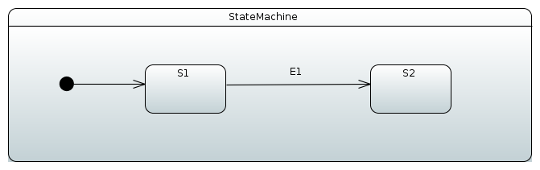

Behind a scenes a raw uml file would look like.

[source,xml,indent=0]
----
include::samples/simple-machine.uml[]
----

[TIP]
====
When opening existing uml model defined as uml, you'll have three
files, `.di`, `.notation` and `.uml`. If model was not created in your
eclipse's session, it doesn't understand how to open an actual state
chart. This is a known issue in a Papyrus plugin and there is an easy
workaround. In a Papyrus _Perspective_ you'll see _Model Explorer_ for
you model, double click _Diagram StateMachine Diagram_ which will
instruct eclipse to open this specific model in its proper Papyrus
modeling plugin.
====

=== Using UmlStateMachineModelFactory

After uml file is in place in your project, it can be imported into
configuration using `StateMachineModelConfigurer` where
`StateMachineModelFactory` is associated with a model.
`UmlStateMachineModelFactory` is a special factory which knows how to
process _Eclipse Papyrus_ generated uml structure. Source uml file can
either be given as a Spring `Resource` or a normal location string.

[source,java,indent=0]
----
include::samples/DocsUmlSampleTests1.java[tags=snippetA]
----

As usually _Spring StateMachine_ is working with _Guards_ and
_Actions_ which are defined as bean, those need to be hooked into uml
by its internal modeling structure. In a below sections you will see
how customized bean references are defined within uml definitions.
Thought it is also possible to register particular methods manually
without defining those as beans.

If `UmlStateMachineModelFactory` is created as a bean its
`ResourceLoader` is wired automatically to find registered actions and
guards. It's also possible to manually define a
`StateMachineComponentResolver` which will then be used to find these
components. Factory also have methods _registerAction_ and
_registerGuard_ which can be used to register these components. More
about this in <<sm-papyrus-statemachinecomponentresolver>>.

Uml model is relatively loose what comes for the implementation like
_Spring StateMachine_ itself. There are choices what implementation
need to take for uml support as it leaves a lot of features and
functionalities for an implementation to decide. Below sections go
through how _Spring StateMachine_ will implement uml model based on
_Eclipse Papyrus plugin_.

[[sm-papyrus-statemachinecomponentresolver]]
==== StateMachineComponentResolver

Below example shows how `UmlStateMachineModelFactory` is defined with
a `StateMachineComponentResolver` which registers a simple functions
`myAction` and `myGuard` respectively. As you notice these components
are not created as beans.

[source,java,indent=0]
----
include::samples/DocsUmlSampleTests1.java[tags=snippetB]
----

=== Creating Model
Let's start by creating an empty state machine model.

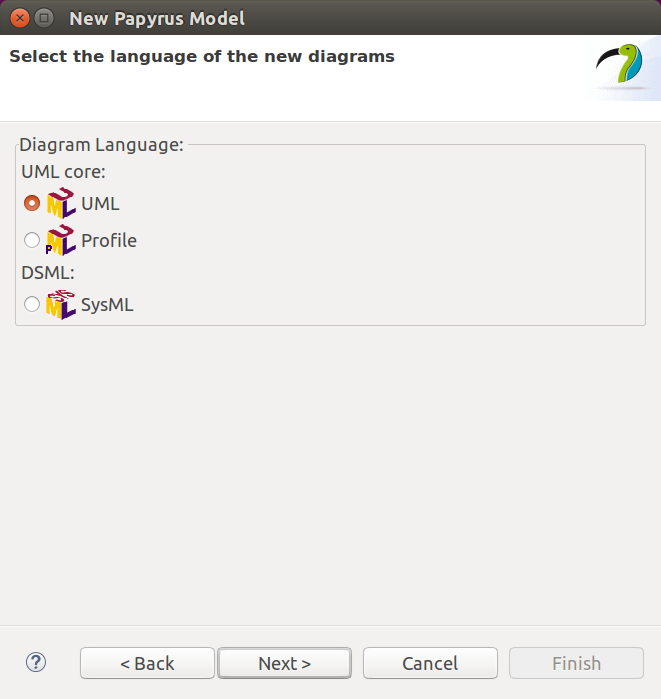

You'll start by creating a new model and giving it a name.

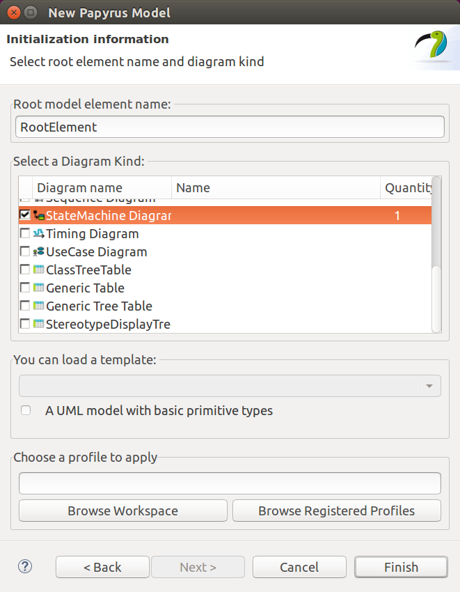

Then you need to choose a _StateMachine Diagram_.

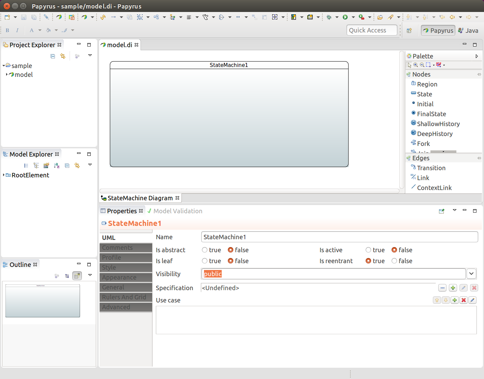

You end up having an empty state machine.

In above sample named `model` you'll end up three files, `model.di`,
`model.notation` and `model.uml` which can then be used in any other
eclipse instance and `model.uml` can be used by importing it into a
_Spring Statemachine_.

=== Define States
State identifier is simply coming from a component name in a diagram.
You must have initial state in your machine which is done by adding
_Initial_ and then drawing a transition to your own initial state.

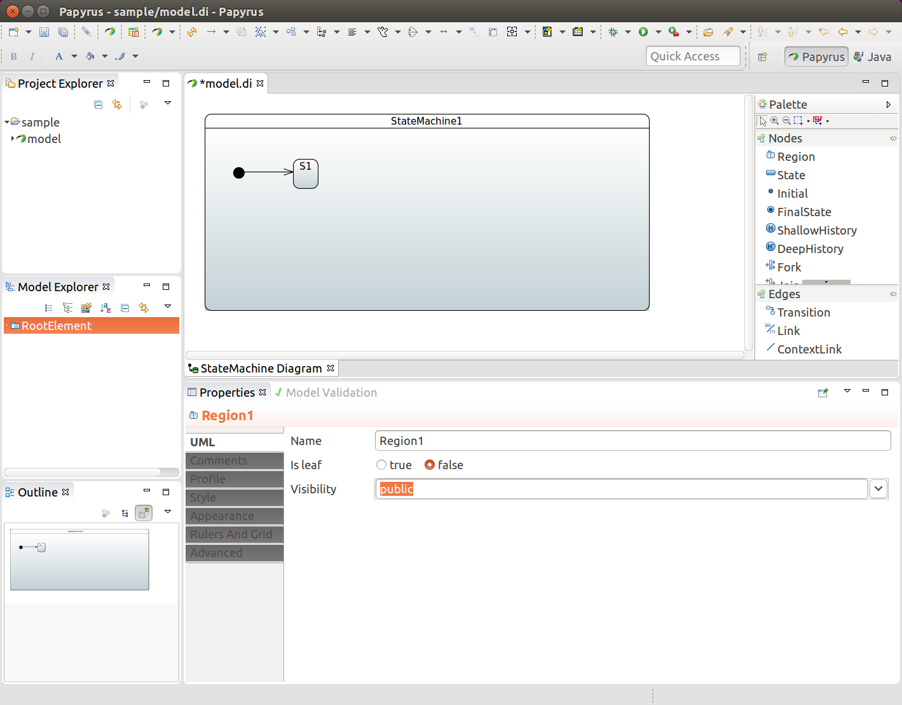

In above we added one state `S1`, initial state, and draw a transition
between those two to indicate that `S1` is an initial state.

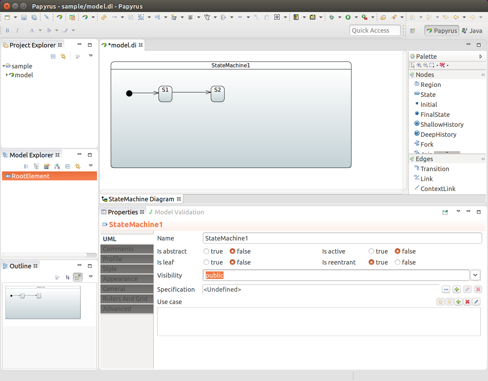

In above we added a second state `S2` and added a transition between
those two.

=== Define Events
To associate an event for a transition you need to create a `Signal`
`E1`. Done from _RootElement->New Child->Signal_.

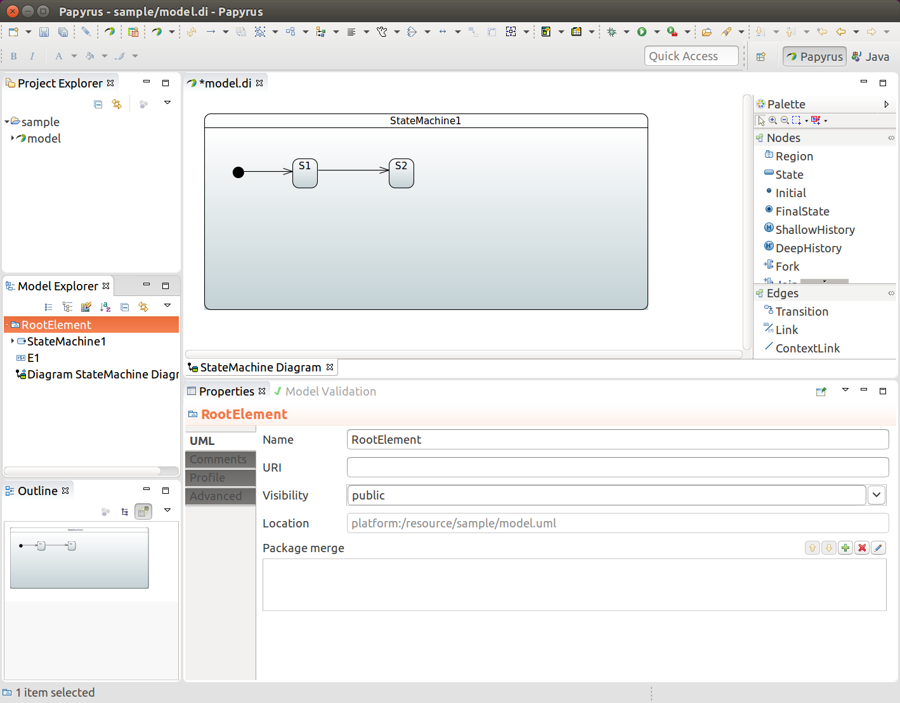

And then `SignalEvent` with defined signal `E1`. Done from
_RootElement->New Child->SignalEvent_.

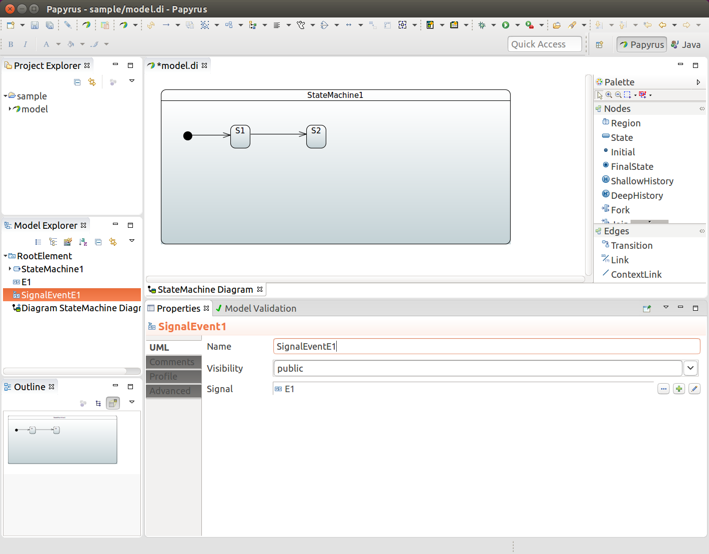

=== Define Transitions
Transition is simply created by drawing _transition_ line between
source and target states. In above we have states `S1` and `S2` and
anonymous trasition between those two. We want to associate event
`E1` with that transition. We choose a transition, create a new
trigger and define `SignalEventE1` for that.

image::images/papyrus-gs-8.png[scaledwidth="100%"]

This will give you something like shown below.

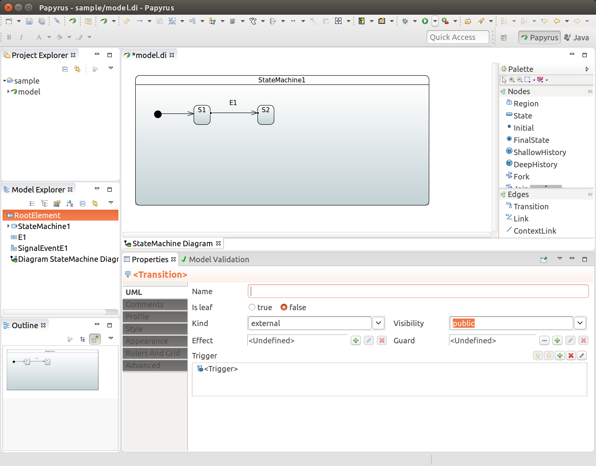

[TIP]
====
If `SignalEvent` is omitted for a transition it becomes an
anonymous transition.
====

=== Define Timers
Transition can also happen based on timed events. Spring Statemachine
support two types of timers, ones which fires continously on a
background and ones which fires once with a delay when state is
entered.

Add new `TimeEvent` child to _Model Explorer_, modify _When_ as
expression defined as _LiteralInteger_. Value of it is then timer as
milliseconds. _Is Relative_ is left to _false_ making timer to fire
continously.

To define one timed based event when state is entered it's exactly
same as above but _Is Relative_ is now defined as _true_.

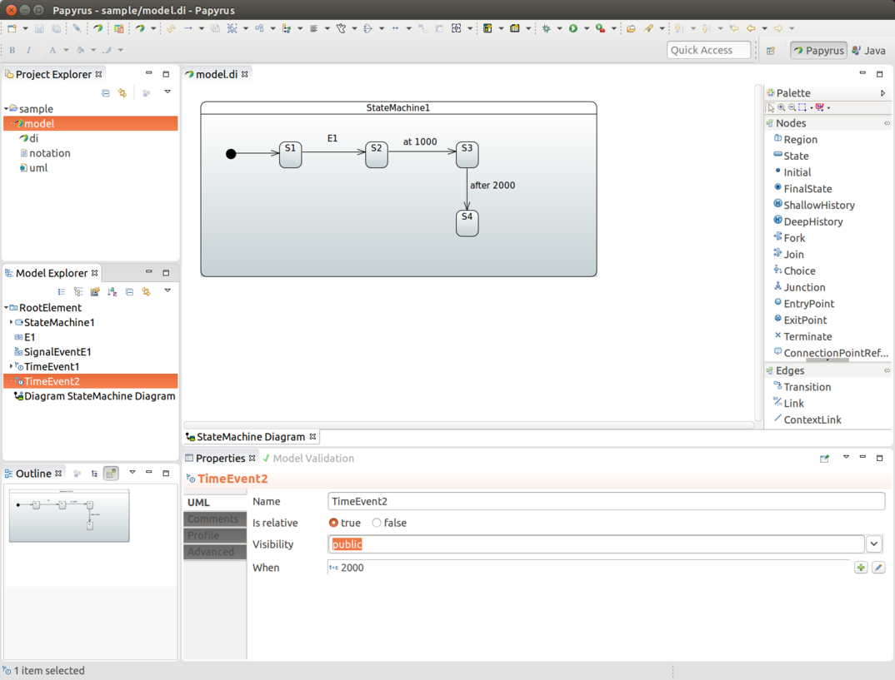

Then what is left for user is to pick these time events instead of
signal event for a particular transition.

=== Define Actions
State entry and exit actions can be associated by using a behaviour,
more about this in <<sm-papyrus-beanref>>.

=== Define Guards
Guard can be defined by first adding _Constraint_ and then defining
its _Specification_ as _OpaqueExpression_ which works in a same way
than <<sm-papyrus-beanref>>.

[[sm-papyrus-beanref]]
=== Define Bean Reference
When there is a need to make a bean reference in any uml _effect_,
_action_ or _guard_, supported method to do that is via
`FunctionBehavior` or `OpaqueBehavior` where defined language needs to
be `bean` and language body having a bean reference id.

[[sm-papyrus-spelref]]
=== Define SpEL Reference
When there is a need to use a _SpEL_ instead of a bean reference in
any uml _effect_, _action_ or _guard_, supported method to do that is via
`FunctionBehavior` or `OpaqueBehavior` where defined language needs to
be `spel` and language body having a SpEL expression.

[[sm-papyrus-submachineref]]
=== Using Sub-Machine Reference
Normally when using sub-states those are simply drawn into a state
chart itself. Chart itself may become a little complex and big to
follow so we also support defining sub-state as a statemachine
reference.

First create a _New Diagram_ and give it a name i.e. _SubStateMachine
Diagram_.

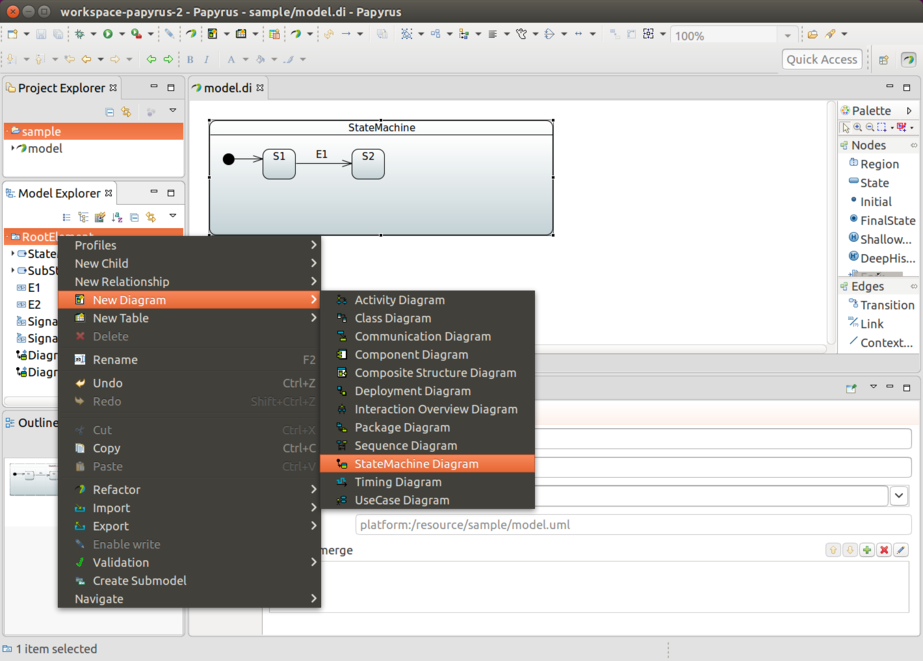

Give new diagram a design you need.

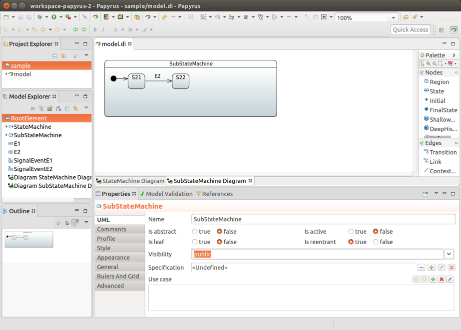

From state you want to link(in this case state `S2`), click
`Submachine` field and choose your linked machine, i.e.
_SubStateMachine_.

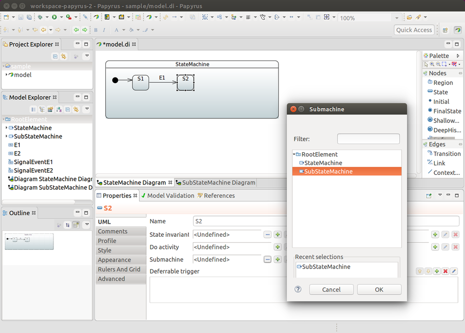

Finally you'll see that state `S2` is linked to `SubStateMachine` as a
sub-state.

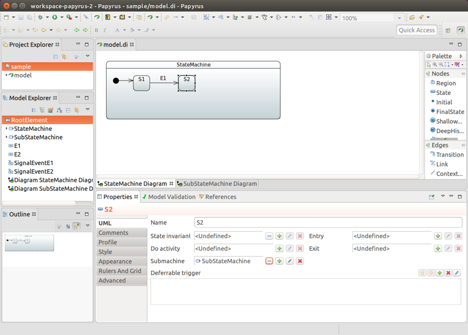

[[sm-repository]]
== Repository Config Support
It is also possible to keep machine configuration in an external
storage where it will be loaded on demand instead of creating a static
configuration either using _JavaConfig_ or _UML_ based config. This
integration works via _Spring Data Repository_ abstraction.

We have created special `StateMachineModelFactory` implementation
called `RepositoryStateMachineModelFactory` which is able to use base
repository interfaces `StateRepository`, `TransitionRepository`,
`ActionRepository` and `GuardRepository` accompanied with base entity
interfaces `RepositoryState`, `RepositoryTransition`,
`RepositoryAction` and `RepositoryGuard` respectively.

Due to way how _Entities_ and _Repositories_ work in a _Spring Data_,
from a user perspective read access can be fully abstracted as it is
done in `RepositoryStateMachineModelFactory` as there is no need to
know what is a real mapped _Entity_ class _Repository_ is working
with. Writing into a _Repository_ is always dependant of using a real
_Repository_ specific _Entity_ class. From machine configuration point
of view we don't need to know these, meaning we don't need to know
actual implementation whether that is _JPA_, _Redis_  or anything else
what _Spring Data_ supports. Using a real _Repository_ related
_Entity_ class comes into play when you manually try to write new
states or transitions into a backed repository.

Actual out of a box implementations are documented in below sections.

[[sm-repository-jpa]]
=== JPA
Actual _Repository_ implementations for a _JPA_ are
`JpaStateRepository`, `JpaTransitionRepository`, `JpaActionRepository`
and `JpaGuardRepository` which are backed by
_Entity_ classes `JpaRepositoryState`, `JpaRepositoryTransition`,
`JpaRepositoryAction` and `JpaRepositoryGuard` respectively.

Generic way to update states and transition manually is shown below.

[source,java,indent=0]
----
include::samples/DocsJpaRepositorySampleTests1.java[tags=snippetA]
----

Complete example can be found from sample
<<statemachine-examples-datajpa>>. This example is also showing how
repository can be pre-populated from existing _json_ file having a
definitions for entity classes.

[[sm-repository-redis]]
=== Redis
Actual _Repository_ implementations for a _Redis_ are
`RedisStateRepository`, `RedisTransitionRepository`, `RedisActionRepository`
and `RedisGuardRepository` which are backed by
_Entity_ classes `RedisRepositoryState`, `RedisRepositoryTransition`,
`RedisRepositoryAction` and `RedisRepositoryGuard` respectively.

